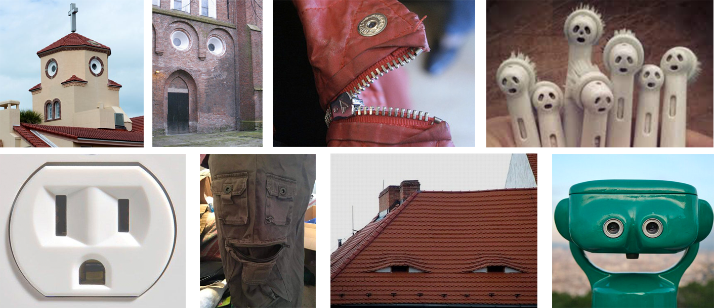

**Procedural Generation and Simulation**

# Questions Session 01

* [Questions Session 01](#questions-session-01)
    * [Questions 01 - Topics & Syllabus](#questions-01---topics--syllabus)
    * [Questions 01 - Procedural Generation](#questions-01---procedural-generation)
    * [Questions 02 - Patterns](#questions-02---patterns)
    * [Questions 03 - Abstraction](#questions-03---abstraction)

## Questions 01 - Topics & Syllabus

1. Which of the chapter topics given in the syllabus are of most interest to you? Why?
2. Are there any further topics in regard to procedural generation and simulation that would interest you?
3. Which tool would you personally prefer to use for the practical tasks (e.g. Houdini, Unreal, Unity, Maya, Blender, JavaScript, p5, GLSL, ...)?
4. How would you rate your level of experience with SideFX's Houdini?
    * [ ] I have only used it in TI
    * [ ] Novice
    * [ ] Intermediate
    * [ ] Advanced
    * [ ] God-like

## Questions 01 - Procedural Generation

Briefly in your own words: how would you explain your nanny what *procedural generation* means? 

## Questions 02 - Patterns

1. Seeing Patterns

Take at least three pictures of natural patterns and at least three pictures of man-made ones (patterns can be two or three dimensional). Try to include at least one pattern with self-similarity. Taking the pictures with your smart phone is just fine. Link all images in this markdown file.

2. Understanding and Implementing Patterns

Write for one of your pattern images a generating algorithm in pseudo-code or code. Submit the code below.

3. Seeing Faces

As an exercise to see and understand the environment around you (and to have some fun 😊), try to find at least two faces. Link all images in this file.

[Image sources left to right, top to bottom: [1](https://www.google.com/imgres?imgurl=https%3A%2F%2Fpbs.twimg.com%2Fprofile_images%2F378800000719377900%2F45f6f5459fe0d5678de052e8741700d0_400x400.jpeg&imgrefurl=https%3A%2F%2Ftwitter.com%2Ffacespics&docid=JoT1wUHfRfTWbM&tbnid=x30M4EKn_ft1wM%3A&vet=10ahUKEwisyqXc27_hAhXGJlAKHXNpArEQMwg_KAAwAA..i&w=400&h=400&bih=915&biw=1680&q=faces%20in%20things&ved=0ahUKEwisyqXc27_hAhXGJlAKHXNpArEQMwg_KAAwAA&iact=mrc&uact=8#h=400&imgdii=PorYURvb5HYYdM:&vet=10ahUKEwisyqXc27_hAhXGJlAKHXNpArEQMwg_KAAwAA..i&w=400), [2](https://www.themarysue.com/things-that-look-like-faces-pareidolia/), [3](https://www.themarysue.com/things-that-look-like-faces-pareidolia/), [4](http://www.abovetopsecret.com/forum/thread1159632/pg1), [5](https://lockerdome.com/buzzfeed.com/6814745186674964), [6](https://twitter.com/FacesPics/status/1086717380837953536), [7](https://laughingsquid.com/faces-in-things-funny-photos-of-objects-that-appear-to-have-faces/), [8](https://twitter.com/facespixx)]

## Questions 03 - Abstraction

1. **Abstraction in Art**

Chose one "traditional" painting, which is inspirational to you. The image can come from the script or you can refer to any artists or image you like.  

Explain briefly what you like about the painting and how it might inspire you for your own work.

1. **Abstracted Artistic Expression in CGI**

Chose one CG image, which you like and of which you think that it has an artistic quality to it. The image doesn't need to be from the script, again you can chose any CGI image you like (it should use 3D graphics). You can find more examples in the [Summary of Artists](../../02_scripts/pgs_ss22_01_intro_script.md#summary-of-artists) section.  

Explain briefly what you like about the image and why you consider it to be somewhat a pice of art. 

