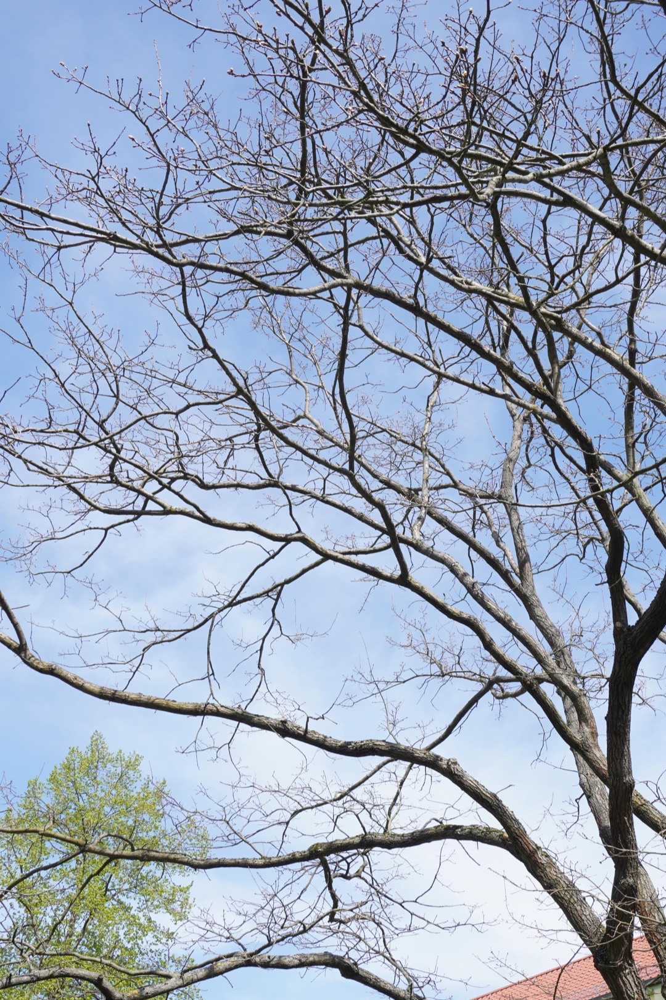
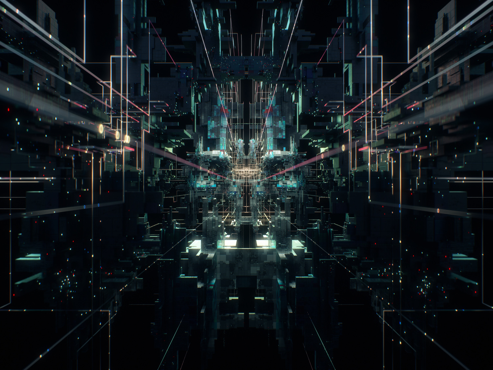

**Procedural Generation and Simulation**

# Questions Session 01

- [Questions Session 01](#questions-session-01)
  - [Questions 1 - Topics & Syllabus](#questions-1---topics--syllabus)
  - [Questions 2 - Procedural Generation](#questions-2---procedural-generation)
  - [Questions 3 - Patterns](#questions-3---patterns)
    - [3.1 Seeing Patterns](#31-seeing-patterns)
    - [3.2 Understanding and Implementing Patterns](#32-understanding-and-implementing-patterns)
    - [3.3 Seeing Faces](#33-seeing-faces)
  - [Questions 4 - Abstraction](#questions-4---abstraction)
    - [4.1 Abstraction in Art](#41-abstraction-in-art)
    - [4.2 Abstracted Artistic Expression in CGI](#42-abstracted-artistic-expression-in-cgi)

## Questions 1 - Topics & Syllabus

* Which of the chapter topics given in the syllabus are of most interest to you? Why?
  > Particle I & II, because on one hand they can be used for something solely for the purpsoe to be beautiful to look at, but one the other hand also applied for effects in films and games. And for me these are one of the most interesting effects that I always wanted to try out to create by myself.
* Are there any further topics in regard to procedural generation and simulation that would interest you?
  > not yet a specific topic, just generally interested to see how it can be applied to 2D and 3D, what and if there are main differences in the creation process besides the dimensions.
* Which tool would you personally prefer to use for the practical tasks (e.g. Houdini, Unreal, Unity, Maya, Blender, JavaScript, p5, GLSL, ...)?
    > Mainly Houdini. But also interested how to use Unreal Engine for it or Houdini inside Unreal Engine, but that may be better to try out later.
* How would you rate your level of experience with SideFX's Houdini?
    * [ ] I have only used it in TI
    * [x] Novice (never used it before)
    * [ ] Intermediate
    * [ ] Advanced
    * [ ] God-like

## Questions 2 - Procedural Generation

Briefly in your own words: how would you explain your nanny what *procedural generation* means? 

> Procedual generation decribes the process to create something, e.g. something graphical, by defining rules and algorithms that can be modified to modify the whole creation.

## Questions 3 - Patterns

### 3.1 Seeing Patterns

Take at least three pictures of natural patterns and at least three pictures of man-made ones (patterns can be two or three dimensional). Try to include at least one pattern with self-similarity. Taking the pictures with your smart phone is just fine. Link all images in this markdown file.

**Natural Patterns:**

*1: Leaf*


*2: Branches with self-similarity:*



*3: Tree bark*


*4: Sand "hills"*


**Man-made Patterns:**

*1: Speaker*


*2: Tiles*


*3: Grid*


### 3.2 Understanding and Implementing Patterns

Write for one of your pattern images a generating algorithm in pseudo-code or code. Submit the code below.

> p5.js Code for man-made pattern 2 - *Tiles*:

```
let tileX = 50;
let tileY = 25;
let space = 2;

function setup() {
  createCanvas(200, 200);
  background(0);
  noStroke();
  fill(255);
}

function draw() {
  for (let y=0; y*(tileY+space)<height;y++){
    for(x=0; x<=width; x+=tileX+space){
      //add an offset every second row
      if(y%2!==0 && x==0){  
        x-=(tileX+space)/2;
      }
      //draw tile
      rect(x,y*(tileY+space),tileX,tileY);
    }
  }
}
```


### 3.3 Seeing Faces

As an exercise to see and understand the environment around you (and to have some fun 😊), try to find at least two faces. Link all images in this file.


## Questions 4 - Abstraction

### 4.1 Abstraction in Art

Chose one "traditional" painting, which is inspirational to you. The image can come from the script or you can refer to any artists or image you like.  

Explain briefly what you like about the painting and how it might inspire you for your own work.


[Monet, Soleil Levant](https://en.wikipedia.org/wiki/Impressionism#/media/File:Claude_Monet,_Impression,_soleil_levant.jpg)

I find the impressionistic painting from Monet interesting, because it seems to have alot of detail, even though the single brush strokes can still be seen. This inspires me, as simple shapes could be used, to create a detailed environment. Refelections are also something, that help to make something look realistic. And this kind of realistic look, without having to be photo realistic, is something that I really like and may be applied to a personal project.

### 4.2 Abstracted Artistic Expression in CGI

Chose one CG image, which you like and of which you think that it has an artistic quality to it. The image doesn't need to be from the script, again you can chose any CGI image you like (it should use 3D graphics). You can find more examples in the [Summary of Artists](../../02_scripts/pgs_ss22_01_intro_script.md#summary-of-artists) section.  

Explain briefly what you like about the image and why you consider it to be somewhat a pice of art. 



This image instantly caught my attention because of the atmosphere it delivers. I imagine a dystopian sci-fi world, with tech-structures everywhere. I think it has an artistic quality to it, because it is nice to look at and still leaves room for the viewer to be inspired and see his own association in this image. Although I think that art can also be something very specific and does not have to be open for interpretation, it just needs to be something, that the viewer can identify with in some kind of way or that it tells a stroy. And to me, everything is fulfilled with this art piece.


