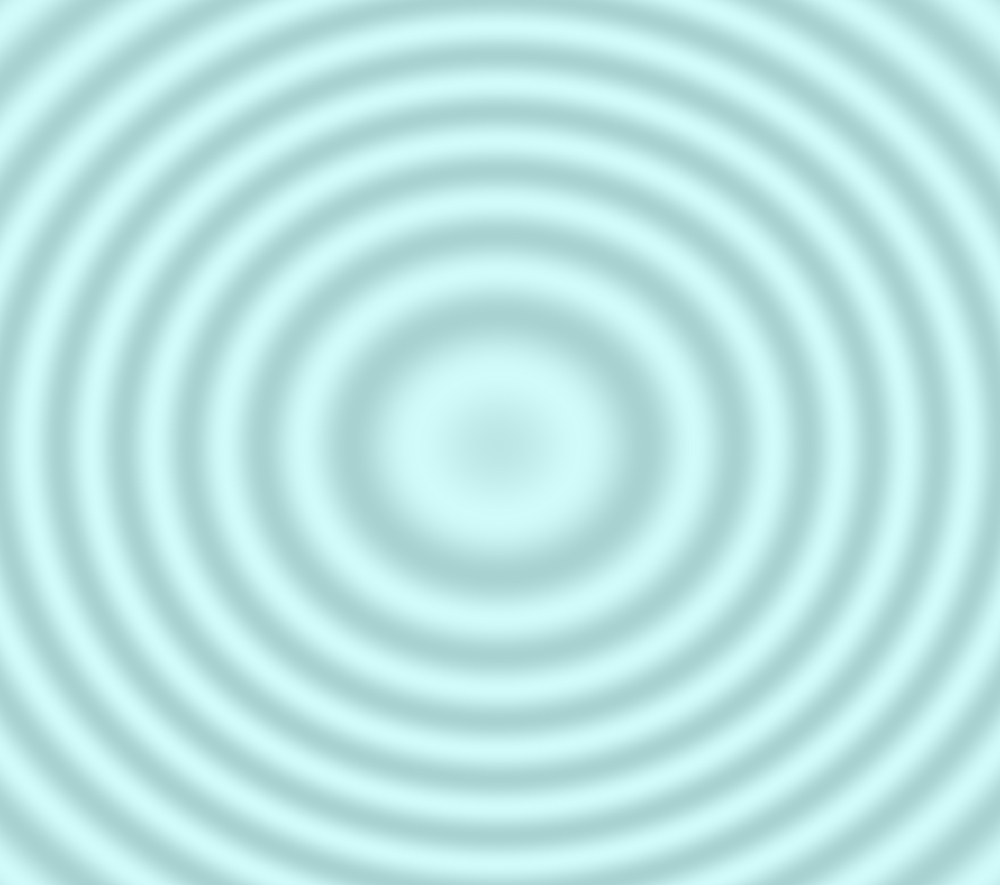
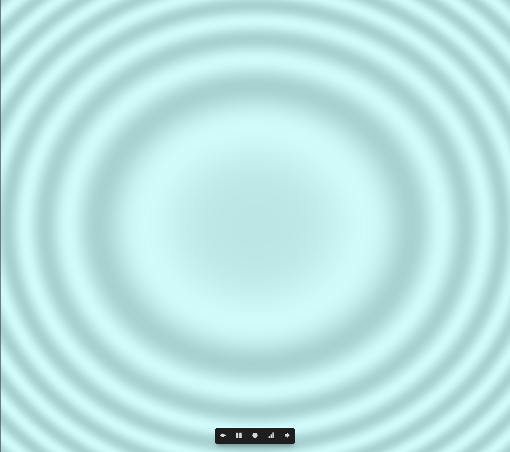
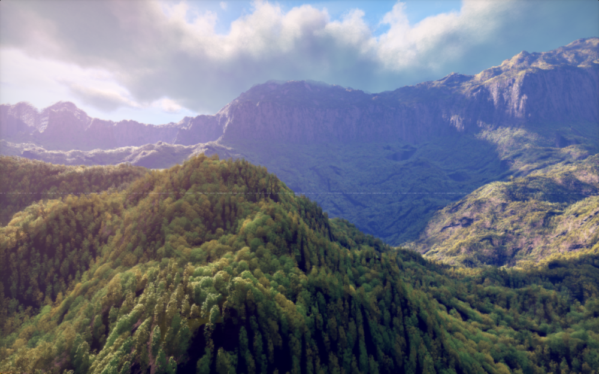
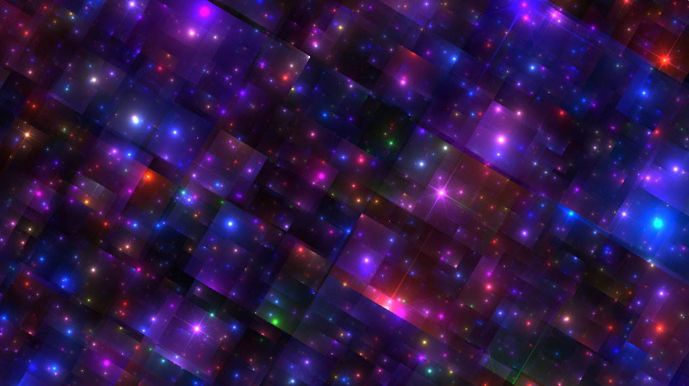

# Experimental shader (animated):

very simple to get a better understanding oin what is going on in shaders. Idea: mix between hypnotic circles and rippling water.

# Shadertoy examples:

**1:** 
https://www.shadertoy.com/view/4ttSWf

The Youtube-Video on how it was done is also interesting to get a basic understanding of the implementation idea.

**2:**
https://www.shadertoy.com/view/7sdcWn

Maybe this one would be a bit more realistic to achieve.