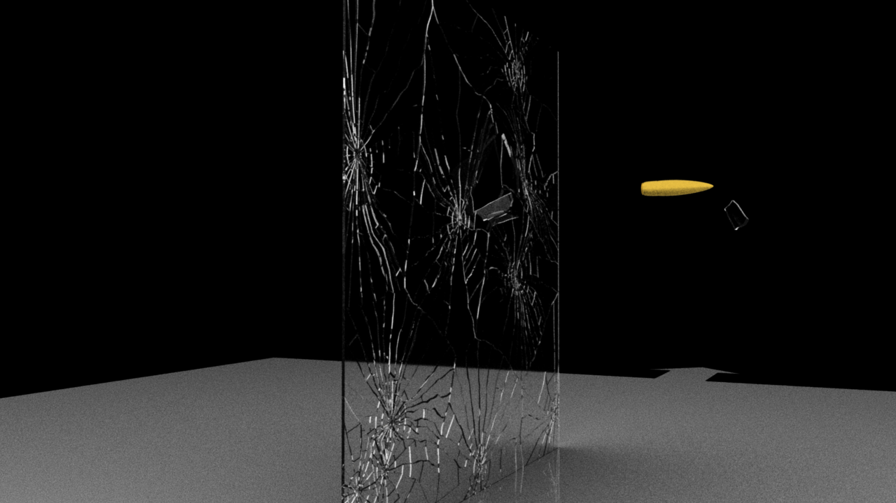

# Session 07

## Forces:

Result from the Forces-Tutorial (Idea: Inspired by an explosion, starting fast, and then only slowly expanding, e.g. a firework, with glowing particles that stay there after an explosion or smoke that slowly rises after an explosion)

## Rigid Body

I followed these tutorials:

- [Houdini Tutorial - Intro Rigid Body Dynamics ](https://youtu.be/I7Yxue9XAiQ)
- [RBD Broken glass and ball](https://youtu.be/Nu5BmGYjzp4)

**Result** (with some quick sound design done in Premiere Pro):

- Video: https://owncloud.gwdg.de/index.php/s/iIrfEnMgSbfzXPW

- Image preview:

