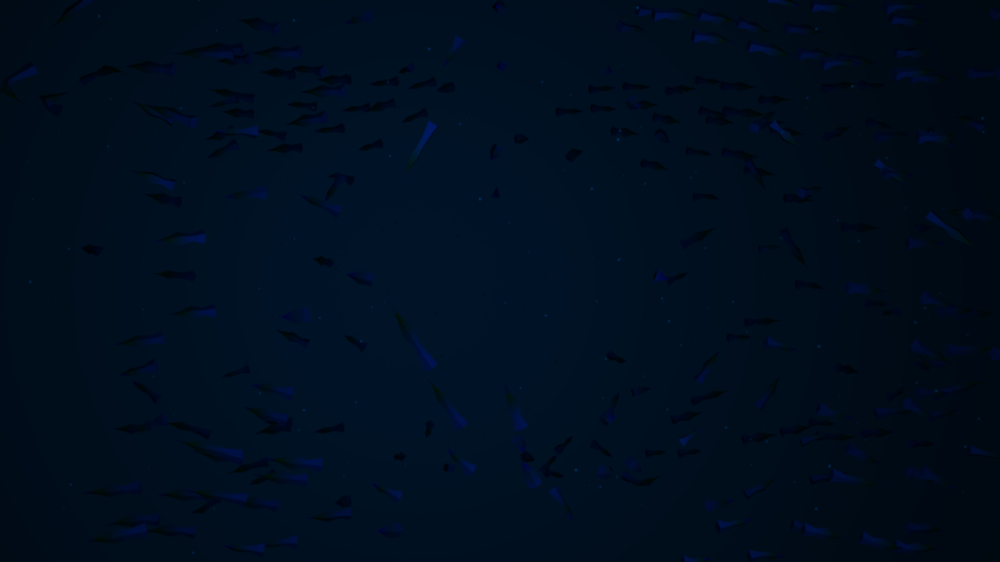

# Session 08

## Particles:

I decided to stay with the fish design and tried to make them look like fish, as far as it was possible with the ramp, adjusted the parameters for some nice behaviour and lit the scene to make it look like underwater. Additionally, I added some sphere-particles so visualise simple bubbles, which follow the same rules but with different parameter settings.

**Result**

- Video: https://owncloud.gwdg.de/index.php/s/kfUkz3xJjQK2X5Q

- Image preview:

