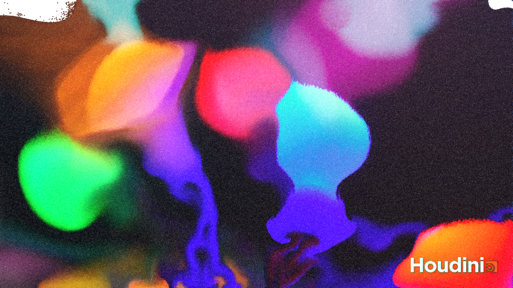

# Session 09:

I started to follow this tutorial [Quicktip: Fluid Splashes Using FLIP](https://youtu.be/_6SQPc961ZE), until the "vdbfrompolygons"-node crashed Houdini several times. After it crashed my whole PC, I decided to never touch this file again and deleted it. Then, I followed the recommended tutorial [Doxia Studio: Mix Fluids From Image](https://youtu.be/aT4mZphB154).

**Result:**
 
- Video: https://owncloud.gwdg.de/index.php/s/v3QdEBjxhjMAvwV

- Image Preview:
  

