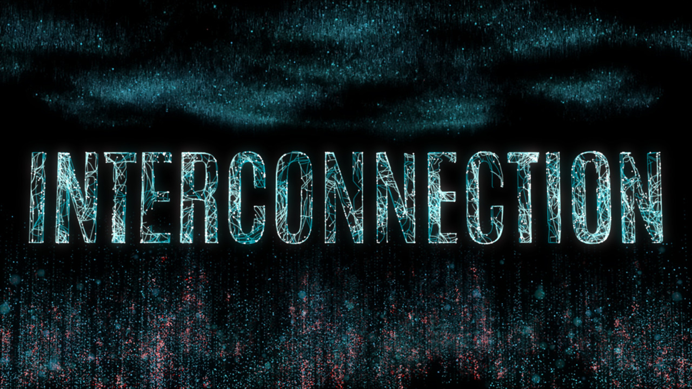

# Final Project

## Abstract

This project is an animated title sequence, done in Houdini. The idea for the title sequence comes from a film project, that I am currently planning. "Interconnection" is for now only the working title, but that can be adjusted easily inside Houdini as everything is procedural, except some camera movements. With this project, I wanted to dive deeper into particle systems and create an environment that fits the mood of the film's story.

## Concept
As the film is set in the future and deals with digital connections between everything and everyone (no spoilers here :) ), I wanted to give it that "modern sci-fi" look, with flowing data streams and connected data points. An example mood image is below. In the center should be the title of the film. But a first draft showed me, that this looks too unimpressive, so I decided to add an environment to it. 

For this concept I thought that particle systems are the best option to achieve my goal. I also wanted to get more familiar with Houdini and see what I can already create with it. That's why I decided to stay in Houdini for my project. 

## Implementation
I searched the internet for a tutorial, of sci fi looks and neural networks. After I found one, I started my project by following this tutorial: https://youtu.be/UWMcv6R8bmk
This gave some great information on how pop networks and trails to design my "data connections". But I found the visualisation in this tutorial too abstarct for my needs, and decided to apply my knowledge from this video to a font in houdini. 

### Text: 
I extruded the font, applied particles and bound them to the letters by using a sop solver and rays. Then I copied the pop network and used speheres to follow the same paths as the lines to get the "connection points". 

### Environment:
After that I started to work on environment. For this I applied explanations from this tutorial series to my project and made adjustements to it, to make it look how I wanted it: 

Part 1: https://www.youtube.com/watch?v=BdNMSTJKYMM 

Part 2: https://www.youtube.com/watch?v=O9W6PjDE7qo 

Part 3: https://www.youtube.com/watch?v=HrPhv_R8mck 

I then arranged everything to a nice composition. My interpretation of the end result is, that in an abstract way it could resemble a skyline, with buildings at the bottom and a sky above the text, both made of data. This is something that I had not directly planned but this thought inspired the arrangement. 

### Camera:
After all that, I added a camera, arranged everything to a nice composition and then worked on the camera animation. For this, I started to use a curve o animate the camera and tried to follow different tutroials for it, because I thought with a curve, I would be more flexible that with keyframes. But after I found it more complicated and less beneficial to find out, how to roll the camera on a curve than to add keyframes, I decided fro a compromise: the backwards movement is animated by using a curve and the rotation is animated by adding a start and end keyframe.

### Rendering:
The Rendering: Unfortunately, I felt really limited with mantra and the apprentice version: It was not possible for me, to achieve the glowing look I wanted with mantra. Additionally, the apprentice version limits the render resolution to 720p. So rendered the 10s sequence as pngs, added colors to the particles, and made some adjustements to increase the quality without increasing the render time too much, by increasing pixel samples to 5, the diffuse limit to 1 and setting the pixel filter to Gaussian 3x3 (softer).  

### Post Processing
As I was not quite happy with the result, I did some post processing and editing in After Effects and Premiere Pro. In Premiere I converted the png sequence to a video sequence, and worked on the sound design by adding copyright free music and sound effects. To enhance the sci-fi-tech-look and fit the sequence to the music and give it an end, I also created some glitch effects. In after Effects I upscaled the video to 1080p, added glow effects and some color correction.

(The post processing is probably not that directly connected to what was done in this course, but for me it was necessary to make it complete. But this was done as a last step and I didn't take the time into account that was used for that.)

## Results
Below, the rsults are shown. First the final outut, second result without editing.

### Images

### Videos
The video files are uplaoded in the ownCloud.

Final result: \
https://owncloud.gwdg.de/index.php/s/C6kQzygCXobIXzl

Result without post processing (except converting the png sequence to mp4): \
https://owncloud.gwdg.de/index.php/s/EWQpcSEm4AyqU5m

## Project Reflection & Discussion

It was fun to to work on it and expanding the knowledge of Houdini. I appreciated the freedom regarding the content, that I had in this project. I am happy with the result, even though I wish I could render it again, but in a higher resolution. After looking several times at the animation, I think I could have fine tuned the camera movement to make it ease in and out and not let it stay there in the end. Either continuing the movement away from the text, or maybe it would already help to not stop the movement abruptly. Perhaps, some of the post processing, for example glitch effects could have been done in Houdini as well, but this would have taken too much time to figure out. 

## Lessons Learned
After finishing this project, I feel more familiar with particles. A huge improvement was learning about caching and pre-rendering, this made working on the project so much more comfortable as it needed less performance afterwards and made it less laggy. All in all I would say, I now know more about the workflow of houdini: 
- how to split nodes in different categories / gemoetry nodes instead of doing too much in only one 
- why the null object is really helpful a
- how to work with caching / pre-rendering.
