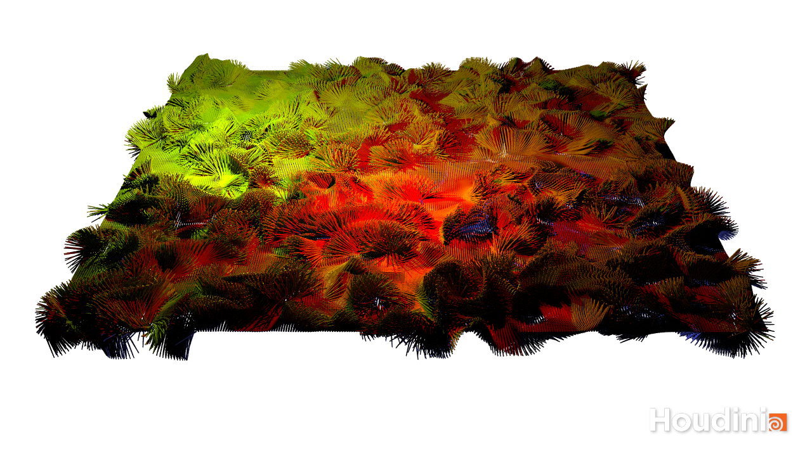
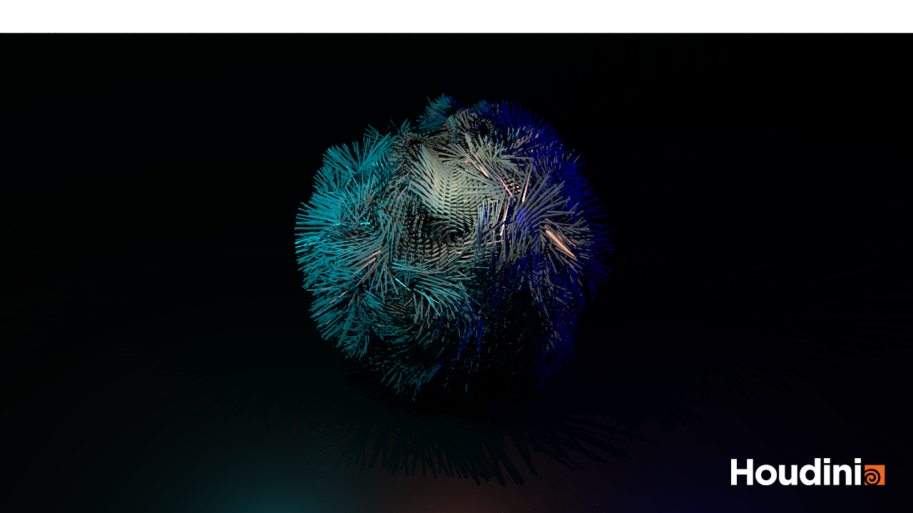

# Procedural Generation and Simulation

Prof. Dr. Lena Gieseke \| l.gieseke@filmuniversitaet.de \| Film University Babelsberg KONRAD WOLF

# Questions Session 06

* [Procedural Generation and Simulation](#procedural-generation-and-simulation)
* [Questions Session 06](#questions-session-06)
    * [Chapter 06 - Seeing Noise](#chapter-06---seeing-noise)

## Chapter 06 - Seeing Noise 

* Submit at least three pictures of natural noise patterns. You can photograph them yourself (recommended) or find them on the internet.
* Submit one stylized / artistic image that uses noise as generating principle or design element. You can find it on the internet.

https://www.shadertoy.com/view/7sVyRw
```GLSL
vec3 hash3(vec2 p) {
	vec3 p3 = fract(vec3(p.xyx) * vec3(.1031, .1030, .0973));
    p3 += dot(p3, p3.yxz + 33.33);
    return fract((p3.xxy + p3.yzz) * p3.zyx);
}

vec3 noise(vec2 p) {
    vec2 i = floor(p);
    vec2 f = fract(p);
	vec2 u = f * f * (3.0 - 2.0 * f);
    return mix(mix(hash3(i + vec2(0.0,0.0)), 
                   hash3(i + vec2(1.0,0.0)), u.x),
               mix(hash3(i + vec2(0.0,1.0)), 
                   hash3(i + vec2(1.0,1.0)), u.x), u.y);
}

vec3 fractal(vec2 p, int oct) {
    float tier = 0.5;
    mat2 m = mat2(1.6, 1.2, 1.2, -1.6);
    p *= 4.0;
    vec3 n = vec3(0);
    for (int i = 0; i < oct; i++) {
        n += noise(p) * tier; 
        p = m * p;
        tier *= tier;
    }
    return sqrt(n);
}

vec3 fbm(vec2 p, int oct, int iter) {
    for (int i = 0; i < iter; i++) {
        p = (fractal(p, oct) + noise(p * 50.0) / 25.0).xy - p;
    }
    return fractal(p, oct);
}

void mainImage(out vec4 fragColor, in vec2 fragCoord) {
    vec2 uv = (2.0 * fragCoord - iResolution.xy) / iResolution.x * 2.0;
    
    uv.y += iTime / 2.0;
    
    fragColor = vec4(vec3(fbm(uv * 2.0, 6, 2)), 1.0);
}
```
Link all images in this file.

 

 


It took me 7-8 hours to finish this homework because some bugs occurred and in order to finish the tutorial and have a result I needed to fix them. One error was the display of the object which from probably a wrong click looked like this:

I coudn't undo it, I didn't find an option in the view that fixed it, I coudln't figure it out from googleing, nobody who I know who is better with houdini than me had the solution and I tried to redo every part of the tutorial to figure out which part messed it up and in the end I just redid the whole thing in a new file.
I also had issues the the Flipbook because I just clicked the link and didn't see that after the link the naming of the files also inclueded a nescessary step of including a part that lets you safe more than one image. So I tried a lot of options but always ended up having one reult image until I asked Vivien who told me about the hint on the filename. 
That's why I just did the tutorial, I couldn't spend more time on creating my own thing out of the tutorial.
