**Procedural Generation and Simulation**

# Questions Session 01

- [Questions Session 01](#questions-session-01)
  - [Questions 1 - Topics & Syllabus](#questions-1---topics--syllabus)
  - [Questions 2 - Procedural Generation](#questions-2---procedural-generation)
  - [Questions 3 - Patterns](#questions-3---patterns)
    - [3.1 Seeing Patterns](#31-seeing-patterns)
  - [Natural](#natural)
    - [Strange pattern on my flatmate's plant](#strange-pattern-on-my-flatmates-plant)
    - [Wind + snow on a Romanian mountaintop](#wind--snow-on-a-romanian-mountaintop)
    - [Original photo of a Wellingtonea Gigantea's trunk](#original-photo-of-a-wellingtonea-giganteas-trunk)
    - [Displacement noise in Tiergarten](#displacement-noise-in-tiergarten)
  - [Human-made](#human-made)
    - [Wall on my balcony](#wall-on-my-balcony)
    - [Kitchen's window](#kitchens-window)
    - [Taking a picture with an iPhone while covering a camera, with maximum ISO](#taking-a-picture-with-an-iphone-while-covering-a-camera-with-maximum-iso)
  - [Bonus: Nature taking back property from the humans](#bonus-nature-taking-back-property-from-the-humans)
    - [3.2 Understanding and Implementing Patterns](#32-understanding-and-implementing-patterns)
    - [3.3 Seeing Faces](#33-seeing-faces)
  - [Questions 4 - Abstraction](#questions-4---abstraction)
    - [4.1 Abstraction in Art](#41-abstraction-in-art)
  - [I really like contrasts and oppositions. Be it in colours, shapes, textures or emotions, I feel that it's much more realistic, then any homogenous representation, since everything around us is the contrary of something else.](#i-really-like-contrasts-and-oppositions-be-it-in-colours-shapes-textures-or-emotions-i-feel-that-its-much-more-realistic-then-any-homogenous-representation-since-everything-around-us-is-the-contrary-of-something-else)
    - [4.2 Abstracted Artistic Expression in CGI](#42-abstracted-artistic-expression-in-cgi)
    - [**Sage Jenson**](#sage-jenson)
    - [Since it is a super tall picture, I just linked his website, where one might find very mesmerizing artworks.](#since-it-is-a-super-tall-picture-i-just-linked-his-website-where-one-might-find-very-mesmerizing-artworks)
    - [I find Sage's works the most inspiring from the whole digital artist scene. They show something very organic, that microscopes can not capture yet. They base they're works on biological papers, writing the code of different kinds of growth. As an artist, I feel like they are a bridge themself between the nature and digital world. Their sketches are also available on the site, I really recommend checking them out.](#i-find-sages-works-the-most-inspiring-from-the-whole-digital-artist-scene-they-show-something-very-organic-that-microscopes-can-not-capture-yet-they-base-theyre-works-on-biological-papers-writing-the-code-of-different-kinds-of-growth-as-an-artist-i-feel-like-they-are-a-bridge-themself-between-the-nature-and-digital-world-their-sketches-are-also-available-on-the-site-i-really-recommend-checking-them-out)

## Questions 1 - Topics & Syllabus

- Which of the chapter topics given in the syllabus are of most interest to you? Why?
  - **Quite an uneasy decision, since this was the study-course that really convinced me to join CTech. I really like the "cheating" approach in CGI (e.g. Stochastic texture generation), but I also believe, that creating a global, open-source creation library, whith tools that are strictly rule-based, written using biology, physics and other sciences' papers, we could actually recreate our world. Also, I believe that this way, CG generalists would be among the firsts, who could find similarities between different sciences' discoveries. Based on these ideas, my answer is Pattern generation and Rule-based generation models.**
- Are there any further topics in regard to procedural generation and simulation that would interest you?
  - **I know that this is an infinite topic, and one semester is a very short time to cover all the things enumerated in the Syllabus, yet I would be really happy, if some creation pipeline knowledge could be acquireable too, so we can actually finish and present all the things created. Here I mean very basic lighting, camera (/camera movement) tehniques and render settings.**
- Which tool would you personally prefer to use for the practical tasks (e.g. Houdini, Unreal, Unity, Maya, Blender, JavaScript, p5, GLSL, ...)?
  - **I find Houdini the most logical and powerful CG tool on the industry, but converting ideas from one software to another (e.g. prototyping in p5, then translating the code to Vex) might give us godlike**
- How would you rate your level of experience with SideFX's Houdini?
  - [ ] I have only used it in TI (Not even there...)
  - [x] Novice
  - [ ] Intermediate
  - [ ] Advanced
  - [ ] God-like

## Questions 2 - Procedural Generation

Briefly in your own words: how would you explain your nanny what _procedural generation_ means?

**Generating procedurally is like explaining our paintbrush how to paint instead of painting ourselves.**

## Questions 3 - Patterns

### 3.1 Seeing Patterns

Take at least three pictures of natural patterns and at least three pictures of man-made ones (patterns can be two or three dimensional). Try to include at least one pattern with self-similarity. Taking the pictures with your smart phone is just fine. Link all images in this markdown file.

**From natural- to human-made patterns in ascending order. For some of them, I find it hard to say!**


## Natural

### Strange pattern on my flatmate's plant
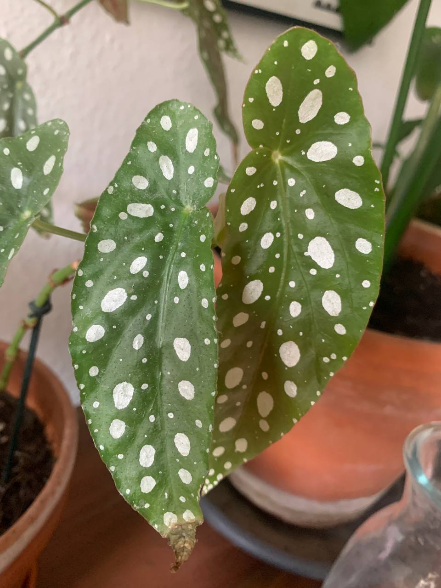

---

### Wind + snow on a Romanian mountaintop
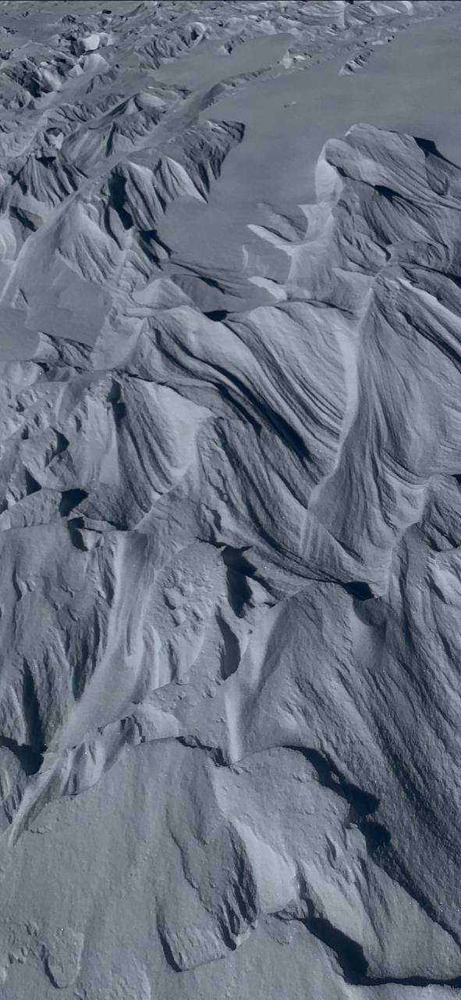

---

### Original photo of a Wellingtonea Gigantea's trunk 
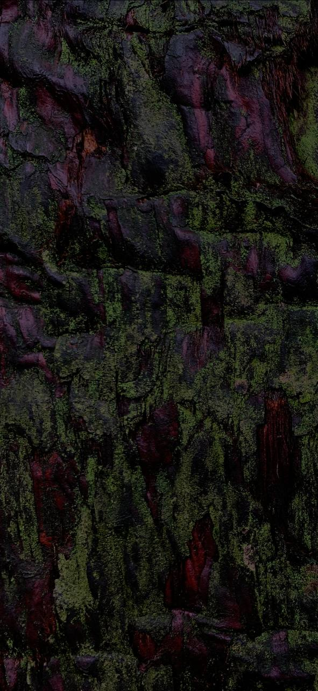

---

### Displacement noise in Tiergarten 
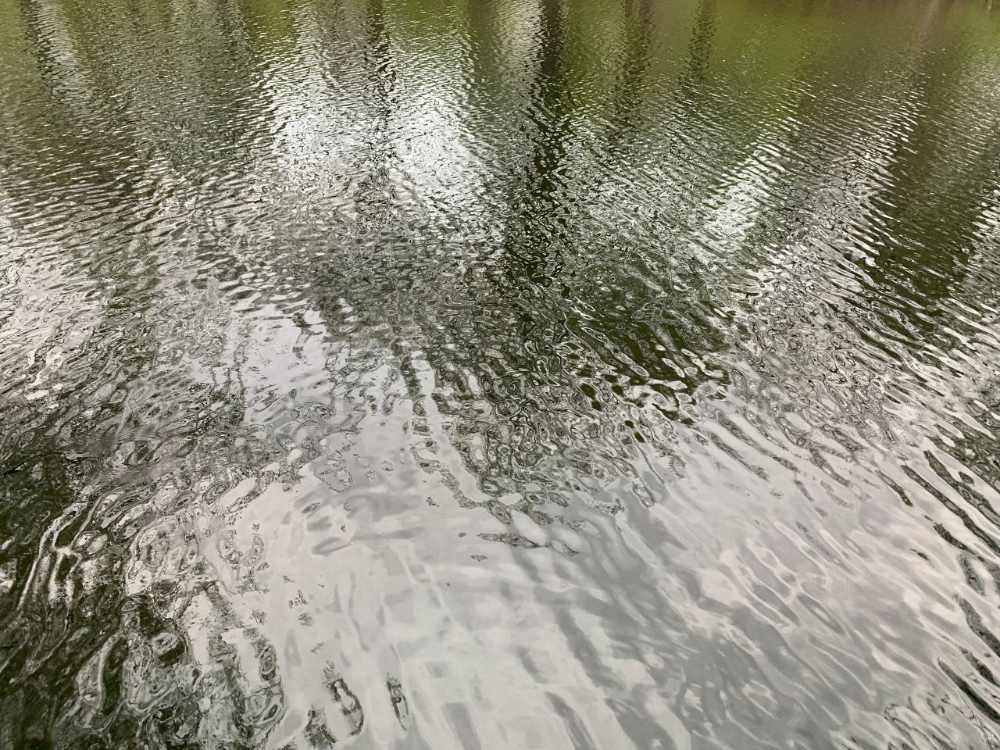

---

## Human-made
### Wall on my balcony
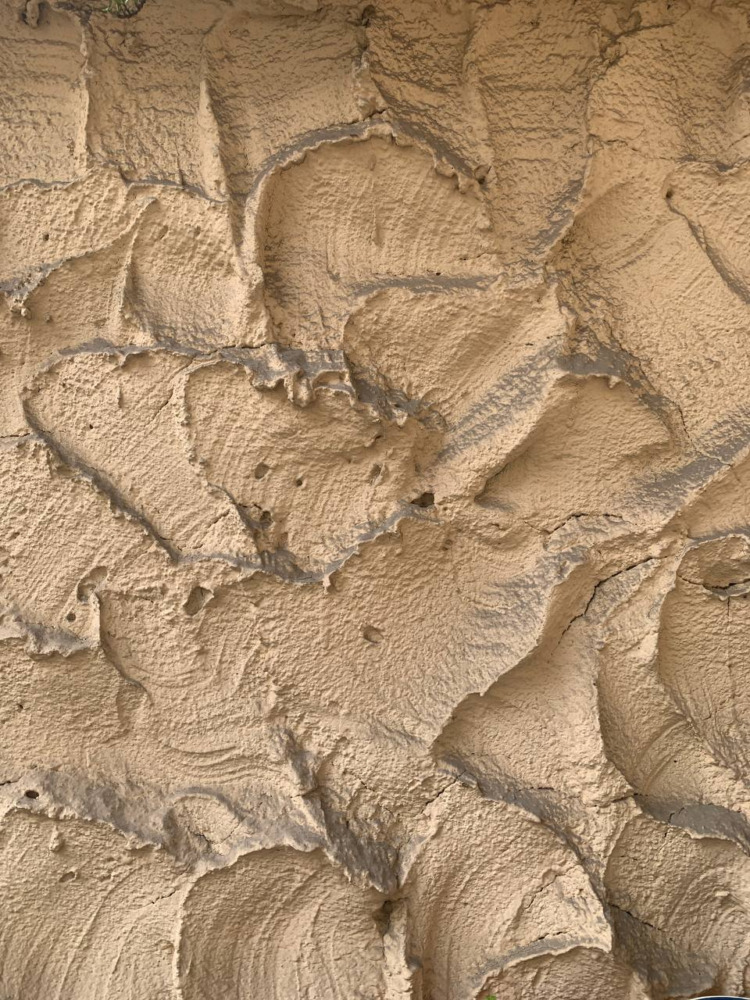

---

### Kitchen's window
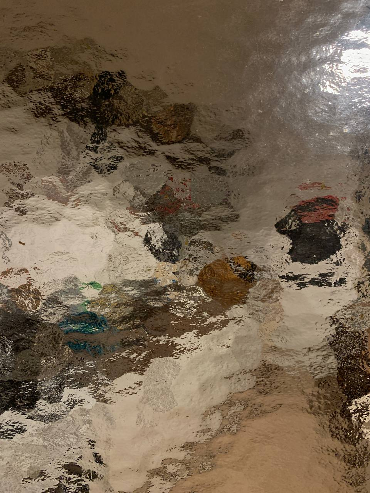

---

### Taking a picture with an iPhone while covering a camera, with maximum ISO
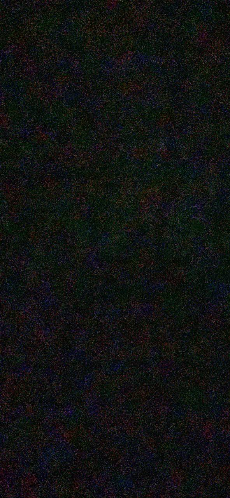

---

## Bonus: Nature taking back property from the humans
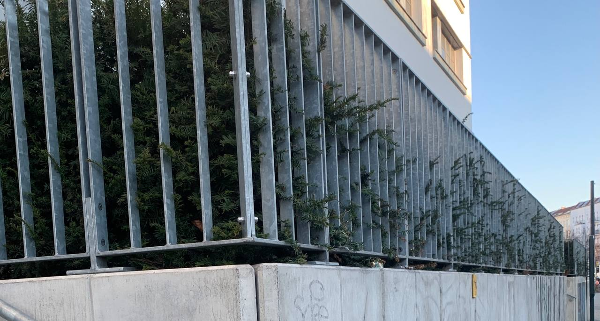
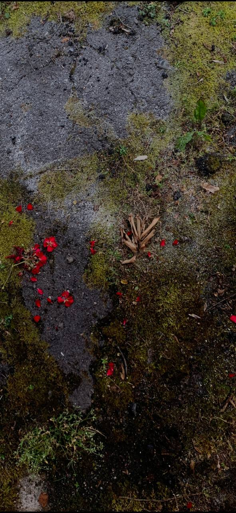
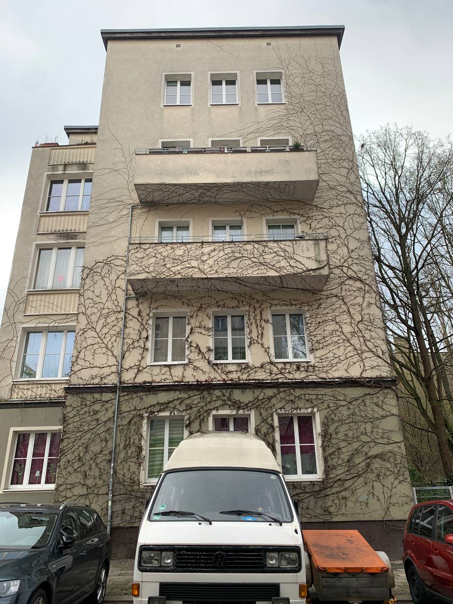

### 3.2 Understanding and Implementing Patterns

Write for one of your pattern images a generating algorithm in pseudo-code or code. Submit the code below.


```glsl
//Based on p5's 2D Noise example:
//https://p5js.org/examples/math-noise2d.html

let noiseVal;
let noiseScale = 0.1;

function setup() {
  createCanvas(200, 200);
        colorMode(HSB);
}

function draw() {
  background(0);


for (let y = 0; y < height ; y++) {
    for (let x = 0; x < width; x++) {
      // noiseDetail of the pixels octave count and falloff value
      noiseDetail(4, 0.9);
      noiseVal = noise((mouseX + x) * noiseScale, (mouseY + y) * noiseScale);
      stroke(noiseVal * 255,noiseVal * 255,noiseVal * 30 );
      point(x, y);
    }
  }
}
```

### 3.3 Seeing Faces

As an exercise to see and understand the environment around you (and to have some fun 😊), try to find at least two faces. Link all images in this file.

**I'm very bad at Pareidolia, but I did my best**

 

---
I couldn't find any other faces, but after I broke this nice cup, I realised that its parts look like a swan

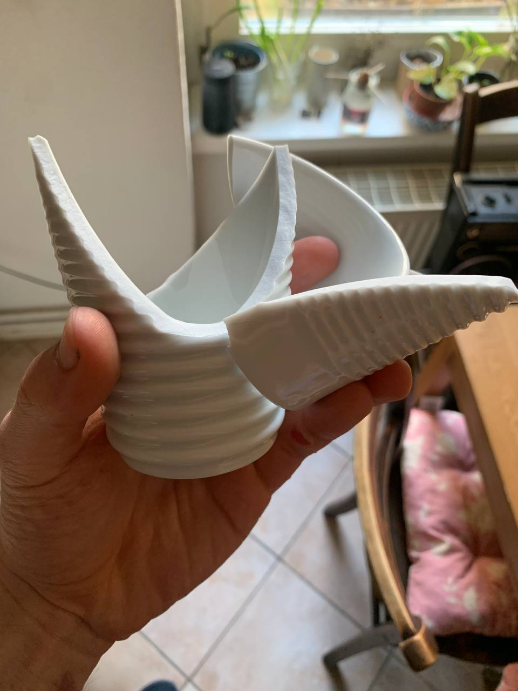 


## Questions 4 - Abstraction

### 4.1 Abstraction in Art

Chose one "traditional" painting, which is inspirational to you. The image can come from the script or you can refer to any artists or image you like.

Explain briefly what you like about the painting and how it might inspire you for your own work.
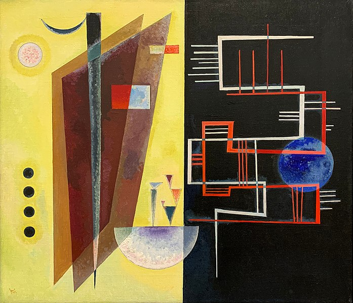


## I really like contrasts and oppositions. Be it in colours, shapes, textures or emotions, I feel that it's much more realistic, then any homogenous representation, since everything around us is the contrary of something else.

---

### 4.2 Abstracted Artistic Expression in CGI

Choose one CG image, which you like and of which you think that it has an artistic quality to it. The image doesn't need to be from the script, again you can chose any CGI image you like (it should use 3D graphics). You can find more examples in the [Summary of Artists](../../02_scripts/pgs_ss22_01_intro_script.md#summary-of-artists) section.

Explain briefly what you like about the image and why you consider it to be somewhat a pice of art.


### **Sage Jenson**

[Link to the picture](https://cargocollective.com/sagejenson/tapestries)

### Since it is a super tall picture, I just linked his website, where one might find very mesmerizing artworks. ###
### I find Sage's works the most inspiring from the whole digital artist scene. They show something very organic, that microscopes can not capture yet. They base they're works on biological papers, writing the code of different kinds of growth. As an artist, I feel like they are a bridge themself between the nature and digital world. Their sketches are also available on the site, I really recommend checking them out. 

---

P.S.
[female digital artits](https://www.instagram.com/velvet_kaoru/) 

(Velvet follows many super-cool female artists):

