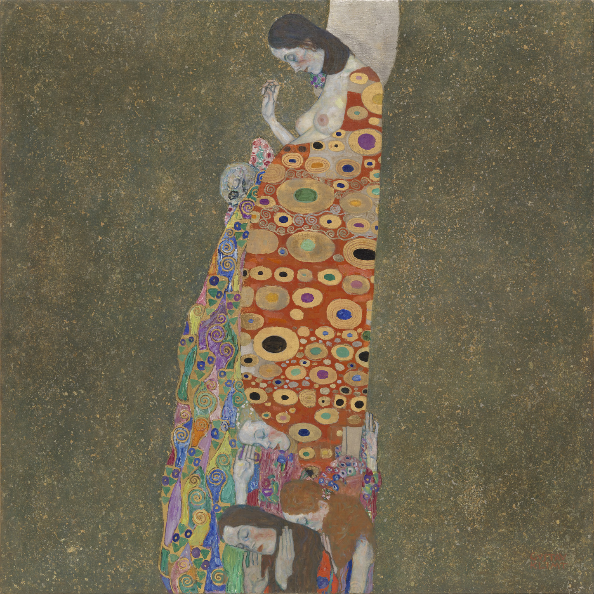
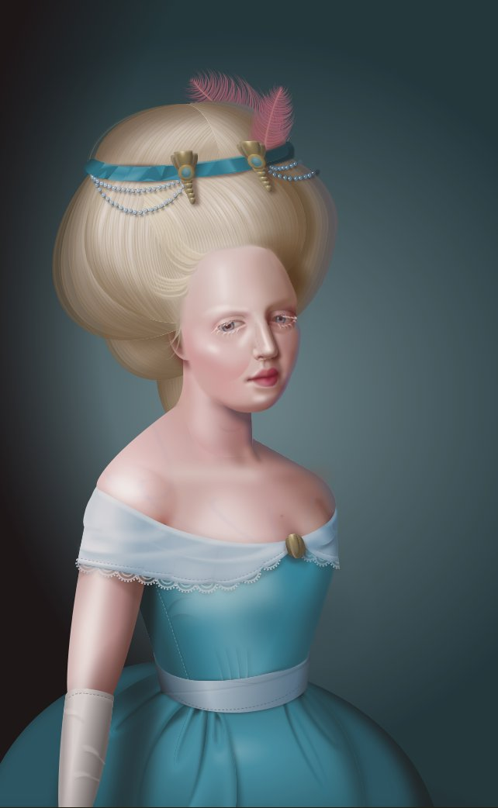

**Procedural Generation and Simulation**

# Questions Session 01

* [Questions Session 01](#questions-session-01)
    * [Questions 1 - Topics & Syllabus](#questions-1---topics--syllabus)
    * [Questions 2 - Procedural Generation](#questions-2---procedural-generation)
    * [Questions 3 - Patterns](#questions-3---patterns)
        * [3.1 Seeing Patterns](#31-seeing-patterns)
        * [3.2 Understanding and Implementing Patterns](#32-understanding-and-implementing-patterns)
        * [3.3 Seeing Faces](#33-seeing-faces)
    * [Questions 4 - Abstraction](#questions-4---abstraction)
        * [4.1 Abstraction in Art](#41-abstraction-in-art)
        * [4.2 Abstracted Artistic Expression in CGI](#42-abstracted-artistic-expression-in-cgi)

## Questions 1 - Topics & Syllabus

* Which of the chapter topics given in the syllabus are of most interest to you? Why?
> Given that Houdini and all its features are pretty new to me, all chapters are of interest to me.
> A few years ago I tried to build an electric guitar with blender (using Google and lots of luck), I am hoping
> to now at least be able to understand some tools within the software.
> I am also really interested in visual effects and therefore pretty excited about moving particles and dynamics.

* Are there any further topics in regard to procedural generation and simulation that would interest you?
> Not a topic, but I am excited to apply the acquired knowledge and try to create realistic scenes.

* Which tool would you personally prefer to use for the practical tasks (e.g. Houdini, Unreal, Unity, Maya, Blender, JavaScript, p5, GLSL, ...)?
> I have only had a brief encounter with Unity yet and did not like it that much. Blender would also be interesting 
> in order to finally understand the software better and maybe finish that guitar (see above). 
> Given that most software in that field has similarities, the things I have learned about Houdini can probably be applied to Blender as well.

* How would you rate your level of experience with SideFX's Houdini?
    * [ ] I have only used it in TI
    * [x] Novice
    * [ ] Intermediate
    * [ ] Advanced
    * [ ] God-like

## Questions 2 - Procedural Generation

Briefly in your own words: how would you explain your nanny what *procedural generation* means?
> Procedural generation is the automated generation of data that uses a set of rules rather than 
> having to code everything manually. It is very scalable due to its autonomy.

## Questions 3 - Patterns

### 3.1 Seeing Patterns

Take at least three pictures of natural patterns and at least three pictures of man-made ones (patterns can be two or three dimensional). Try to include at least one pattern with self-similarity. Taking the pictures with your smart phone is just fine. Link all images in this markdown file.

### 3.2 Understanding and Implementing Patterns

Write for one of your pattern images a generating algorithm in pseudo-code or code. Submit the code below.

### 3.3 Seeing Faces

As an exercise to see and understand the environment around you (and to have some fun 😊), try to find at least two faces. Link all images in this file.

[Image sources left to right, top to bottom: [1](https://www.google.com/imgres?imgurl=https%3A%2F%2Fpbs.twimg.com%2Fprofile_images%2F378800000719377900%2F45f6f5459fe0d5678de052e8741700d0_400x400.jpeg&imgrefurl=https%3A%2F%2Ftwitter.com%2Ffacespics&docid=JoT1wUHfRfTWbM&tbnid=x30M4EKn_ft1wM%3A&vet=10ahUKEwisyqXc27_hAhXGJlAKHXNpArEQMwg_KAAwAA..i&w=400&h=400&bih=915&biw=1680&q=faces%20in%20things&ved=0ahUKEwisyqXc27_hAhXGJlAKHXNpArEQMwg_KAAwAA&iact=mrc&uact=8#h=400&imgdii=PorYURvb5HYYdM:&vet=10ahUKEwisyqXc27_hAhXGJlAKHXNpArEQMwg_KAAwAA..i&w=400), [2](https://www.themarysue.com/things-that-look-like-faces-pareidolia/), [3](https://www.themarysue.com/things-that-look-like-faces-pareidolia/), [4](http://www.abovetopsecret.com/forum/thread1159632/pg1), [5](https://lockerdome.com/buzzfeed.com/6814745186674964), [6](https://twitter.com/FacesPics/status/1086717380837953536), [7](https://laughingsquid.com/faces-in-things-funny-photos-of-objects-that-appear-to-have-faces/), [8](https://twitter.com/facespixx)]

## Questions 4 - Abstraction

### 4.1 Abstraction in Art

Chose one "traditional" painting, which is inspirational to you. The image can come from the script or you can refer to any artists or image you like.

**Gustav Klimt**
Hope, II (1907-08)

Explain briefly what you like about the painting and how it might inspire you for your own work.
> I saw this painting by Klimt at MoMa in 2015 and was mesmerized by its colors. The grainy dark background represents 
> such a nice contrast to the golden robe. I also like the use of simple shapes that come together as one.

### 4.2 Abstracted Artistic Expression in CGI

Chose one CG image, which you like and of which you think that it has an artistic quality to it. The image doesn't need to be from the script, again you can chose any CGI image you like (it should use 3D graphics). You can find more examples in the [Summary of Artists](../../02_scripts/pgs_ss22_01_intro_script.md#summary-of-artists) section.

Explain briefly what you like about the image and why you consider it to be somewhat a pice of art. 
> This is a slightly different interpretation of the question but I found this a while ago and thought it was worth a mention!
> The above portrait is made entirely from CSS and HTML. What I like about it is that
> older browser versions interpret the styles differently so it might actually be evolving still!
> [CSS Art](https://digg.com/2018/purecss-francine)

