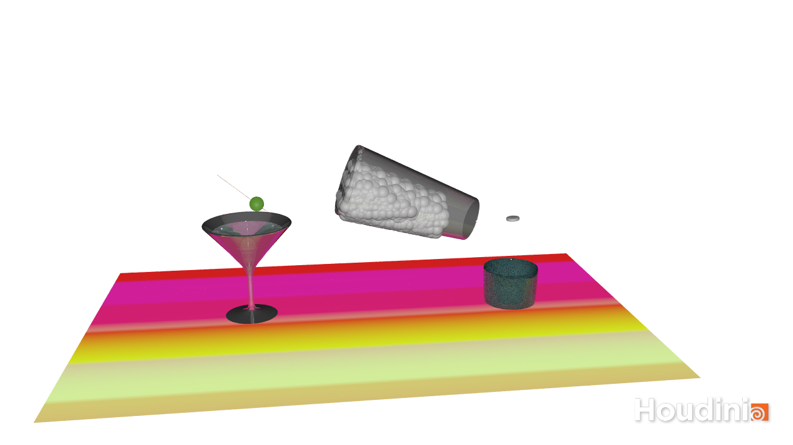

# Final Mini Project

### Abstract
A few lectures ago I decided to complete the FLIP Interface Reactions tutorial. 
It took me some time to make it work, but it was very rewarding, and I was intrigued to see what else I could do with it.
Given my interest in visual effects I like somewhat realistic scenes and wanted to create some more fluid reactions.

### Concept
I wanted to create a Martini glass that has an olive falling into it and (as a hangover cure) a glass that has
an Aspirin thrown into it, that is then topped with water from a carafe.

### Implementation
In the beginning I had a clear vision and steps in mind:
1. Model glasses for the scene
2. Create Aspirin, olive and table cloth geometries
3. Set volume limits for the liquid -> glass collider

Little did I know how many days this endeavor would take haha.

### Results

First try

Unfortunately, the rendering took up to 8 hours for one frame at one point, so after frame 22 I had to stop – this is
the result!

### Project Reflection & Discussion
It is very rewarding when things are working out but equally frustrating when they are not! I have watched a few 
tutorials beforehand and at some point was really impressed that I knew what tools to use and properties to tweak in 
order to achieve a certain behavior. I feel pretty comfortable with 
Houdini now and had lots of fun working with it. 

Tutorials I would recommend:
- https://www.youtube.com/watch?v=_6SQPc961ZE&t=333s
- https://www.youtube.com/watch?v=VbpnGHacARo (from the lecture)

### Lessons Learned
I have learned a lot of lessons after sitting in front of my laptop all night waiting for the dopnet to cook:
* Turn off the "Auto Update" for the Render and Scene View when working with lots of geometries
* Particle fluid surface and flip object need to have the same particle separation
* For faster rendering the particle separation needs to be rather small
* To blast an object the Scene View needs to be on "Auto Update" and primitive type of curve needs to be a polygon

One of the biggest takeaways had to do with the merge tool. I started new projects and remodeled countless glasses and
carafes because I could not believe that pouring a glass of water without having it spill through the glass could be 
that big of a challenge until finally – by accident - I clicked on the merge tool and realized that the key to making 
it work was to change the order of objects within the merge tool – because the left inputs affect the right input (in my case).
After that the water stayed inside the cup and everything was great.

Here is a screenshot collection of some fun little problems:

Curve was not drawn around origin but revolve starts at origin

Water spills out through glass but not through carafe

Glass is transparent but only fluids with 0 transparency show through it? -> could not fix it

