**Procedural Generation and Simulation**

# Questions Session 01

* [Questions Session 01](#questions-session-01)
    * [Questions 1 - Topics & Syllabus](#questions-1---topics--syllabus)
    * [Questions 2 - Procedural Generation](#questions-2---procedural-generation)
    * [Questions 3 - Patterns](#questions-3---patterns)
        * [3.1 Seeing Patterns](#31-seeing-patterns)
        * [3.2 Understanding and Implementing Patterns](#32-understanding-and-implementing-patterns)
        * [3.3 Seeing Faces](#33-seeing-faces)
    * [Questions 4 - Abstraction](#questions-4---abstraction)
        * [4.1 Abstraction in Art](#41-abstraction-in-art)
        * [4.2 Abstracted Artistic Expression in CGI](#42-abstracted-artistic-expression-in-cgi)

## Questions 1 - Topics & Syllabus

* Which of the chapter topics given in the syllabus are of most interest to you? Why?

  * I'm generally interested in learning Houdini, and the topics from the syllabus that interest me specifically are Agency and Complex Systems. I'm interested in those topics because I am least familiar with them, and would like to learn more about programming agents as well as rendering fluid simulations. I think the beauty in procedural systems is often in ordered complexity, so I am very interested in learning more about those types of systems.
* Are there any further topics in regard to procedural generation and simulation that would interest you?

  * Although I know the focus of this course is more on the abstract design aspects of procedural generation, I would be interested in a course that dives deeper into the realistic rendering capabilities of Houdini.
* Which tool would you personally prefer to use for the practical tasks (e.g. Houdini, Unreal, Unity, Maya, Blender, JavaScript, p5, GLSL, ...)?
  * I would like to use Houdini, Blender, Javascript, GLSL, Touch Designer, and if possible, try to incorporate some Unreal (that might be a reach goal) 
* How would you rate your level of experience with SideFX's Houdini?
    * [ ] I have only used it in TI
    * [x] Novice
    * [ ] Intermediate
    * [ ] Advanced
    * [ ] God-like

## Questions 2 - Procedural Generation

Briefly in your own words: how would you explain your nanny what *procedural generation* means?

* Procedural generation is like writing a recipe for someone else to cook a very complex dish, but in this case, the dish is a piece of art, and the chef is a computer that executes your code, or recipe. By knowing how the computer likes to cook, we can modify the recipe to get the dish to turn out the way we like, but there's also some elements of randomness or unexpected-ness that might actually inspire us and make the dish better.

## Questions 3 - Patterns

### 3.1 Seeing Patterns

Take at least three pictures of natural patterns and at least three pictures of man-made ones (patterns can be two or three dimensional). Try to include at least one pattern with self-similarity. Taking the pictures with your smart phone is just fine. Link all images in this markdown file.

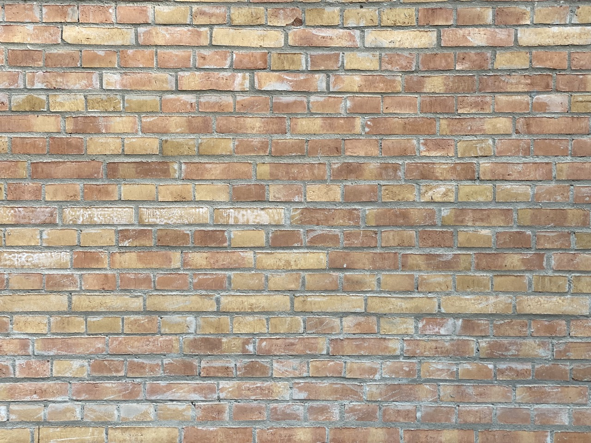
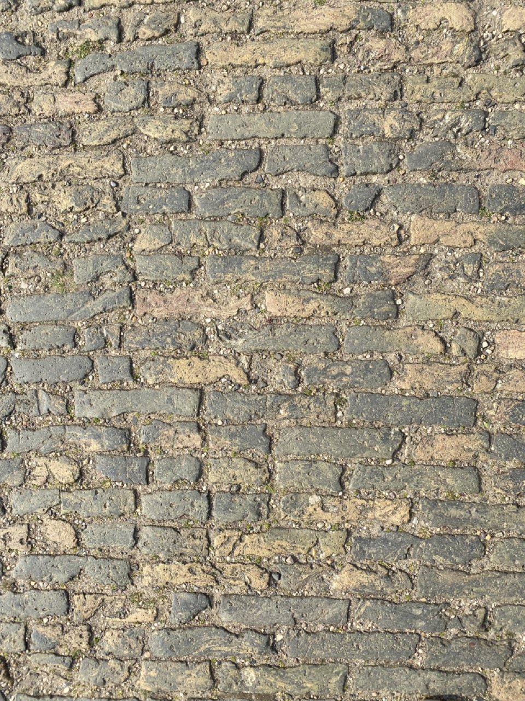
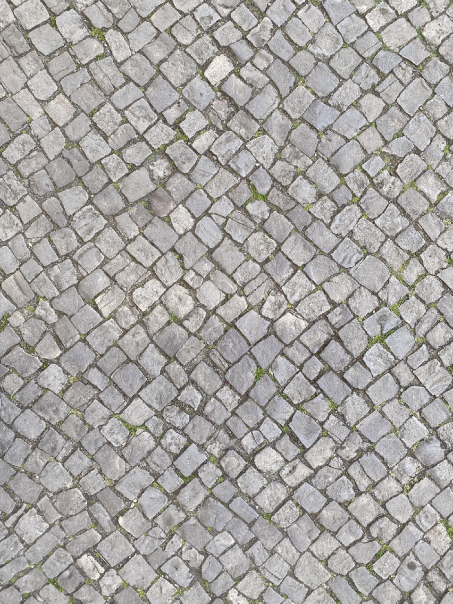
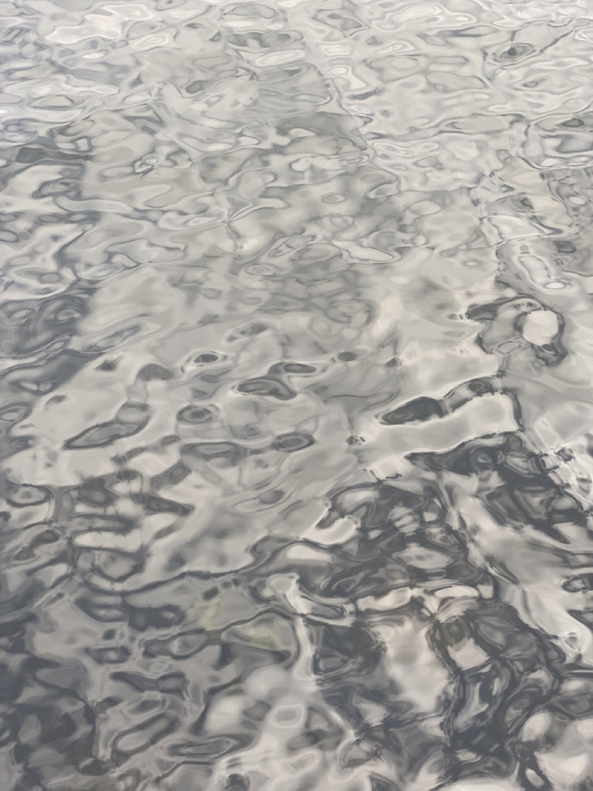
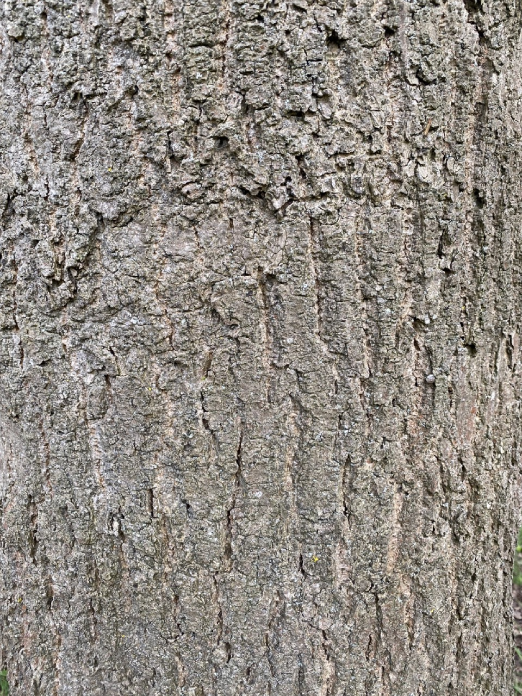
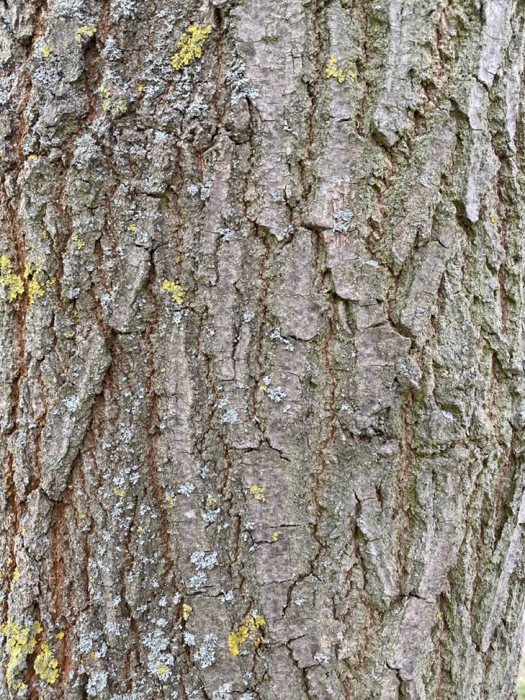
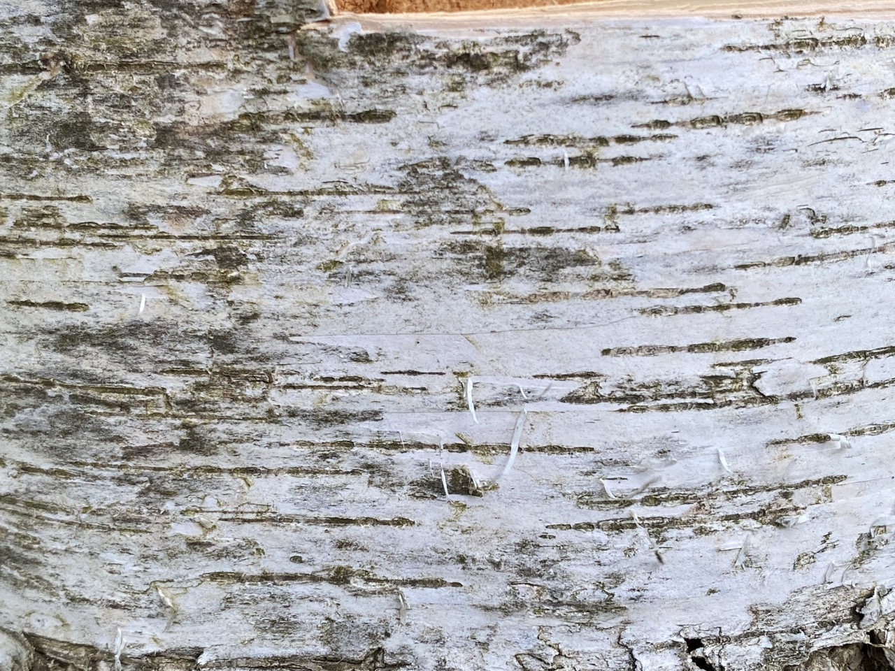
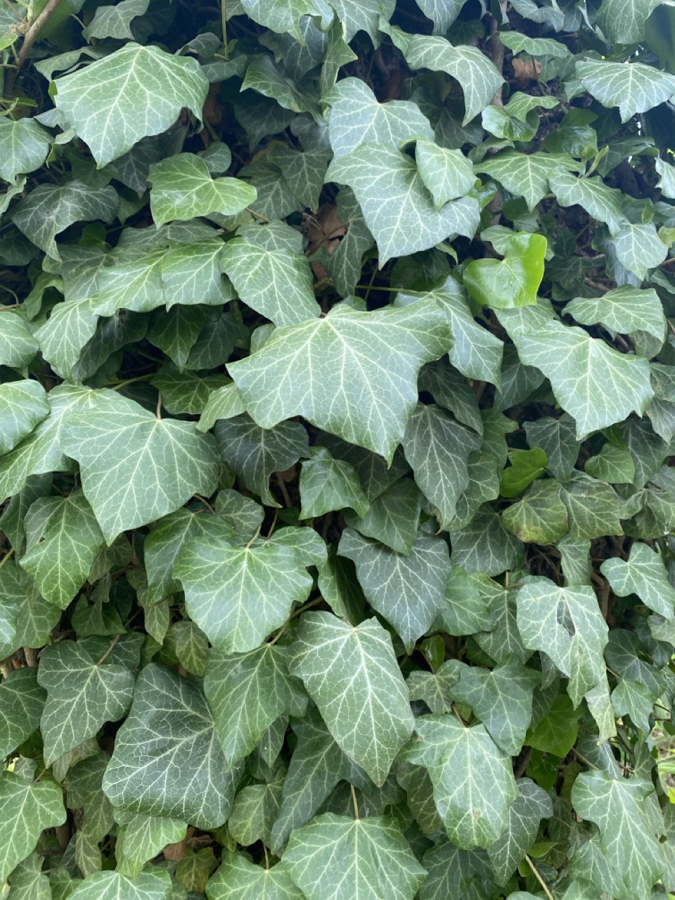

### 3.2 Understanding and Implementing Patterns

Write for one of your pattern images a generating algorithm in pseudo-code or code. Submit the code below.

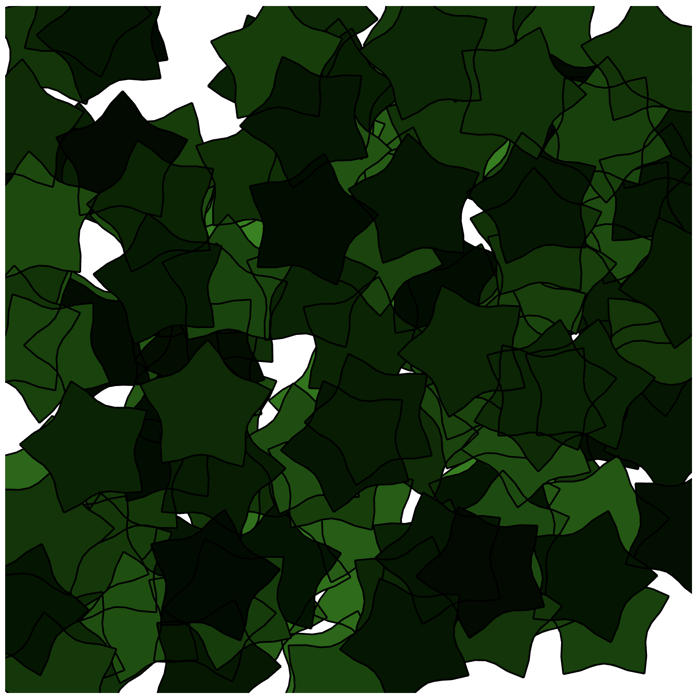

This is an abstract implementation of the leaf pattern in the last photo in P5.js. It uses a formula I found in TBAG last semester to procedurally generate the leaf shapes from a few parameters, and randomly fills the canvas with the resulting shape. Each parameter can be changed, which would result in different leaf shapes. I've also colored the leaves based on a randomly assigned depth layer, so that leaves further down have a lower maximum green brightness.

The formula:

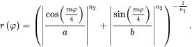

The code:

```javascript
let canvasWidth = 800
let canvasHeight = 800
let maxLeafDepth = 3;
let numLeaves = 150;

//Superformula parameters for leaf shape
let a = 12;
let b = 12;
let m = 25;
let n1 = 5;
let n2 = 8;
let n3 = 8;

function setup() 
{
	createCanvas(canvasWidth, canvasHeight, WEBGL);
    translate((-1 * canvasWidth / 2), (-1 * canvasHeight / 2))

    for (let i = 0; i < numLeaves; i++) {
        push();
        let depthLayer = random(1, maxLeafDepth);
        translate(random(0, canvasWidth), random(0, canvasHeight));
        rotateZ(random(0, PI))
        beginShape();
            stroke(0)
            fill(0, random(10, 50 * depthLayer), 0);
            strokeWeight(2);
            for (let theta = 0; theta < TWO_PI; theta+=TWO_PI/30) {
                radius = superFormula(theta, a, b, m, n1, n2, n3);
                let x = cos(theta) * radius;
                let y = sin(theta) * radius;
                let z = depthLayer * -1;
                vertex(x, y, z);
            }
        endShape(CLOSE);
        pop();
    }

}

function draw()
{

}

function superFormula(theta, a, b, m, n1, n2, n3){
    return Math.pow(((Math.pow(abs((cos((m * theta) / 4.0)) / a), n2)) + (Math.pow(abs(sin((m * theta) / 4.0) / b), n3))), (-1.0 / n1))
}
```

### 3.3 Seeing Faces

As an exercise to see and understand the environment around you (and to have some fun 😊), try to find at least two faces. Link all images in this file.

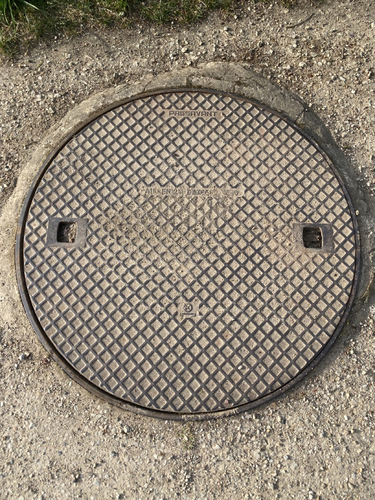
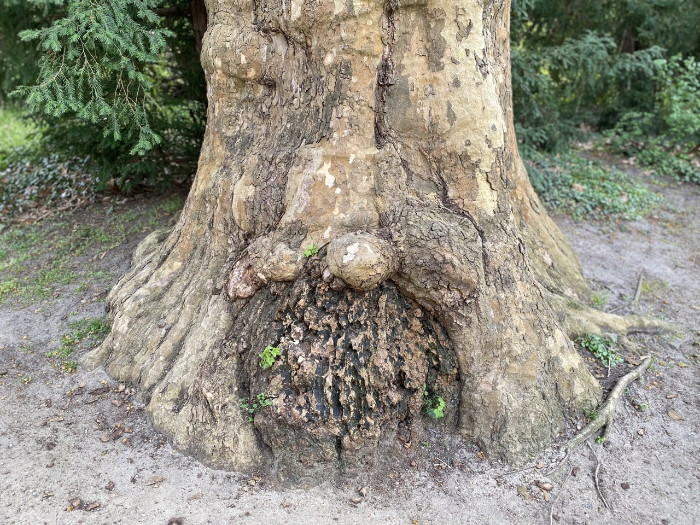
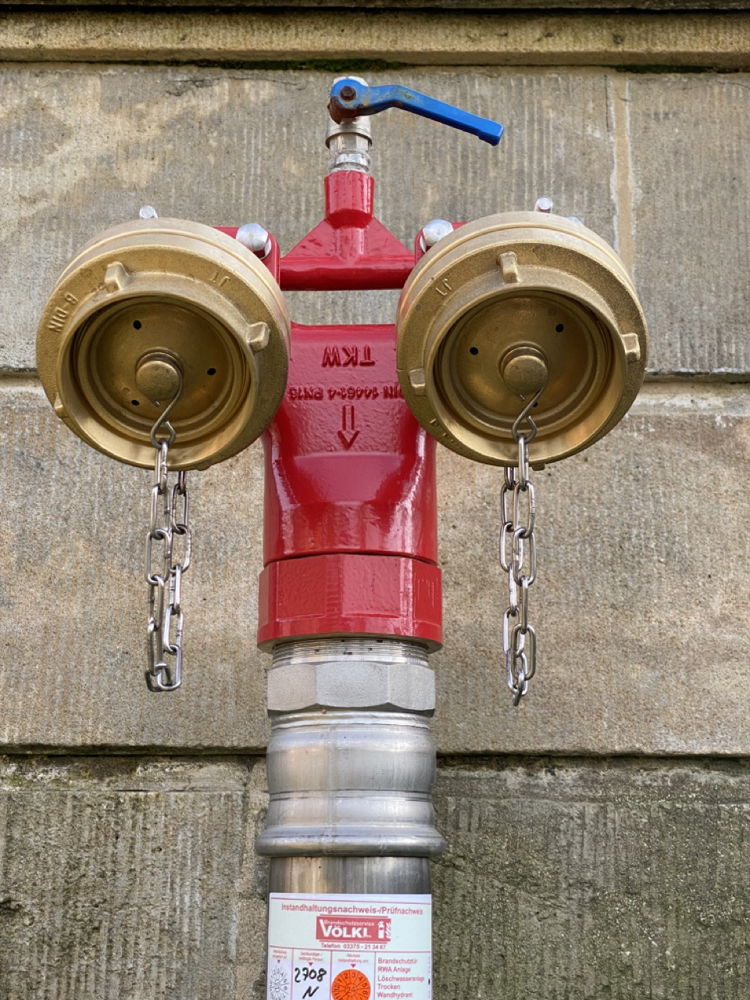

## Questions 4 - Abstraction

### 4.1 Abstraction in Art

Chose one "traditional" painting, which is inspirational to you. The image can come from the script or you can refer to any artists or image you like.  

Explain briefly what you like about the painting and how it might inspire you for your own work.

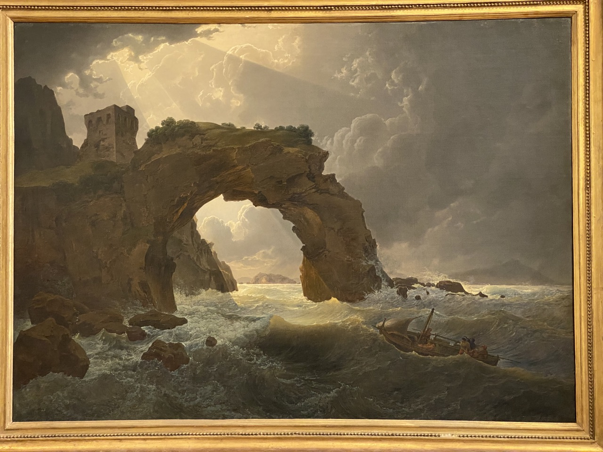

This painting by Joseph Rebell which I saw in a gallery in Vienna inspires me because of its use of volumentric light and atmosphere, as well as the interaction between the lighting and the complex 'fluid simulations' of the clouds and turbulent water. I am very impressed with the realistic way that Rebell pictured these phenomena by hand.

### 4.2 Abstracted Artistic Expression in CGI

Chose one CG image, which you like and of which you think that it has an artistic quality to it. The image doesn't need to be from the script, again you can chose any CGI image you like (it should use 3D graphics). You can find more examples in the [Summary of Artists](../../02_scripts/pgs_ss22_01_intro_script.md#summary-of-artists) section.  

Explain briefly what you like about the image and why you consider it to be somewhat a pice of art. 

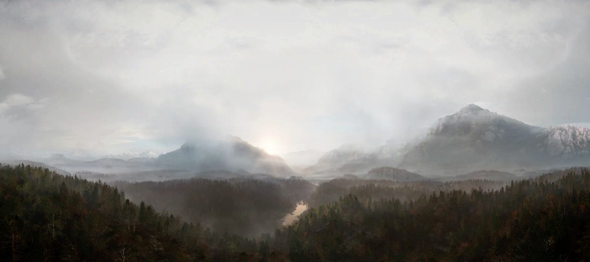

This is a still from a 360 video created in Cinema4D by the VR artist Marc Zimmermann called "Longing For Wilderness". In it, the viewer is transported from a busy city environment at night to a beautiful mountain landscape, and it evokes a feeling of scale and awe that I haven't seen in too many other 360 pieces.
