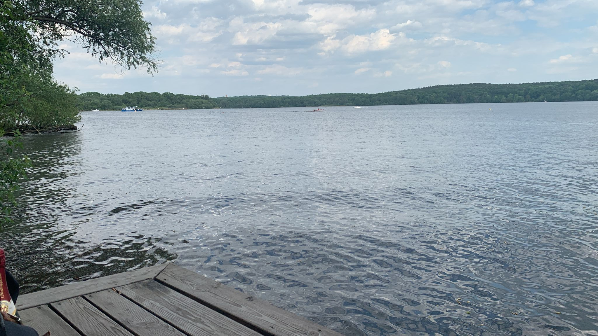
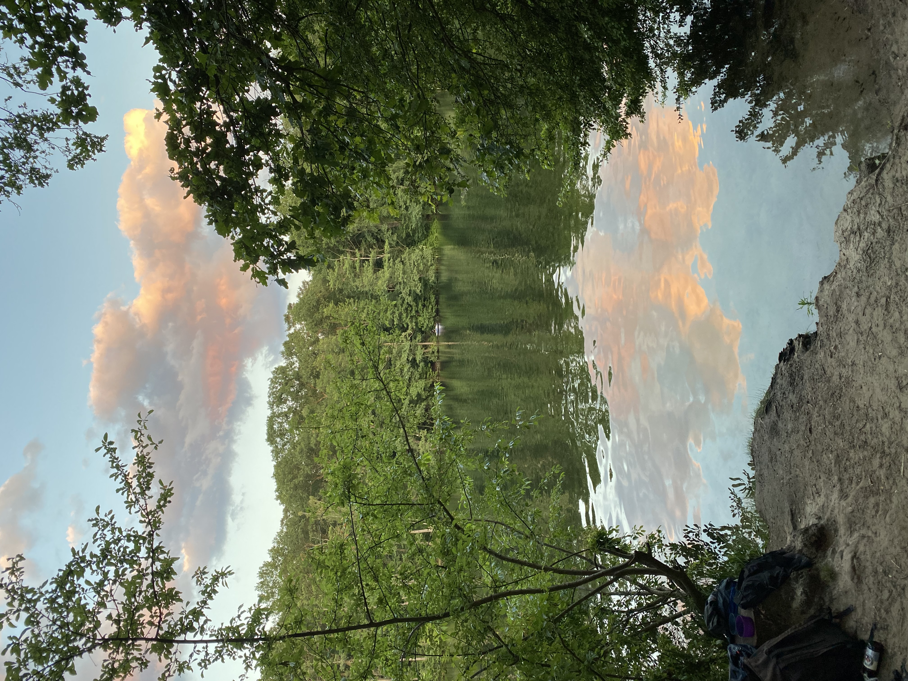
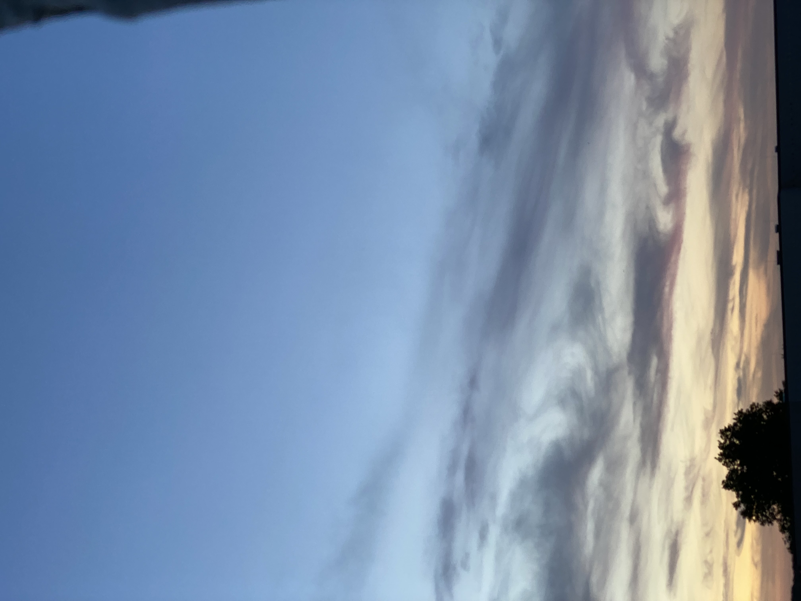
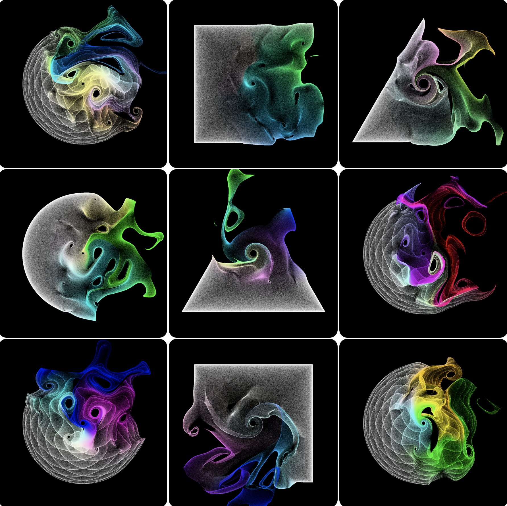

# Procedural Generation and Simulation

Prof. Dr. Lena Gieseke \| l.gieseke@filmuniversitaet.de \| Film University Babelsberg KONRAD WOLF

# Questions Session 06

* [Procedural Generation and Simulation](#procedural-generation-and-simulation)
* [Questions Session 06](#questions-session-06)
    * [Chapter 06 - Seeing Noise](#chapter-06---seeing-noise)

## Chapter 06 - Seeing Noise 

* Submit at least three pictures of natural noise patterns. You can photograph them yourself (recommended) or find them on the internet.

* Submit one stylized / artistic image that uses noise as generating principle or design element. You can find it on the internet.

[Link to Source](https://twitter.com/canvas_51/status/1538569504996958214/photo/1)

Link all images in this file.

