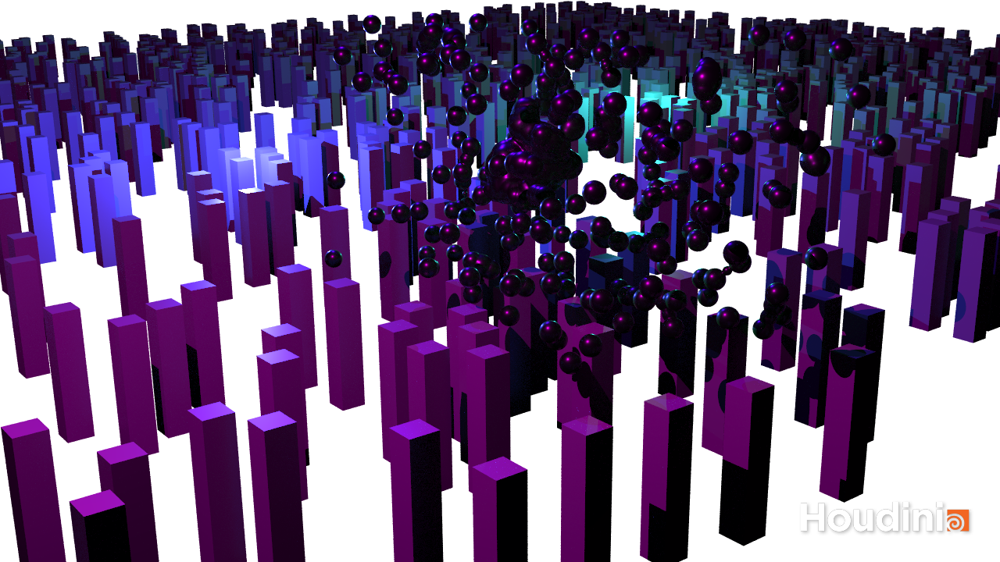

# Procedural Generation and Simulation

Prof. Dr. Lena Gieseke \| l.gieseke@filmuniversitaet.de \| Film University Babelsberg KONRAD WOLF

# Session 07

We will discuss this session on **Monday, July 11th**.   

This session should take less than 5h.

## Task 1: Chapter 07 - Particles

* Read [Chapter 07 - Particles](../../02_scripts/pgs_ss22_08_particles_script.md)

## Task 2: Boids

This tutorial is a hand-made [Boids](http://www.red3d.com/cwr/boids/) particle simulation from scratch. 

  
   

Go through the tutorial and make the example your own.  

### Resources

* Start with this Houdini file: [tutorial_05_swarm_start.hipnc](tutorial_05_swarm_start.hipnc)  
* All code: [tutorial_05_swarm_code.md](tutorial_05_swarm_code.md)
    * I do not type the code in the tutorial but copy & past it. It is up to you to decide whether you also want to simply copy & paste the code or type it yourself. I personally feel like that typing code also helps me to understand it.

### Videos

* [Intro](https://drive.google.com/file/d/1YWuFcIVImTqkta4Ov3sO7FRfeZrXKkLq/view?usp=sharing) (21:51 min)
* [Moving](https://drive.google.com/file/d/1AT9PNayC8C1AoeTcB2RgiFbKnihlZrDm/view?usp=sharing) (29:05 min)
* [Separation](https://drive.google.com/file/d/1EsKMdmgBNUdWMJTSsSuhwE7dFLPQ4_GT/view?usp=sharing) (21:33 min)
* [Alignment and Cohesion](https://drive.google.com/file/d/1svxZ3mP5ZTIlyFeStkif-0h7mBZE9k8x/view?usp=sharing) (24:49 min)
* [Geometry and Rendering](https://drive.google.com/file/d/1kNZXDUK0WPMq7slVmGjelIP3i6vkcgeH/view?usp=sharing) (38:54 min)

Or download all videos at once from [this folder](https://drive.google.com/drive/folders/1uefzYAQ7hQg_OI64ylIa3Ff9vRZOax-g?usp=sharing).

*Please do not share these videos*.

### Reference

* [Swarm Intelligence](https://www.youtube.com/watch?v=dUec3GXc6Tg) by Junichiro Horikawa.
* [Swarm System](https://www.patreon.com/posts/houdini-tutorial-26863021) by Doxia Studio.

Submit your houdini file as `pgs_ss22_tutorial_05_lastname.hipnc`, at least one image file as `pgs_ss22_tutorial_05_lastname.png` and one animation as `pgs_ss22_tutorial_05_lastname.gif`.

---

**Happy Simulating!**
In this render, I modified the tutorial output by using metaballs instead of primitive geometry, which resulted in this kind of pulsating ball of slime / goo? 

In the beginning of the shot, the attraction force is still great enough to keep all the particles in the center of the ball, but as some parts start to escape, the attraction center becomes unstable and it starts a chain reaction that causes more and more of the mass to escape. The reaction becomes faster and faster until at the end, the attraction of the swarm becomes diffused and many parts can escape.

