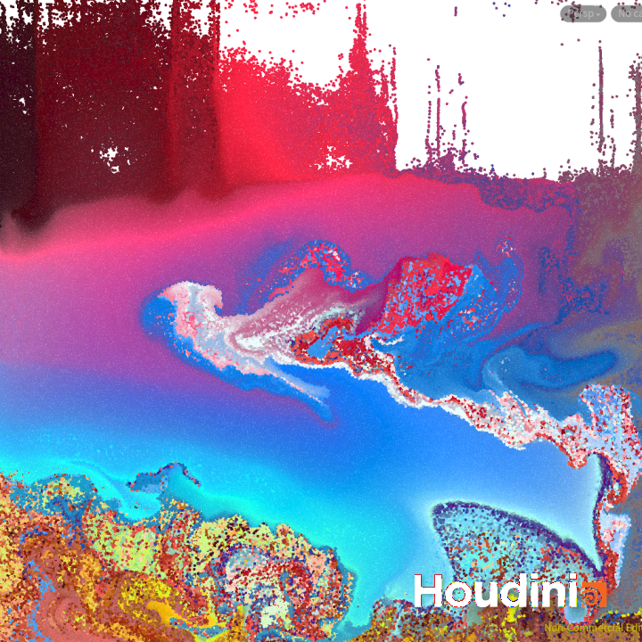
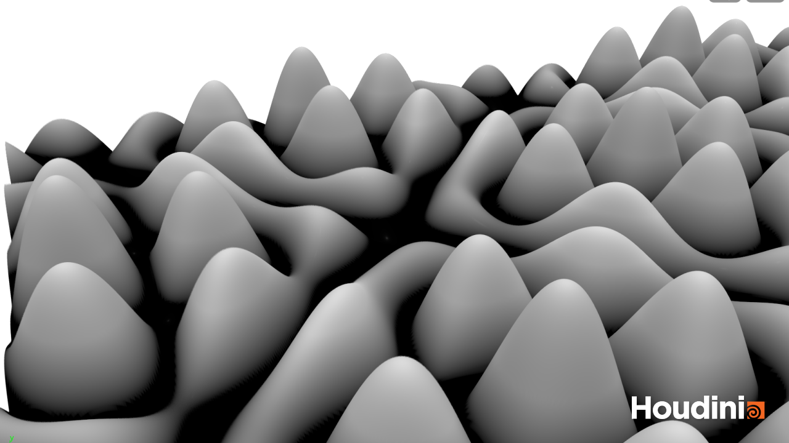

# Procedural Generation and Simulation

Prof. Dr. Lena Gieseke \| l.gieseke@filmuniversitaet.de \| Film University Babelsberg KONRAD WOLF

# Session 08

This session should take less than 3h.

## Task 1 - Learning More About Fluids (or Ignoring Fluids and Working with Audio in Houdini)

### Option 1

* Read the original paper [Real-Time Fluid Dynamics for Games](https://www.dgp.toronto.edu/public_user/stam/reality/Research/pdf/GDC03.pdf) from Jos Stam
    * The additional resources in the slides might also help for a better understanding
* Start to implement the paper yourself
    * C++ is a good choice here!
    * For glsl you will probably need to use textures as data structures - manageable but an additional challenge
    * p5

Submit your code however far you got in the given as `pgs_ss22_08_lastname.xx`, and if possible image file as `pgs_ss22_08_lastname.png`.

### Option 2

Chose any fluid-related Houdini tutorial. For example:

* [Doxia Studio: Mix Fluids From Image](https://www.youtube.com/watch?v=aT4mZphB154&t=230s)
* [VoxelFX: Introduction to fluid simulations #1 - FLIP fluid tools - Houdini 18](https://www.youtube.com/watch?v=UQXS12sj9IA&t=42s), [#2 - Colliders](https://www.youtube.com/watch?v=2H1EWhvMewk), [#3 - Forces](https://www.youtube.com/watch?v=tAio77ZdKos)
* [Houdini Liquid Flow Tutorial](https://www.youtube.com/watch?v=_0QzfR-i2Os)
* [CG Wiki - Flip Fluids](https://www.tokeru.com/cgwiki/index.php?title=HoudiniDops#Flip)
* ...

Submit your houdini file as `pgs_ss22_08_lastname.hipnc` and at least one image file as `pgs_ss22_08_lastname.png`.

I completed the first tutorial ([Doxia Studio: Mix Fluids From Image](https://www.youtube.com/watch?v=aT4mZphB154&t=230s)) and generated the following image and animation from a source image:

[source image](https://wallpapercave.com/wp/wp3144233.jpg)

[VIDEO](./imgs/pgs_ss22_fluids_ho.mp4)

### Option 3 - ***I integrated this tutorial into my final project***

If fluids are at this point not of interest to you, alternatively you can complete the following tutorial from Simon Stimberg that connects Audio to Houdini.

* [Tutorial 07](tutorial_07_audio.md)

Go through the tutorial and make the example your own.  

Submit your houdini file as `pgs_ss22_tutorial_07_lastname.hipnc`, at least one image file as `pgs_ss22_tutorial_07_lastname.png` and one animation as `pgs_ss22_tutorial_07_lastname.xx`.

---

**Happy Flowing!**
