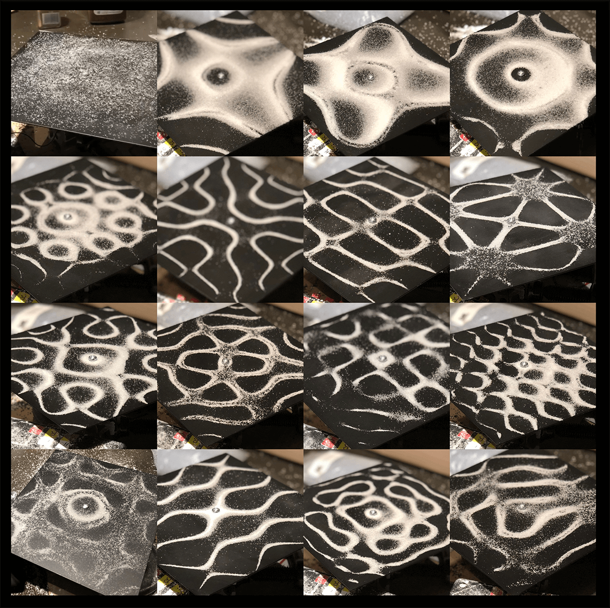
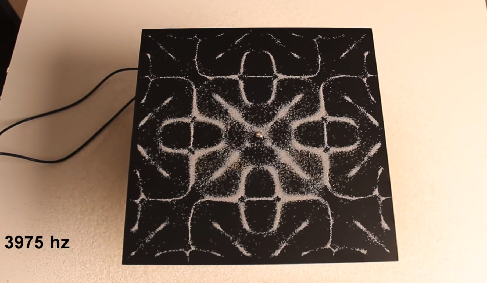
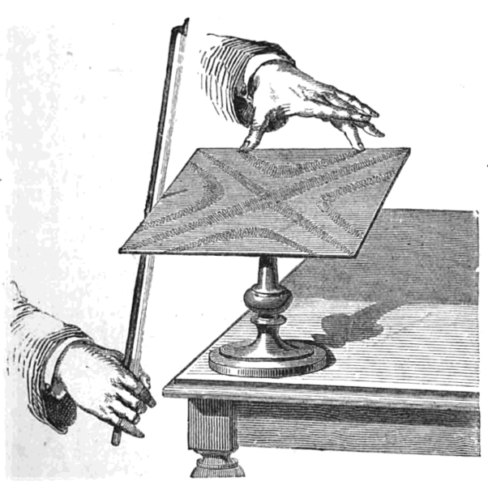
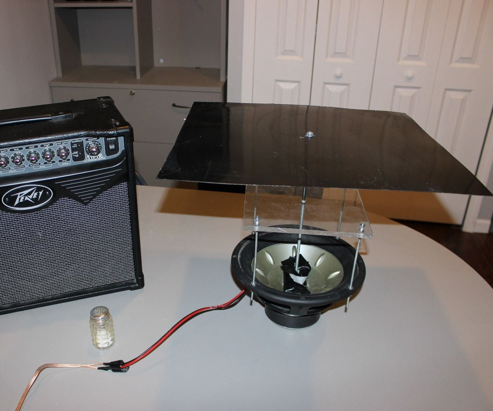
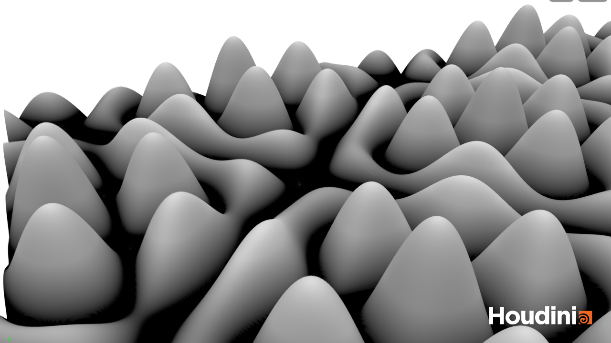

# Abstract
For my final project, I created a digital version of a Chladni Plate, parameterized the simulation and animated it procedurally using an audio input. It runs in near real-time and can be played in either particle sim mode or shaded mode.

# Concept


[CYMATICS: Science Vs. Music - Nigel Stanford - YouTube](https://www.youtube.com/watch?v=Q3oItpVa9fs)



[Amazing Resonance Experiment! - YouTube](https://www.youtube.com/watch?v=wvJAgrUBF4w)

For this project, I was inspired by a physical phenomena, that can be observed when vibrating small particles on a metal plate at a certain frequency. It was first described by and named after the mathematician Ernst Chladni in 1787 in his book *Entdeckungen über die Theorie des Klanges*. In his experiment he used a violin bow to vibrate a metal plate to generate patterns in randomly distributed sand on the plate. The patterns that can be generated are quite beautiful and almost emergent, when so many small particles rearrange themselves into complex shapes seemingly on their own.



[source](https://skullsinthestars.files.wordpress.com/2013/05/bowing_chladni_plate.png)

The modern version of this device involves a metal or plastic plate attached to the center of a vibrating speaker, with sand or salt grains to visualize the patterns of standing frequencies, or areas where the plate's vibration causes the particles to find equilibrium.



I wanted to create a digital version of this device, that can be triggered with certain frequencies and organizes particles into emergent patterns. I'm also implementing this same concept in C++ for realtime interaction for Creative Coding II, and I wanted to use Houdini as a prototyping tool to see what patterns I could generate.

# Implementation

To implement this device in Houdini, I found [this tutorial](https://www.youtube.com/watch?v=wEXaBtZFgWE) by Junichiro Horikawa, which goes into an implementation example. The tutorial follows previous work from [Paul Borke](paulbourke.net/geometry/chladni/), and uses his version of Chladni's original equations for the implementation. From Paul Borke's site,

*"the equation for the zeros of the standing wave on a square Chladni plate (side length L) constrained at the center is given by the following.*"

cos(n pi x / L) cos(m pi y / L) - cos(m pi x / L) cos(n pi y / L) = 0

by parameterizing M, N, we can get transitions between patterns that result in interesting patterns:


[Source: - Learning Thursdays](https://learningthursdays.com/tesla-chladni-and-yantras/)

In Houdini, I first created a grid, then used a point wrangle node to create a height for each vertex on that grid:

```vex
//add channels for control values
float n = chf("n");
float m = chf("m");
float res = chi("res");
float height = chi("height");

//define x and y resolution
int xid = @ptnum % res;
int yid = floor(@ptnum / float(res));

i@xid = xid;

//define terms for equation
float angleX = xid / float(res - 1) * $PI;
float angleY = yid / float(res - 1) * $PI;

//implement Paul Borke's Chladni formula
float c = cos(n * angleX) * cos(m * angleY) - cos(m * angleX) * cos(n * angleY);

float col = abs(c) / height;
f@col = col;

//set y height to equation output
@P.y = col;
```


I scattered points on the grid, and used a solver node to calculate the downward tangent at each point, to determine in which direction and with what magnitude the particle should move on the next frame:


```vex
//set the radius of the point and particle speed
float p_rad = chf("p_rad");
float p_speed = chf("p_speed");
float p_maxSize = chf("p_maxSize");
float p_minSize = chf("p_minSize");
int maxLife = chf("maxLife");

//offset the point from the surface by the radius so it's above the surface
@P.y += p_rad;

// set the y component of the vector to 0
vector axis = normalize(set(@N.x, 0, @N.z));

//rotate the normal 90 degrees to create a temp axis of rotation for a later step
vector4 quat = quaternion(radians(90), set(0, 1, 0));
axis = normalize(qrotate(quat, axis));

//rotate the original normal around the new rotation vector to get downward normals
vector4 quat2 = quaternion(radians(90), axis);

//set the normals to point down slope
@N = normalize(qrotate(quat2, @N));

//move the particle in the normal direction at speed p_speed
@P += @N * p_speed;
```

Then, I copy a sphere to each point and merge the geometries. To optimize memory usage, I pack the geometry to generate instanced versions of the spheres since each should be identical.

For artistic control, I put in a Controller Null that has direct access to many of the parameterized values for the simulation. I tried to pick out the parameters that have the most visual effect on the final outcome and put them all in one place. 


To drive the animation, I combined the result from the Chladni sim with Simon's tutorial from session 09, to drive the parameters using beat and envelope data. I use a low-pass filter and a trigger threshold to extract the beat signal from a piece of music (monolink - Harlem River) and use that signal to trigger a sample-and-hold node, which samples from a triangle wave function. I use a lag function to adjust the animation curves. I wanted the changes to have a punchy feel, so I used the lag function to increase the attack and slow the decay of sample-and-hold step.


# Results
Here's the Chladni particle sim running:


And here's a demo of the shaded material with audio reactivity. I find that with the shaded material it is easier to see the audio reactivity, so I prefer to play the demo in shaded mode. *Please watch the version linked below with sound!* - I couldn't embed it in markdown with sound.




# Project Reflection & Discussion

Overall I'm pretty happy with the way things turned out with this project, and it turned out quite similar to how I had imagined it in my head at the beginning of the project. I was actually more happy with the intermediate step, the shaded material, than the end particle effect, which I wasn't expecting. I have a better understanding of how I want to implement the same effect interactively in C++ and OpenFrameworks, but I fear that the Houdini version will look much better...

# Lessons Learned

I learned that things take much longer in Houdini than expected (well, I knew that a bit before :) ) but just the tutorials took me almost the whole amount of time, even though they were not that long. I didn't factor in the work needed to just understand what was happening on a conceptual basis. I was pretty satisfied at the end that I was able to integrate audio into Houdini, but there is still a bit more to learn how to optimize it for real-time playback.

During the course of the project, I wanted to find a faster way to iterate designs, and thought about integrating midi input to control some of the parameters. The interface in Houdini wasn't working too well for me, since I had to click into too many nodes to get to the parameters I wanted to change - I thought it would be much faster to have a dedicated slider or knob that I could always reach to change parameters no matter where I was in the network, and more importantly, to be able to change multiple parameters simultaneously. After about 4 hours of research into Midi input into Houdini, I found from an old forum post that Midi input is not supported on OSX or Linux 🤦

Midi not working:

https://www.sidefx.com/forum/topic/20470/?page=1#post-268988

https://www.cgcircuit.com/tutorial/rapid-asset-creation-in-houdini-and-midi

https://www.sidefx.com/forum/topic/84057/?page=1#post-363431

https://www-technical--artist-net.translate.goog/?p=1217&_x_tr_sl=auto&_x_tr_tl=en&_x_tr_hl=en

https://www.sidefx.com/forum/topic/74022/
