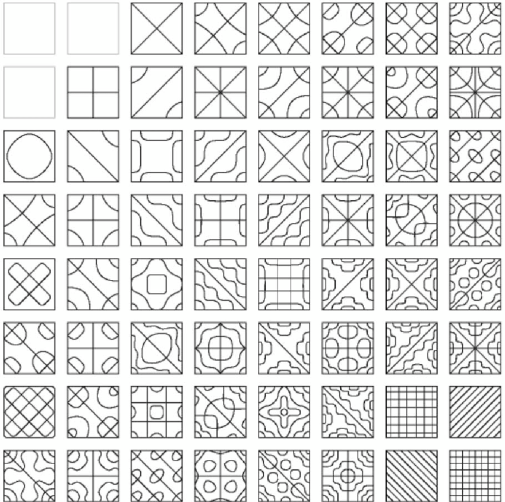

# Abstract

# Concept

For this project, I was inspired by a physical phenomena, that can be observed when vibrating small particles on a metal plate at a certain frequency. It was first described by and named after the mathematician Ernst Chladni in 1787 in his book *Entdeckungen über die Theorie des Klanges*. In his experiment he used a violin bow to vibrate a metal plate to generate patterns in randomly distributed sand on the plate. The patterns that can be generated are quite beautiful and almost emergent, when so many small particles rearrange themselves into complex shapes seemingly on their own.

[source](https://skullsinthestars.files.wordpress.com/2013/05/bowing_chladni_plate.png)

The modern version of this device involves a metal or plastic plate attached to the center of a vibrating speaker, with sand or salt grains to visualize the patterns of standing frequencies, or areas where the plate's vibration causes the particles to find equilibrium.

I wanted to create a digital version of this device, that can be triggered with certain frequencies and organizes particles into emergent patterns. I'm also implementing this same concept in C++ for realtime interaction for Creative Coding II, and I wanted to use Houdini as a prototyping tool to see what patterns I could generate.

# Implementation

To implement this device in Houdini, I found [this tutorial](https://www.youtube.com/watch?v=wEXaBtZFgWE) by Junichiro Horikawa, which goes into an implementation example. The tutorial follows previous work from [Paul Borke](paulbourke.net/geometry/chladni/), and uses his version of Chladni's original equations for the implementation. From Paul Borke's site,

*"the equation for the zeros of the standing wave on a square Chladni plate (side length L) constrained at the center is given by the following.*"

cos(n pi x / L) cos(m pi y / L) - cos(m pi x / L) cos(n pi y / L) = 0

by parameterizing M, N, we can get transitions between patterns that result in interesting patterns:

[Source: - Learning Thursdays](https://learningthursdays.com/tesla-chladni-and-yantras/)

In 

# Results

# Project Reflection & Discussion

# Lessons Learned
