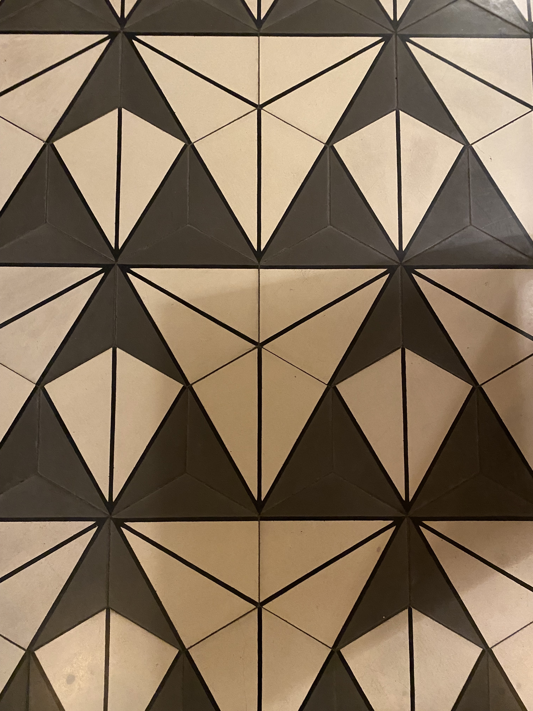
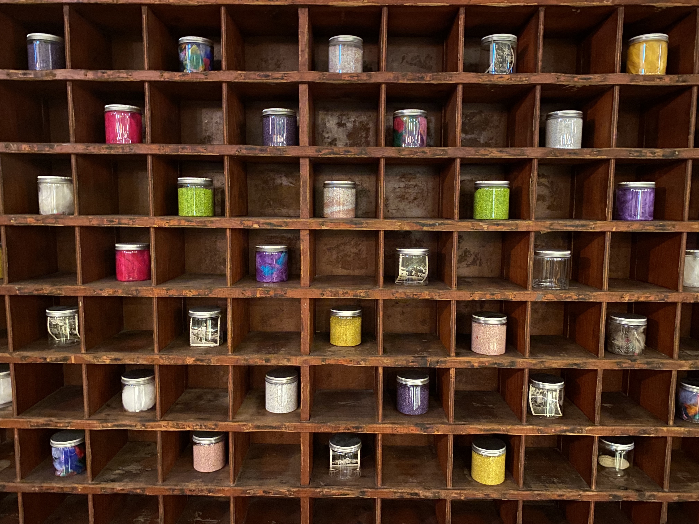
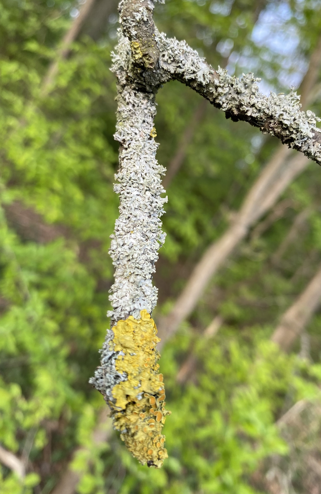
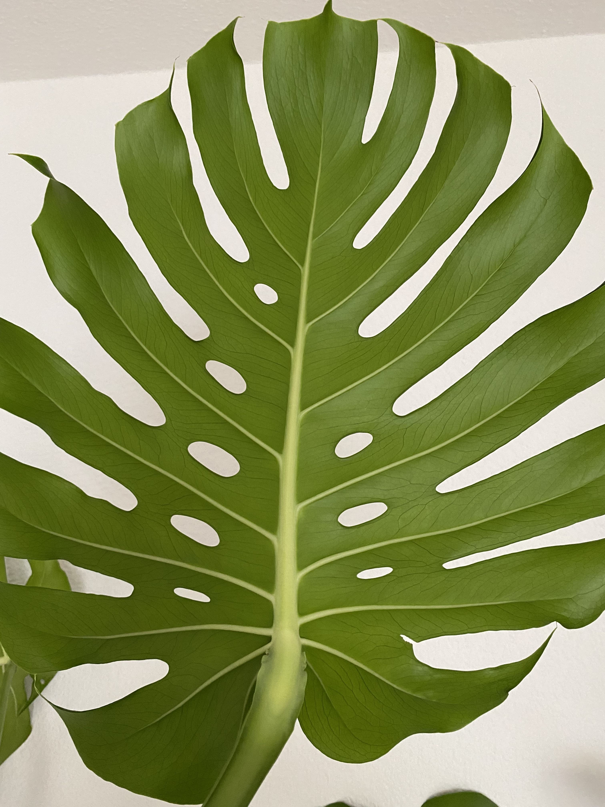
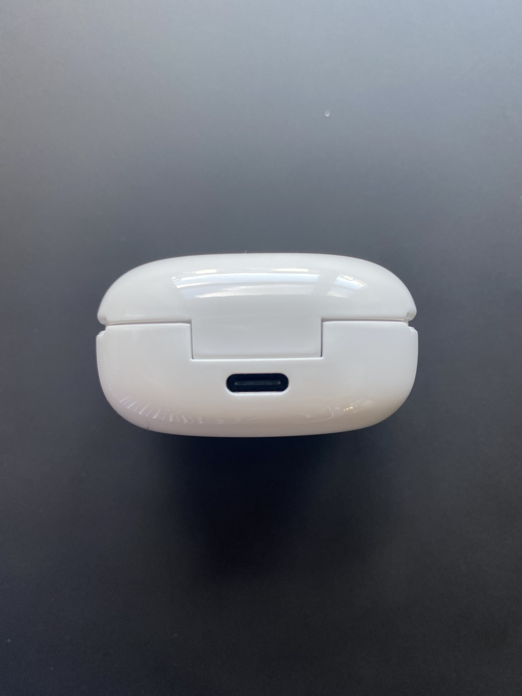
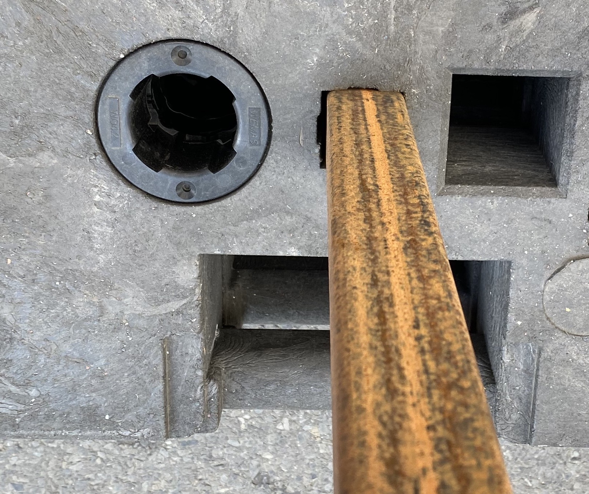
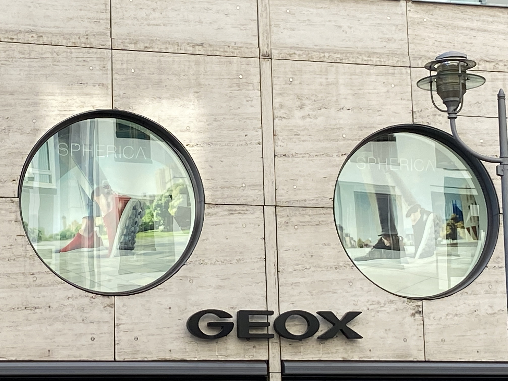

**Procedural Generation and Simulation**

# Questions Session 01

## Questions 1 - Topics & Syllabus

* Which of the chapter topics given in the syllabus are of most interest to you? Why?
    > Since I have no experience with the topic procedural generation, all the topics sound interesting to me. But what I remember most is the topic "noise". It sounds like an really powerful tool to generate endless worlds, by "controlling the randomness". I think this topic stand out the most for me, because I always ask myself how game developers of huge games can create such worlds with all the details and variance in appearance.
    
* Are there any further topics in regard to procedural generation and simulation that would interest you?
    > Because I'm completely new to this topic, I have no subtopic in my mind that could be interesting,too.

* Which tool would you personally prefer to use for the practical tasks (e.g. Houdini, Unreal, Unity, Maya, Blender, JavaScript, p5, GLSL, ...)?
    > When I choose the tool with which I have the most experience then it would be JavaScript. But after the explanation in the lecture and the fact that I like to learn something new, Houdini sounds really interesting. I rarely tried out Unity, so that one would be good, too.

* How would you rate your level of experience with SideFX's Houdini?
    * [x] Completly new
    * [ ] I have only used it in TI
    * [ ] Novice
    * [ ] Intermediate
    * [ ] Advanced
    * [ ] God-like

## Questions 2 - Procedural Generation

Briefly in your own words: how would you explain your nanny what *procedural generation* means? 

## Questions 3 - Patterns

### 3.1 Seeing Patterns

Take at least three pictures of natural patterns and at least three pictures of man-made ones (patterns can be two or three dimensional). Try to include at least one pattern with self-similarity. Taking the pictures with your smart phone is just fine. Link all images in this markdown file.

> Human pattern

> Nature pattern

### 3.2 Understanding and Implementing Patterns

Write for one of your pattern images a generating algorithm in pseudo-code or code. Submit the code below.

### 3.3 Seeing Faces

As an exercise to see and understand the environment around you (and to have some fun 😊), try to find at least two faces. Link all images in this file.

## Questions 4 - Abstraction

### 4.1 Abstraction in Art

Chose one "traditional" painting, which is inspirational to you. The image can come from the script or you can refer to any artists or image you like.  

Explain briefly what you like about the painting and how it might inspire you for your own work.

>This street art is from SOBR a french artist. This piece is part of the project "It's time to dance". You can find parts of the art pieces in different big cities all over the world (e.g. Paris, London and Berlin). Especially in Berlin you can find a lot of these. The artist depicts people of the nightlife and surrounds them with glitter and confetti. I really like about this picture that it shows everyday people who just feeling the moment and forget their environment while dancing.

>It inspires me because the artist took situation out of the daily life and converts it into art. This reminds me to pay more attention to my environment in order to find some inspiration for my own work.

### 4.2 Abstracted Artistic Expression in CGI

Chose one CG image, which you like and of which you think that it has an artistic quality to it. The image doesn't need to be from the script, again you can chose any CGI image you like (it should use 3D graphics). You can find more examples in the [Summary of Artists](../../02_scripts/pgs_ss22_01_intro_script.md#summary-of-artists) section.  

Explain briefly what you like about the image and why you consider it to be somewhat a pice of art. 

