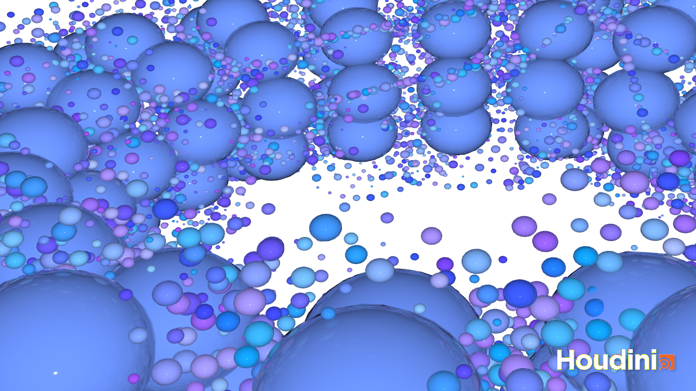
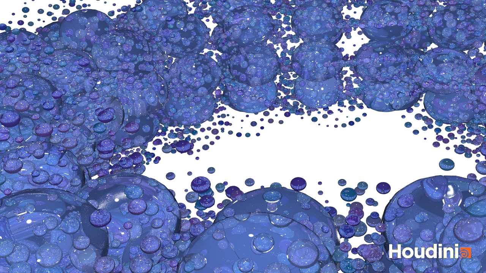

## Task 1: Chapter 06 - Noise

* Read [Chapter 06 - Noise](../../02_scripts/pgs_ss22_06_noise_script.md)
* [Questions 01](pgs_ss22_06_questions.md#chapter-06---noise)

Answer all questions directly in a copy of the [`pgs_ss22_06_questions.md`](pgs_ss22_06_questions.md) file and also link and display your images in that file. Submit your copy as `pgs_ss22_06_questions_lastname.md` in your assignments folder.

## Task 2: Using Noise in Houdini 

* Complete the [Houdini Tutorial](pgs_ss22_tutorial_03_noise.md)

Submit your houdini file as `pgs_ss22_tutorial_03_lastname.hipnc`, at least one image file as `pgs_ss22_tutorial_03_lastname.png` and one animation as `pgs_ss22_tutorial_03_lastname.gif`.

Image:

GIF:

