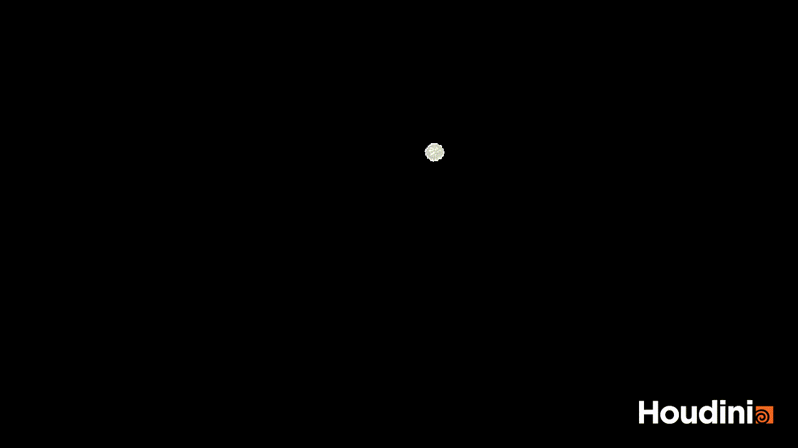
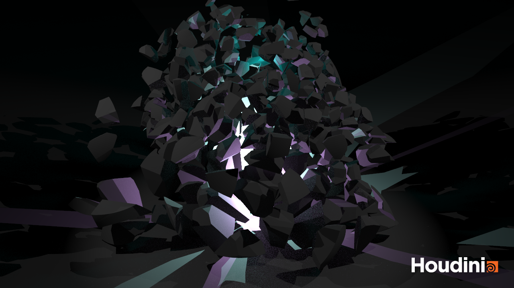
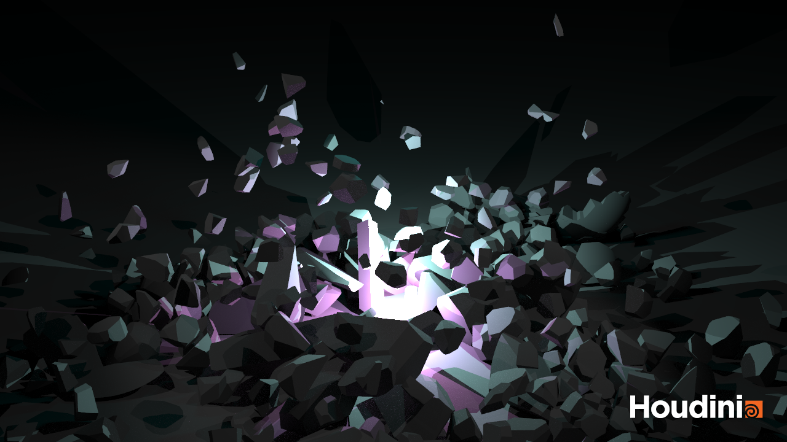

# Task 1

# Task 2

## Render Images

## GIF

# Questions (Task 2)

- How can I can connect the debris-source to smoke? The explanation in the tutorial doesn't work for me
- How can I add inside and outside material to the sphere?