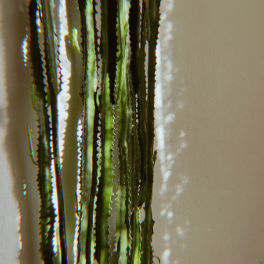

**Procedural Generation and Simulation**

# Questions Session 01

- [Questions Session 01](#questions-session-01)
  - [Questions 1 - Topics & Syllabus](#questions-1---topics--syllabus)
  - [Questions 2 - Procedural Generation](#questions-2---procedural-generation)
  - [Questions 3 - Patterns](#questions-3---patterns)
    - [3.1 Seeing Patterns](#31-seeing-patterns)
    - [3.2 Understanding and Implementing Patterns](#32-understanding-and-implementing-patterns)
    - [3.3 Seeing Faces](#33-seeing-faces)
  - [Questions 4 - Abstraction](#questions-4---abstraction)
    - [4.1 Abstraction in Art](#41-abstraction-in-art)
    - [4.2 Abstracted Artistic Expression in CGI](#42-abstracted-artistic-expression-in-cgi)

## Questions 1 - Topics & Syllabus

* Which of the chapter topics given in the syllabus are of most interest to you? Why?
I like the syllabus in general, as I think this course puts up together different things I have learned during the past semester. I am interested in Noise, but also in Agency and Complex Systems (Particles, Fluids, Crowds, etc) as these are very powerful tools that I am eager to learn about.  
* Are there any further topics in regard to procedural generation and simulation that would interest you?
I think it's great the way it is. 
* Which tool would you personally prefer to use for the practical tasks (e.g. Houdini, Unreal, Unity, Maya, Blender, JavaScript, p5, GLSL, ...)?
I would like to take this opportunity to explore Houdini. :)
* How would you rate your level of experience with SideFX's Houdini?
    * [x ] I have never used it
    * [ ] Novice
    * [ ] Intermediate
    * [ ] Advanced
    * [ ] God-like

## Questions 2 - Procedural Generation

Briefly in your own words: how would you explain your nanny what *procedural generation* means? 
I would say that procedural generation means when you generate/ do something - by following a procedure/ an algorithm. 

## Questions 3 - Patterns

### 3.1 Seeing Patterns

Take at least three pictures of natural patterns and at least three pictures of man-made ones (patterns can be two or three dimensional). Try to include at least one pattern with self-similarity. Taking the pictures with your smart phone is just fine. Link all images in this markdown file.

### 3.2 Understanding and Implementing Patterns

Write for one of your pattern images a generating algorithm in pseudo-code or code. Submit the code below.
I choose the three structure in the low-left corner of the natural patterns, adapting the Recursive Tree example to a static image https://p5js.org/examples/simulate-recursive-tree.html

function setup() {
  createCanvas(600, 400);
}

function draw() {
  background(67);
  stroke(0);
  let a = 70;
  theta = radians(a);
  translate(width/2,height);
  line(0,0,0,-120);
  translate(0, -120);
  branch(200);
}
function branch(h) {
  h *= 0.66;
  if (h > 2) {
    push();    
    rotate(theta);   
    line(0, 0, 0, -h);  
    translate(0, -h); 
    branch(h);      
    pop();     
    push();
    rotate(-theta);
    line(0, 0, 0, -h);
    translate(0, -h);
    branch(h);
    pop();
  }
}

### 3.3 Seeing Faces

As an exercise to see and understand the environment around you (and to have some fun 😊), try to find at least two faces. Link all images in this file.

I love this - I always collect faces and shapes around me :))

I will add also this photo with a funny crying house I saw last summer

## Questions 4 - Abstraction

### 4.1 Abstraction in Art

Chose one "traditional" painting, which is inspirational to you. The image can come from the script or you can refer to any artists or image you like.  

Explain briefly what you like about the painting and how it might inspire you for your own work.

One painting that I am fascinated about is from Matías de Arteaga: El origen de la pintura / La invención de la pintura, 1665 - The origin/invention of painting. The Spanish painter makes a beautiful representation of the "History of Painting" from Pliny the Elder's Naturalis Historia. 
Portraying the story of a young man that before leaving to the army had his silhouette painted, in order for his loved one to not forget him. In that moment, painting would have been invented, by making something present through representation. 
Portraying the story of a young man who, before leaving to the army, had his silhouette painted in order for his loved one to not forget him. In that moment, painting would have been invented by making something present through representation. 
The image of the shadow/silhouette creates the illusion of the body, without which it wouldn’t exist. In  one frame with warm but dark colours and a nostalgic atmosphere, Matias de Arteaga captures not only various concepts like the duality between illusion vs. reality, presence vs. absence or the foundation of painting but also, eventually, some of the deepest human emotions, love and longing. 
[origin_of_painting](img/painting_1.png)

### 4.2 Abstracted Artistic Expression in CGI

Chose one CG image, which you like and of which you think that it has an artistic quality to it. The image doesn't need to be from the script, again you can chose any CGI image you like (it should use 3D graphics). You can find more examples in the [Summary of Artists](../../02_scripts/pgs_ss22_01_intro_script.md#summary-of-artists) section.  

Explain briefly what you like about the image and why you consider it to be somewhat a pice of art. 

