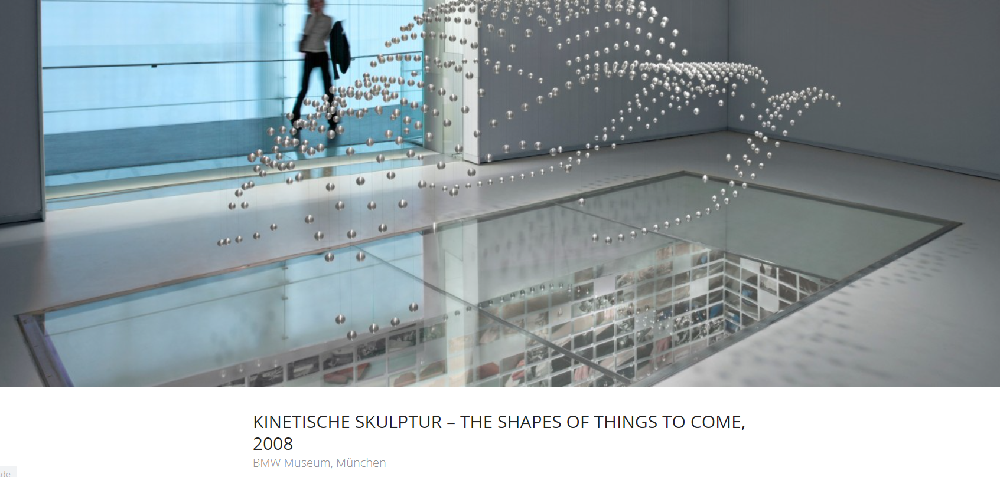
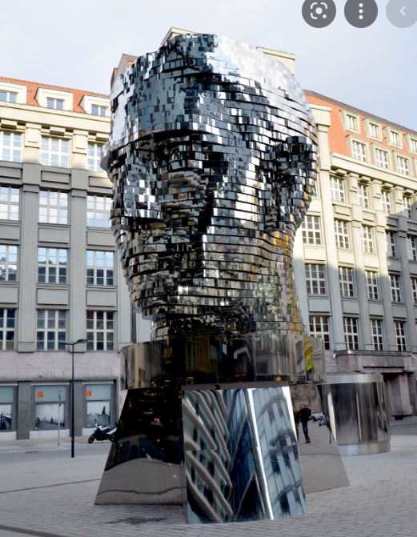
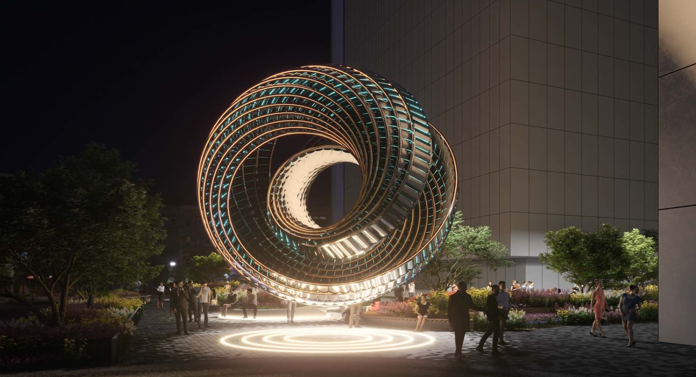

**Procedural Generation and Simulation**

# Questions Session 02

* [Questions Session 02](#questions-session-02)
    * [Chapter 03 - Beauty in Maths - Creative Project Development](#chapter-03---beauty-in-maths---creative-project-development)

## Chapter 03 - Beauty in Maths - Creative Project Development

1. **Numbers and Curves**

Develop a creative and / or visual and / or auditive concept in regard to one of the topcis of Chapter 3, be it a number or numbers, spirals or specific curves, or all of them. The project doesn't need to be executable by you but you should be able to plan it thoroughly. Imagine it as if you are the creative and technical director but you don't have to do everything yourself. You can use any setup, framework, tool, etc. you like for this concept, it does not have to be with Houdini.

This concept should ideally include

- the idea and goal,
- references and inspiration (feel free to investigate your topic further),
- the specific concept,
- optional: concept sketches,
- execution and implementation details on how to do it.

Communicate exponential growth.

## Concept idea: 3D mathematical kinectic sculptures

Idea: 
Using the same algorithm we used for this tutorial, I would like to see this as a 3D sculptural ansamble that is changing shape in time. 
Of course, as it is physical, each sculpture would be limited but would have a very fluid dynamic. 

References: 

Or this proposal, the difference being in making something of a smaller size and instead of one piece, multiple pieces (let's say 4). 

https://amazingarchitecture.com/pavilion/hole-zero-timeless-kinetic-art-sculpture-by-mask-architects

Concept:
The idea would be through this 4 sculptures to somehow represent the beauty of the numbers, evolution due to their positioning and shape reminding of a classical sculpture and also the passing of time as there are 4 seasons in one year as well. 

Implementation:
There should be the 3D mock-ups done firstly and then I would say to use a 3D printer to sculpt the material. 
I suppose for the implementation there will be needed a lot of arduino programming and motors that would shift the sculpture. 
