## Tutorial Results

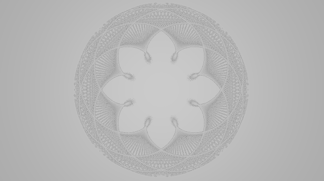

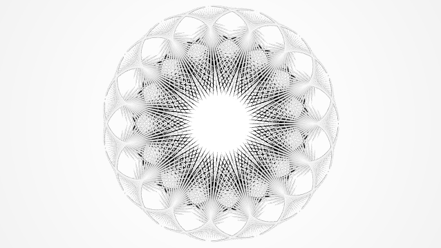

Experimenting with the parameters and materials - process:

_ugly_ things:
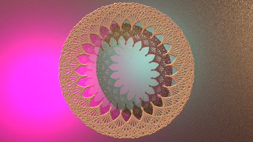
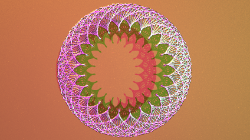
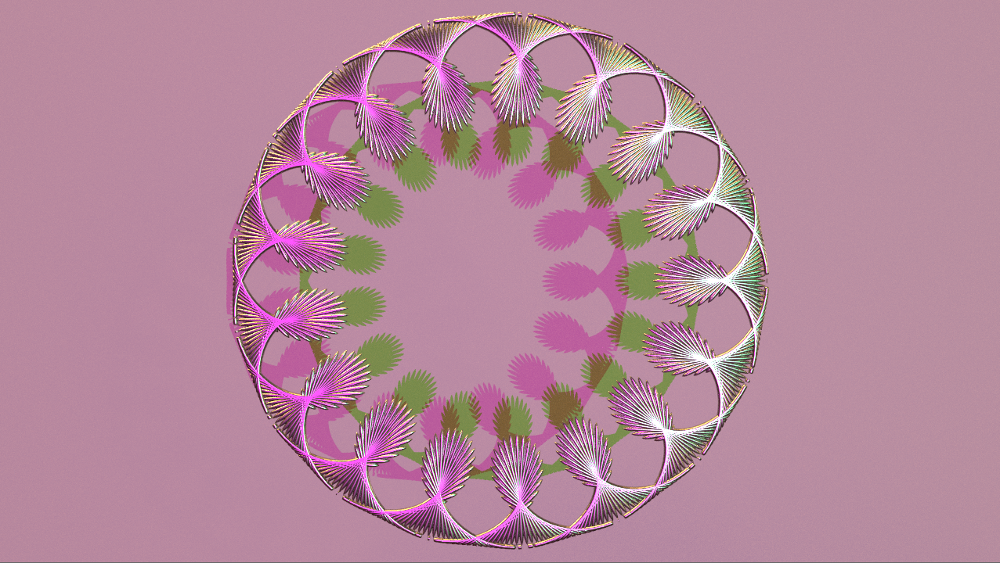
change of perspective and materials:
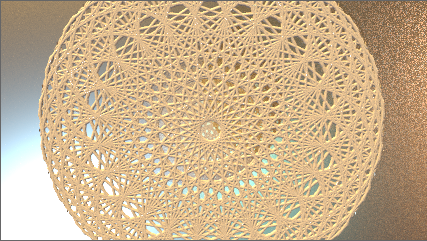

**Results I really like:**

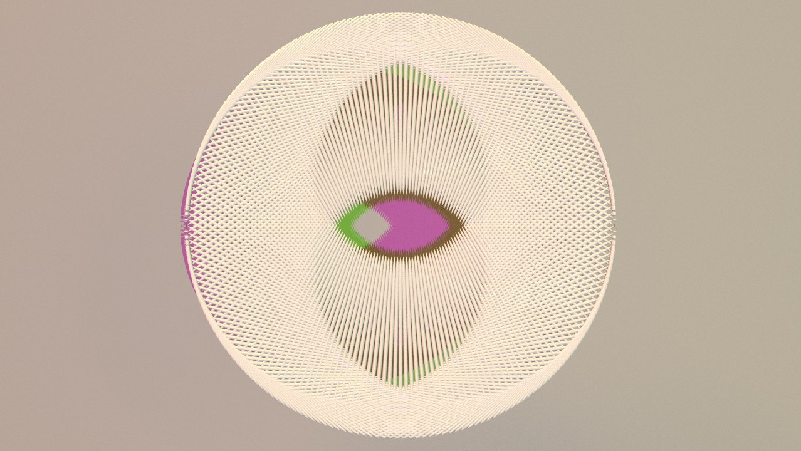
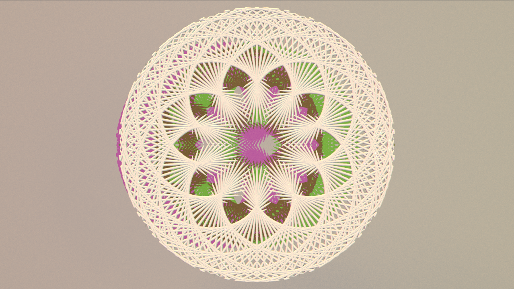
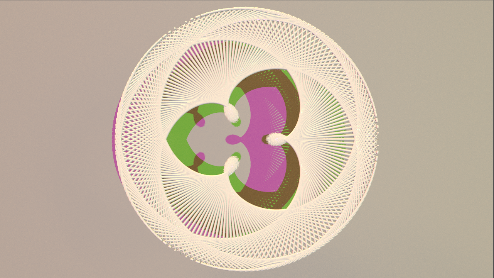

Also other renderings I really liked a lot:

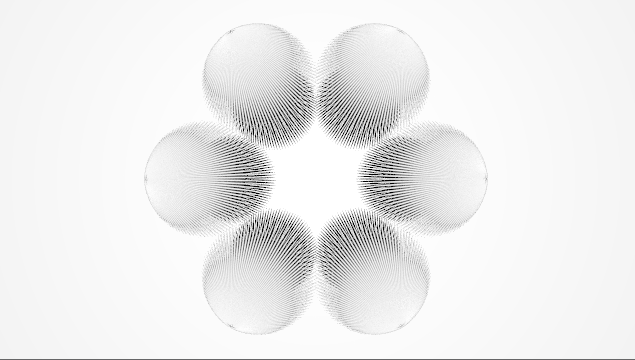

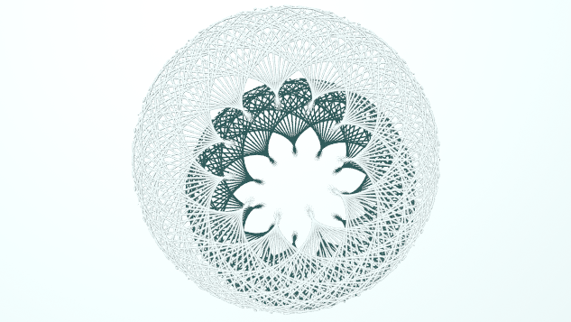
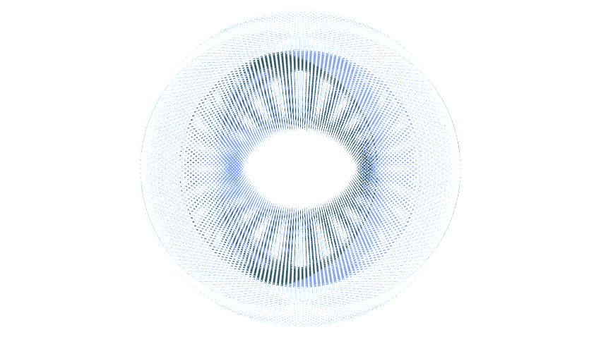

Bonus:
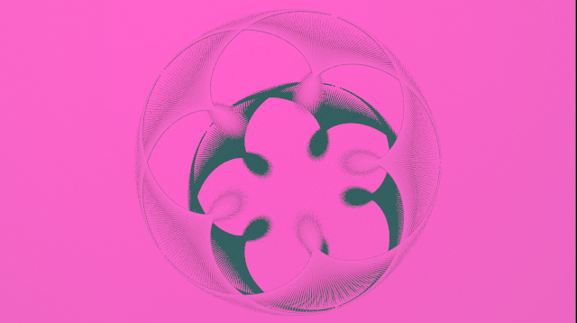
