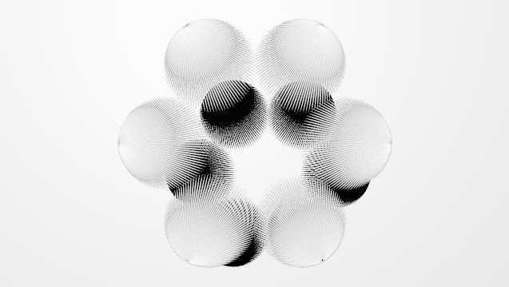

## Tutorial Results

Experimenting with the parameters and materials - process:

_ugly_ things:

change of perspective and materials:

**Results I really like:**

Also other renderings I really liked a lot:

Bonus:

