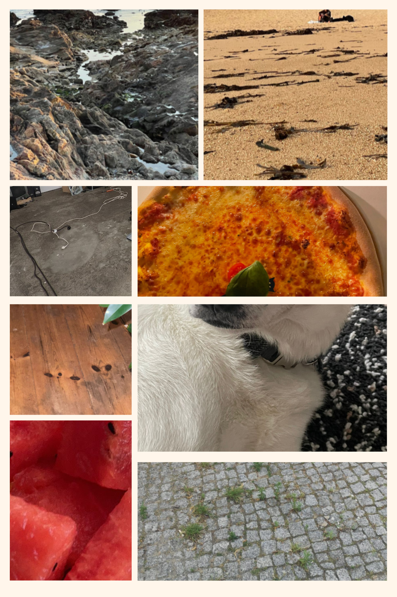

# Procedural Generation and Simulation

Prof. Dr. Lena Gieseke \| l.gieseke@filmuniversitaet.de \| Film University Babelsberg KONRAD WOLF

# Session 06

We will discuss this session on **Monday, June 20th**.   

This session should take less than 3h.

---

## Task 1: Chapter 06 - Noise

* Read [Chapter 06 - Noise](../../02_scripts/pgs_ss22_06_noise_script.md)
* [Questions 01](pgs_ss22_06_questions.md#chapter-06---noise)

Submit at least three pictures of natural noise patterns. You can photograph them yourself (recommended) or find them on the internet.

Submit one stylized / artistic image that uses noise as generating principle or design element. You can find it on the internet.

I chose the work of the romanian painter Adrian Ghenie. I think what he does in traditional painting is exactly adding up this noise-layer to the very-representative-scene that he is portraying. 

For example this is the scene where Nicolae Ceausescu and his wife had the trial before their very-fast-paced death sentence. 

Other works by him:

## Task 2: Using Noise in Houdini 

* Complete the [Houdini Tutorial](pgs_ss22_tutorial_03_noise.md)

Submit your houdini file as `pgs_ss22_tutorial_03_lastname.hipnc`, at least one image file as `pgs_ss22_tutorial_03_lastname.png` and one animation as `pgs_ss22_tutorial_03_lastname.gif`.

---

**Happy Randomizing!**
