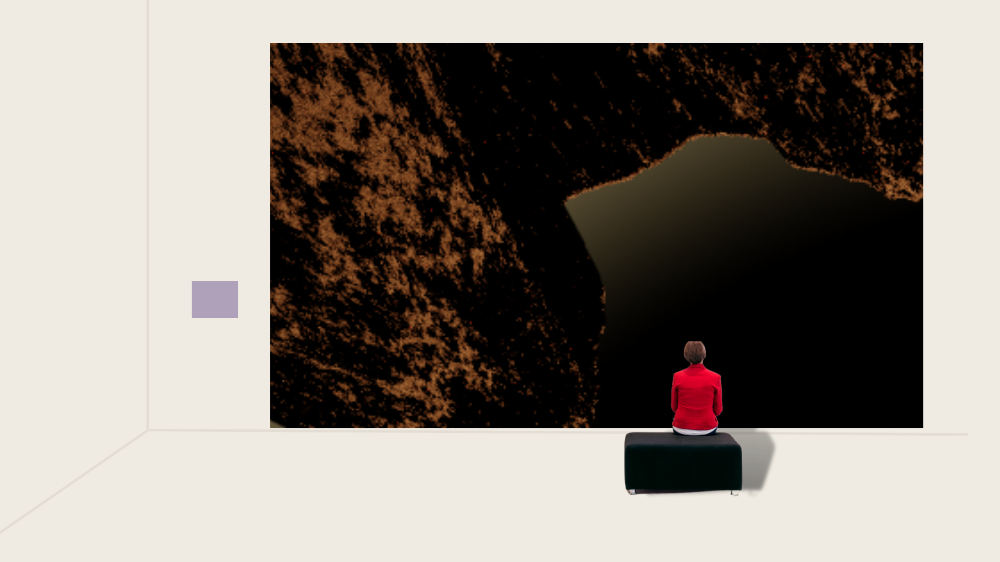
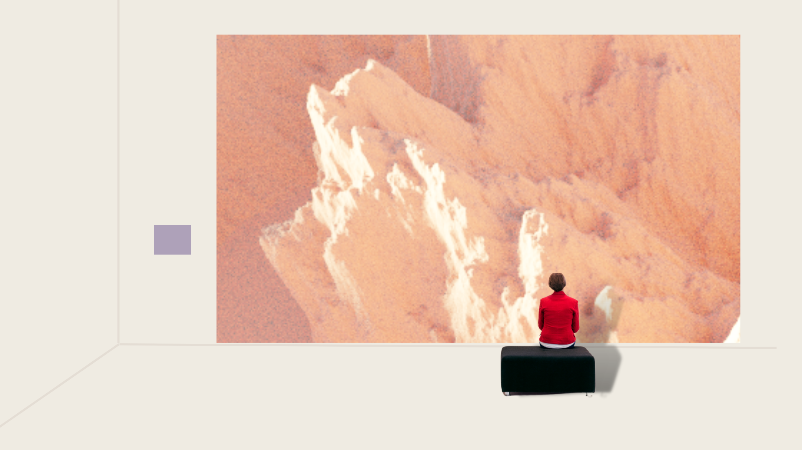
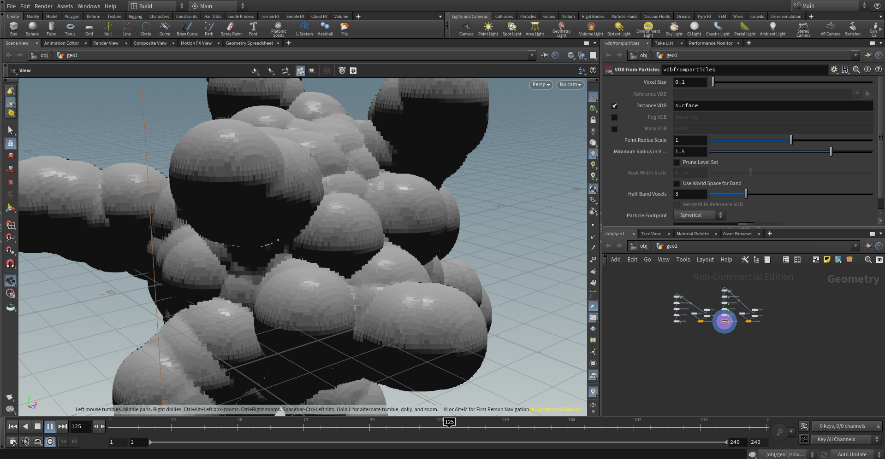
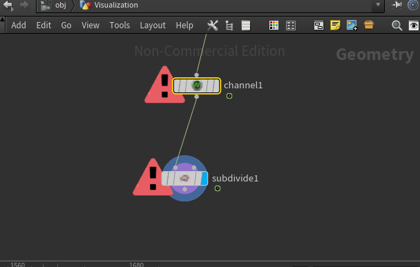
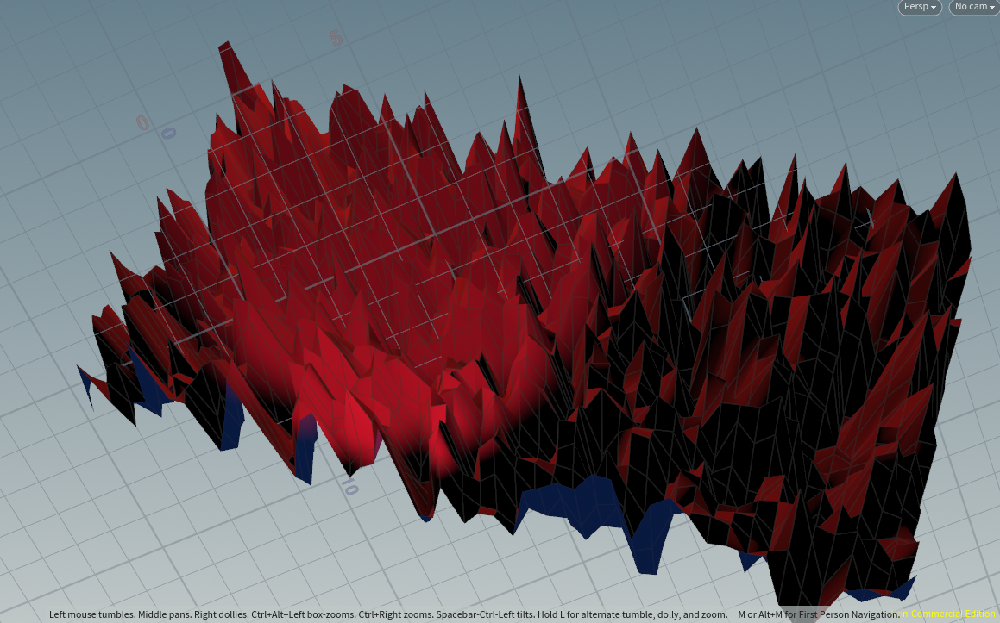
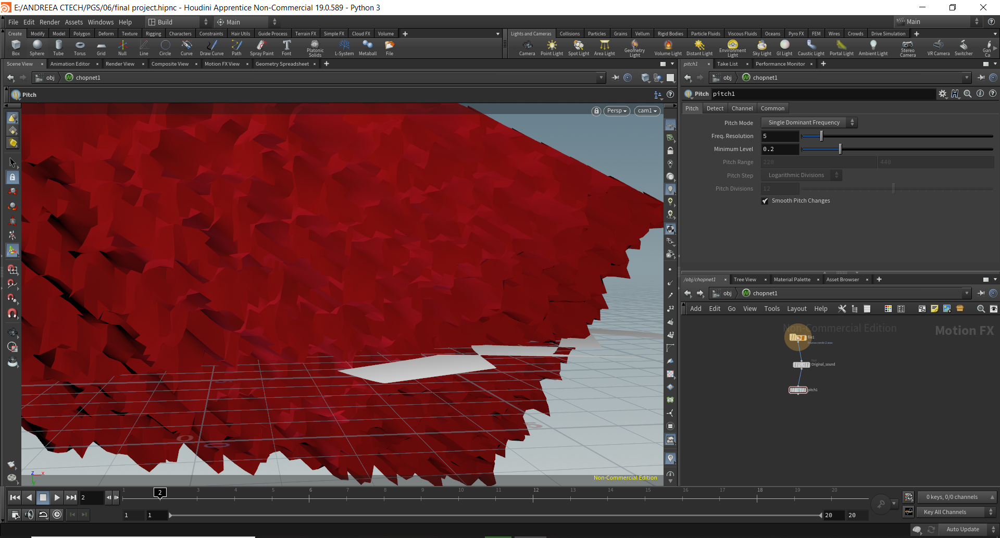

# FLOATING (videoart prototype)

## Abstract

Procedural mountain-scape and camera path-line movement in Blender
Bird-view simulation

## Concept

### _The world is flat and you are a bird. There are no more humans and there is no more water or vegetation. Only an endless deserted mountain scape. Just that it’s not endless. And behind it there’s nothing._

Floating is the prototype of a video-art installation: 
a white room, a very--good quality rendering, in a loop, on a big white wall making the viewer float through known and unknown surfaces.

Conceptually, this idea has two different strong references:
Firstly, when I was a child, next to my school there was this huge church that had a very tall brick wall without any window. Going close to it, because of its imensity and the way the bricks were organized similarly to a pavement, one could feel like they are flying. And that’s a memory I always wanted to find ways to recreate.
As a second inspiration, there is this video with the ducks from Nick Cave’s song, where they fly across lands from a ducks perspective, which I also find fascinating. 

[Nick Cave - By your side](https://www.youtube.com/watch?v=P0v9vd4JEeo )

Mock-up of an ideal set-up:

## Implementation

One of the things that fascinated me in this course was noise. SImilarly, I would say, to our musical computin class, where by combining and playing around with different noises one could create a relatable soundscape, I like the way noise can create things that we perceive and relate to. Noise can tell a story.
So I wanted to find a way to play with that.

Initially, inspired by this tutorial [Tutorial_Coral](https://www.youtube.com/watch?v=l-rt4jSkhPE) and this [Tutorial_Coral2](https://www.youtube.com/watch?v=NqdnTXuxn6k&list=PLdFfFRXT0K_gyA6VVBnYVDgAEGYeaJlKN&index=10) I tried to create a sort of noisy-figure that would grow at the same time connected to a song (with Simons tutorial).
I failed terribly. 

Going back to the noise course, I really felt like when manipulating the grid with “mountains”, it looks very much like… mountains. And I liked that, the God-effect of creating earth.
I decided to leave the sound reactivity behind and to learn how to animate the camera, in order to create this bird-view sensation. 

I tried two different scenarios: 

From this tutorial (which I am not sure why I haven’t saved the file, I got extremely frustrated with it and just closed it apparently :( ) [Tutorial Heightfields](https://www.youtube.com/watch?v=iogVyO_nK6g&t=339s)
And even this simple abstract shape for a potential "trippy" travel:

But I had hard time making the camera follow the path, it was working and then failing + the lights, render time was very long and the lights kind of always random. 

After I tried for a very long time (I really mean very long time) to do my final project in Houdini, I decided to move to Blender. Why? Houdini was crashing continuously, everything was very very slow and when I eventually did something in the direction I wanted to go 
(my “big” goal was a procedural geometry coral-style that is growing on sound and I just couldn’t make the camera work through the highlands) it crashed and crashed my laptop as well.The rendering time was endless and already I had spent way too much time on this and had nothing. 

My experience with Blender is irrelevant, I opened the software several times and watched a few tutorials last year when I was assisting a group project of a 360 video and tried 2D animation in it. 
Firstly, I tried to follow this introduction to Blender  . I was quite happy (and proud about it) that even if I previously to PGS had no experience with these kind of softwares, because of the Houdini experience I managed to get along there. By that I mean, even if it was a new software, it didn’t freak me out and seemed somewhat familiar.
 I found this: [Tutorial Mountains](https://www.youtube.com/watch?v=yrMee2gcS20) which I found a bit too realistic (and complex) for my taste but gave me some insight on how Blender works and then I found the perfect one: [Procedural Mountains](https://www.youtube.com/watch?v=yrMee2gcS20)

I tested different lights but ended up remaining with the Sky Texture because I really liked the shadows and the highlights. However, I changed the nodes. 

Then followed the camera movement. On the same structure as what I tried implementing in Houdini, I wanted to have the camera movement on a path through the whole structure. Even if there are many tutorials who claim to explain this, they skip valid information and short keys and things end up not working for no reason. [Camera Path](https://www.youtube.com/watch?v=FIWxL4M0t2s) this tutorial helped me to manage that, eventually. 

When I thought I am finally done, I had to render. That was a bit hussle. I had to watch many tutorials to understand how to render an animation properly [How to render](https://www.youtube.com/watch?v=JCLSJg9sdNI) [Render correctly]https://www.youtube.com/watch?v=THgQ5t5WIMw&t=136s AND I did two fragment renderings that I lost haha because I haven’t put an output folder and I just didn’t find them anymore. It all took a lot lot lot of time and I eventually simplified the whole set in order to make it faster (300 frames at 20% took 12h and a half).

## Results

## Project Reflection & Discussion

I am not happy of the results but I am happy of my learning experience.

PGS was my first experience into this kind of softwares (I include here everything Houdini, Blender etc) so that I enjoyed a lot the process and started to think “procedurally” in general. 
I am happy that I got to have an introduction to Blender now and it was very nice to see how connecting it with what I already knew from Houdini made it much easier than it was last year when I tried understanding it. 

Compared to the process in Hodini, in this case the noise is created through the shader not the geometry. It was interesting to see this approach as well. 
I feel like Houdini was more clear when it came to the procedural aspect, I felt more organized there for sure and I would like to give it another try but not with the apprentship license which is just… terribly slow. 
Overall, I feel like this task was depressing, as I was very excited to follow along and I was checking tutorials, I knew the steps etc but when actually implementing it everything would crash without me understanding why. 
In the future, I would like to recreate this project in a better rendering and more detailed structure (I had to simplify it a lot due to the long render time). 

## Lessons Learned

Noise is cool. Due to this task, I want to explore more this realistic aspect of noise.

I think I will study Blender for a while, I am very happy I had to dive into it. I will leave Houdini for later a bit. 

Rendering takes a very long time and computer power is very important. By the beginning of the semester I will make sure I have a good PC. The uni-laptop is better than mine but it was also overheating and blocking. 

I think I learned a lot about procedural mindset and method. I think it’s my take-away for the future. 

When I started to think of this task, I was very confused what I could be doing, as I am very much aware that my homeworks and renderings are somewhat childish and ugly. I am not satisfied with the prototype but I am happy that I managed to do it. Now I feel like I want to explore more and more of the procedural world. 
I am a bit sad of the change from Houdini to Blender and I hope one day to go back to it and know what I am doing.   

