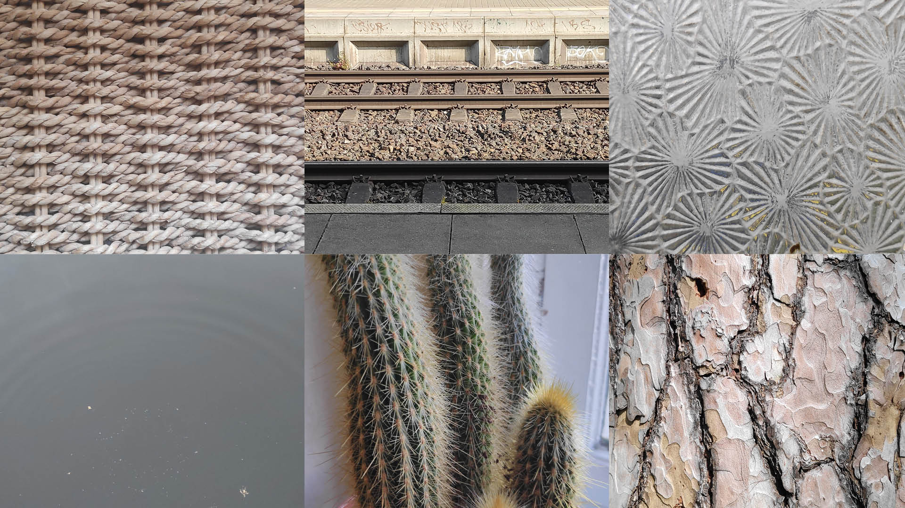
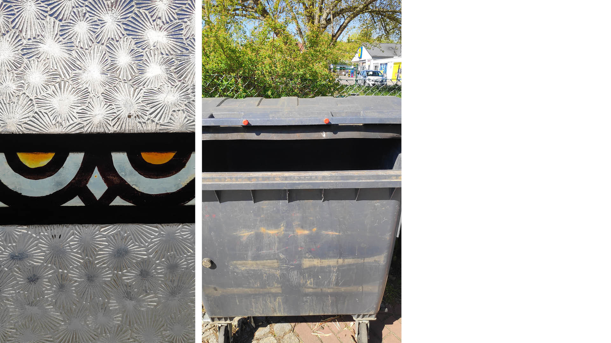
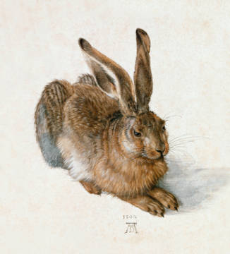
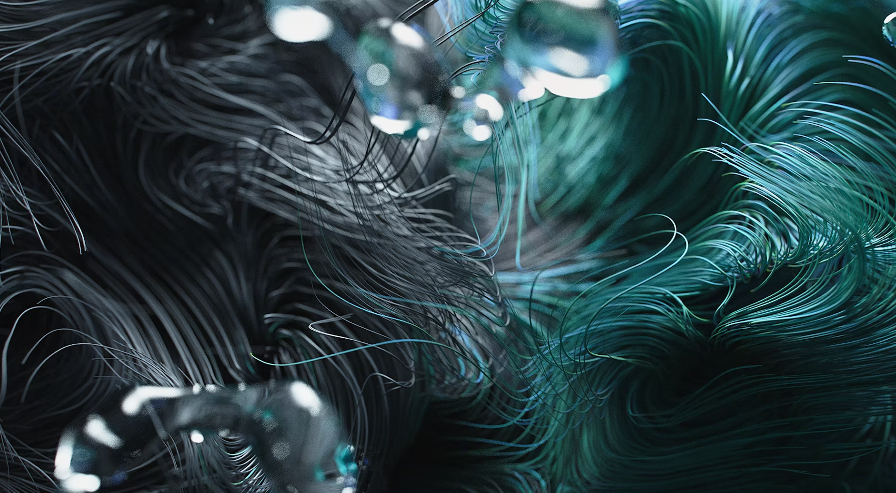

**Procedural Generation and Simulation**

# Questions Session 01

- [Questions Session 01](#questions-session-01)
  - [Questions 1 - Topics & Syllabus](#questions-1---topics--syllabus)
  - [Questions 2 - Procedural Generation](#questions-2---procedural-generation)
  - [Questions 3 - Patterns](#questions-3---patterns)
    - [3.1 Seeing Patterns](#31-seeing-patterns)
    - [3.2 Understanding and Implementing Patterns](#32-understanding-and-implementing-patterns)
    - [3.3 Seeing Faces](#33-seeing-faces)
  - [Questions 4 - Abstraction](#questions-4---abstraction)
    - [4.1 Abstraction in Art](#41-abstraction-in-art)
    - [4.2 Abstracted Artistic Expression in CGI](#42-abstracted-artistic-expression-in-cgi)

## Questions 1 - Topics & Syllabus

* Which of the chapter topics given in the syllabus are of most interest to you? Why?
  * _I would say dynamics and agency are the topics that interest me the most. Dynamics is something that is very powerful. A simple shape moving and behaving in a interesting way is already nicer to look at than the same shape in a basic linear motion. Agency often is a nice way to scale a simple behaviour up to a complex system that can be really beautiful._
* Are there any further topics in regard to procedural generation and simulation that would interest you?
  * _I think you already mentioned in the class, so it will probably be touched anyway, but I think besides the potential output or the things that can be created procedurally I'd be really interested in building the systems that do that in a smart, flexible and structured way. For me it is always hard to think of what I will need beforehand and build a system in a way, that I could add functionality later on without breaking the consitency of the system_
* Which tool would you personally prefer to use for the practical tasks (e.g. Houdini, Unreal, Unity, Maya, Blender, JavaScript, p5, GLSL, ...)?
  * _I am really interested in learning Houdini, but Blender's Geometry Nodes and also GLSL are compelling to me._
* How would you rate your level of experience with SideFX's Houdini?
    * [ ] I have only used it in TI
    * [x] Novice
    * [ ] Intermediate
    * [ ] Advanced
    * [ ] God-like

## Questions 2 - Procedural Generation

Briefly in your own words: how would you explain your nanny what *procedural generation* means?

_Procedural generation is basically a way to generate things, be it images or objects, in a semi-automated way, where you define some algorithm based on mathemtical formulas beforehand, so that you then can quickly generate a variety of output by changing individual parameters of the algorithm._

## Questions 3 - Patterns

### 3.1 Seeing Patterns

Take at least three pictures of natural patterns and at least three pictures of man-made ones (patterns can be two or three dimensional). Try to include at least one pattern with self-similarity. Taking the pictures with your smart phone is just fine. Link all images in this markdown file.

### 3.2 Understanding and Implementing Patterns

Write for one of your pattern images a generating algorithm in pseudo-code or code. Submit the code below.

_this is the rough pseudo code for the braiding pattern:_

* create two parallel vertical lines directly next to each other, move 2 units to the right => repeat 10 times
* create two prallel lines horizontally directly next to each other, connect the neighboring ends of the parallel lines and rotate one end clockwise around the center of the connected ends, the other end CCW => until twisted tightly
* make twisted line follow sin curve with x offset of 0.5 that is rotated by 90° around x and that is mulitplied with a constant factor that equals at least half the width of one line
* move down by the sum of the widths of the two parallel horizontal lines
* repeat the last three steps 10 times (first iteration that is already done is repeating step 0), but if the count of the reapting step modulo 2 equals 1, offset the rotated sine curve by -0,5 units on the x axis. 

### 3.3 Seeing Faces

As an exercise to see and understand the environment around you (and to have some fun 😊), try to find at least two faces. Link all images in this file.

## Questions 4 - Abstraction

### 4.1 Abstraction in Art

Chose one "traditional" painting, which is inspirational to you. The image can come from the script or you can refer to any artists or image you like.  

Explain briefly what you like about the painting and how it might inspire you for your own work.

_It might seem a bit random since I don't ejoy this painting that much anymore but I think looking back this was one of the most inspirational paintings to me. I came across it as a really young child and was completely immersed by how well it is done. I took it as an expample and tried to get my drawing and painting skills to that level. Which I never succeeded with. I got also really inspired by the photo realistic work of Sebastian Krüger, i remeber now. Nowadays I like more emotional abstarct pieces but I don't know about a piece that had such an impact on me._

### 4.2 Abstracted Artistic Expression in CGI

Chose one CG image, which you like and of which you think that it has an artistic quality to it. The image doesn't need to be from the script, again you can chose any CGI image you like (it should use 3D graphics). You can find more examples in the [Summary of Artists](../../02_scripts/pgs_ss22_01_intro_script.md#summary-of-artists) section.  

Explain briefly what you like about the image and why you consider it to be somewhat a pice of art. 

_I chose an still from a Nike advertisement done by Simon Fiedler. To me the interest in motion graphics and this highpolished look of some shoes being proceduarlly knitted and stitched together in some artistic fashion and with the nicest colors and lighting and the right amount of blur along with an pumping electronic beat is the reason why I chose the path of becoming a creative for a living. I somehow got more attracted by interactive stuff nowadays and I might try to avoid working for big companies like Nike if i can decide but I still love a good advertisement/motion graphics clip._
