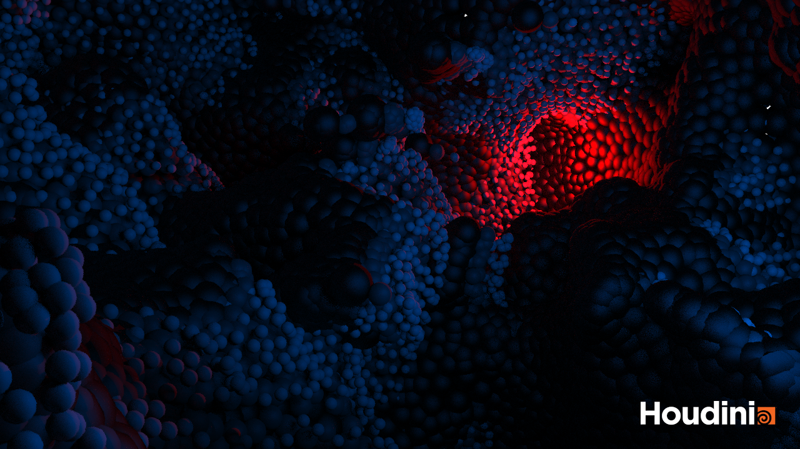
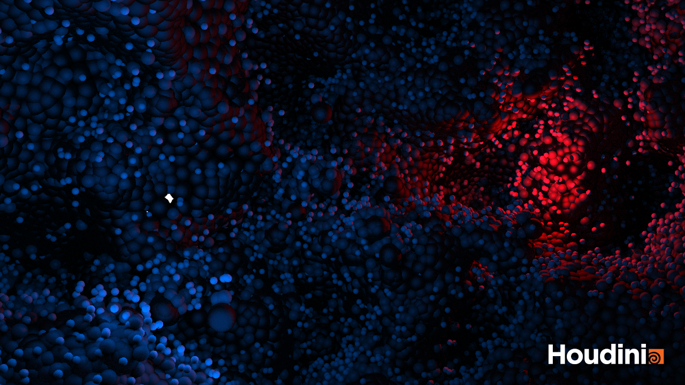
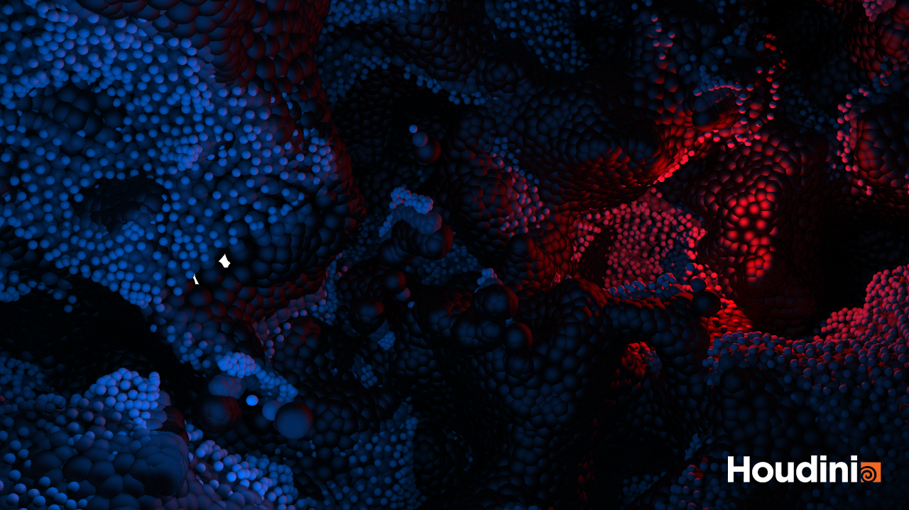
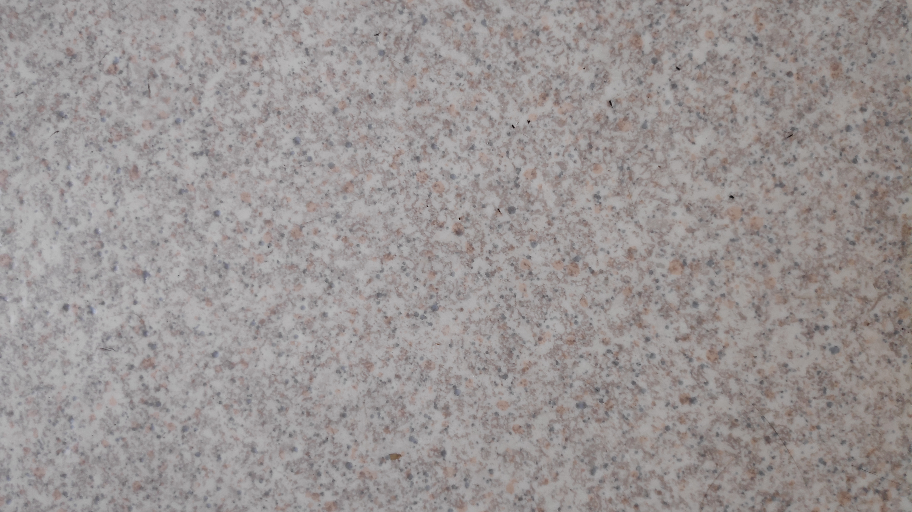
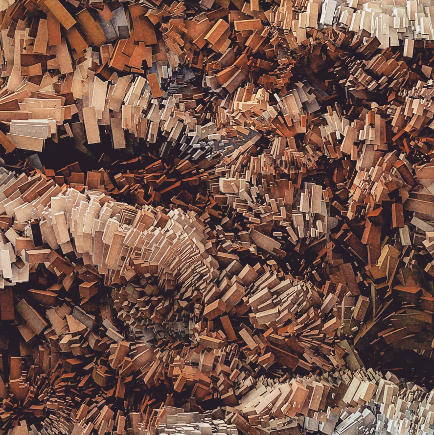

# Procedural Generation and Simulation

Prof. Dr. Lena Gieseke \| l.gieseke@filmuniversitaet.de \| Film University Babelsberg KONRAD WOLF

# Questions Session 06

- [Procedural Generation and Simulation](#procedural-generation-and-simulation)
- [Questions Session 06](#questions-session-06)
  - [Task 2 Tutorial: Chapter 03 - Noise](#task-2-tutorial-chapter-03---noise)
  - [Chapter 06 - Seeing Noise](#chapter-06---seeing-noise)

## Task 2 Tutorial: Chapter 03 - Noise 

Flipbook:

## Chapter 06 - Seeing Noise 

* Submit at least three pictures of natural noise patterns. You can photograph them yourself (recommended) or find them on the internet.

   

*Just saw that we should collect **natural** noise patterns. Will replace the pictures when I collected those.*

* Submit one stylized / artistic image that uses noise as generating principle or design element. You can find it on the internet.
* 

Link all images in this file.

