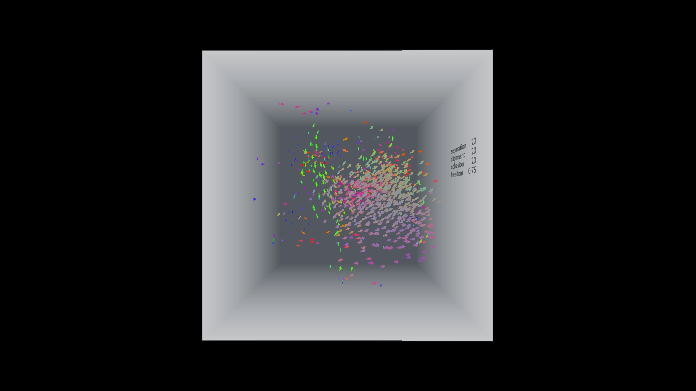
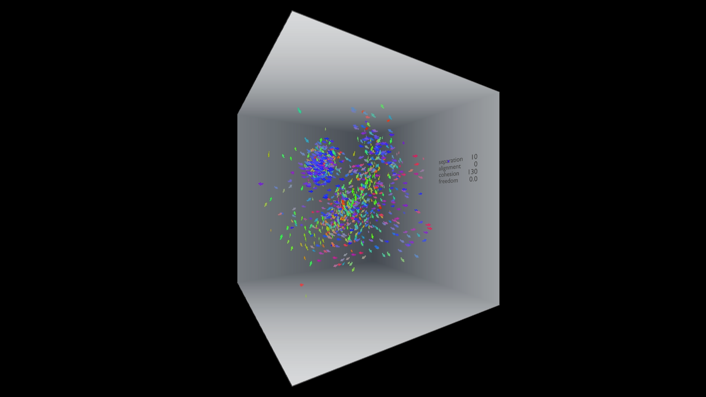
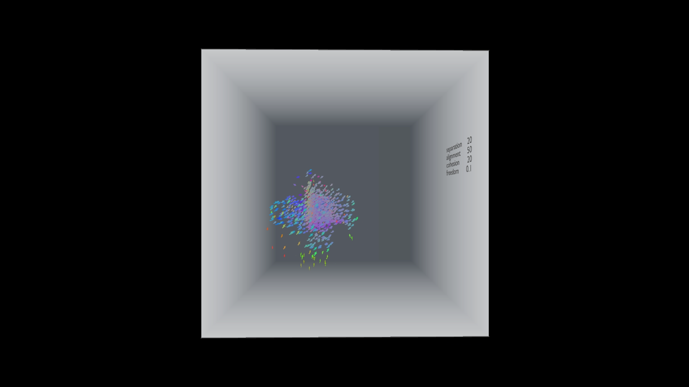
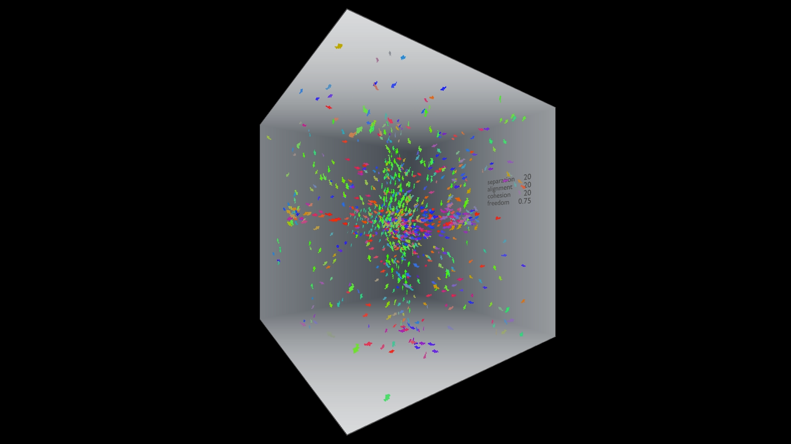

**Procedural Generation and Simulation**
# Final Assignment

## Impossible Aquarium
*Four different schools of fish in a non-euclidean cube, somewhere in the web.*

https://user-images.githubusercontent.com/71271326/180185902-10acae4a-5a21-486b-ab4e-82272211d120.mp4

This is the [**Link**](https://timrumpf.com/ImpossibleAquarium) to the live version.

With this project I wanted to pick up on our sessions on dynamics, agency and complex systems.
I chose to do it in a realtime environment and therefore looked into gpu computing in Three.js .
The outcome is an impossible cube, where the content of the cube depends on the viewing angle. Four different boid systems are rendered. The fish are colored based on their velocity.

I made heavy use of these two projects:
- [**Creating an Impossible Box with GLSL & THREE.js**](https://dev.to/jessesolomon/creating-an-impossible-box-with-glsl-three-js-3mi5m)
- [**THREE.js - webgl gpu birds**](https://threejs.org/examples/webgl_gpgpu_birds.html)

