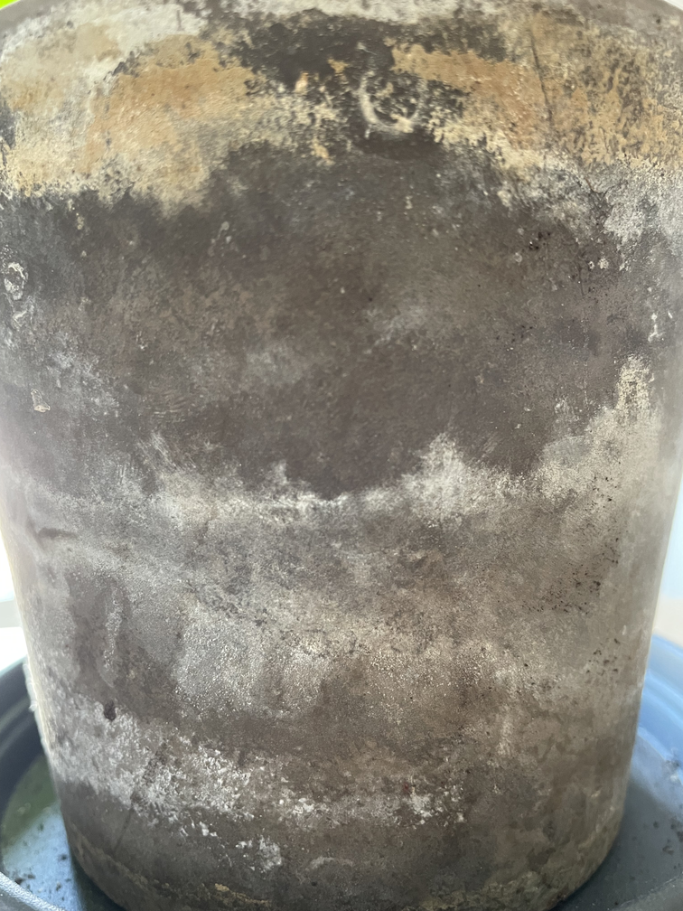

**Procedural Generation and Simulation**

# Questions Session 01

- [Questions Session 01](#questions-session-01)
  - [Questions 1 - Topics & Syllabus](#questions-1---topics--syllabus)
  - [Questions 2 - Procedural Generation](#questions-2---procedural-generation)
  - [Questions 3 - Patterns](#questions-3---patterns)
    - [3.1 Seeing Patterns](#31-seeing-patterns)
    - [3.2 Understanding and Implementing Patterns](#32-understanding-and-implementing-patterns)
    - [3.3 Seeing Faces](#33-seeing-faces)
  - [Questions 4 - Abstraction](#questions-4---abstraction)
    - [4.1 Abstraction in Art](#41-abstraction-in-art)
    - [4.2 Abstracted Artistic Expression in CGI](#42-abstracted-artistic-expression-in-cgi)

## Questions 1 - Topics & Syllabus

* Which of the chapter topics given in the syllabus are of most interest to you? Why?
Beauty in Maths because learning how mathematics is utilised in design could be a good foundation to easily explore the creation of many different ideas of design. I've spent a long time in the intuitive act of creativity and I'd like to explore the more structured formulaic way.

* Are there any further topics in regard to procedural generation and simulation that would interest you?
Maybe procedural generation in sound design. For example, creating generative audio systems.

* Which tool would you personally prefer to use for the practical tasks (e.g. Houdini, Unreal, Unity, Maya, Blender, JavaScript, p5, GLSL, ...)?
It's hard for me to say because it's a fight between learning yet more programs and getting to know a select few more extensively.

I guess I would narrow it down to (in order of preference) Houdini, JavaScript and Blender.

* How would you rate your level of experience with SideFX's Houdini?
    * [x] Never used it
    * [ ] I have only used it in TI
    * [ ] Novice
    * [ ] Intermediate
    * [ ] Advanced
    * [ ] God-like

## Questions 2 - Procedural Generation

Briefly in your own words: how would you explain your nanny what *procedural generation* means? 
Procedural Generation is where you create something by telling a machine to follow rules. But these rules interact with one another as well, meaning that each time you run the instructions again, you will end up with something that looks different than before. As to *how* different it will look, that is dependent on how much potential for variation you include in your rules. 

## Questions 3 - Patterns

### 3.1 Seeing Patterns

Take at least three pictures of natural patterns and at least three pictures of man-made ones (patterns can be two or three dimensional). Try to include at least one pattern with self-similarity. Taking the pictures with your smart phone is just fine. Link all images in this markdown file.
   
   
   
   
   


### 3.2 Understanding and Implementing Patterns

Write for one of your pattern images a generating algorithm in pseudo-code or code. Submit the code below.


```js
var threadThickness = something; 

for (i = 0; i < height; i + threadThickness){

  - draw one ellipse at x = 0: 
  - ellipse height = threadThickness and x width = random width
  - random selection from colour pallette 
  - duplicate that ellipse along the x axis until x = width
}
}
```

### 3.3 Seeing Faces

As an exercise to see and understand the environment around you (and to have some fun 😊), try to find at least two faces. Link all images in this file.

   
   


## Questions 4 - Abstraction

### 4.1 Abstraction in Art

Chose one "traditional" painting, which is inspirational to you. The image can come from the script or you can refer to any artists or image you like.  
Explain briefly what you like about the painting and how it might inspire you for your own work.

[the endless enigma - Dali](https://storage.googleapis.com/hippostcard/p/6ff043d2dda1d05905a66c3ac9afbea7.jpg)

I love how everything in this painting is melting into everything else. You can observer the scene as a whole, but as soon as you start to focus on an element, your eyes start to wander and follow all the weird pathways in the environment, uncovering things you could never have noticed before. There's lots of strange perception illusions and so many little peculiarities to discover.

This inspires me to explore ways in which abstract shapes and well chosen colour pallets can morf and contort in ways that look abstract from afar, but on closer inspection reveal detail and characteristics that are familiar to us. 


### 4.2 Abstracted Artistic Expression in CGI

Chose one CG image, which you like and of which you think that it has an artistic quality to it. The image doesn't need to be from the script, again you can chose any CGI image you like (it should use 3D graphics). You can find more examples in the [Summary of Artists](../../02_scripts/pgs_ss22_01_intro_script.md#summary-of-artists) section.  

Explain briefly what you like about the image and why you consider it to be somewhat a pice of art. 

[lukas vojir](https://ctechfilmuniversity.github.io/lecture_procedural_generation_and_simulation/02_scripts/img/01/cgi_05c.jpg)

Both in terms of design and aesthetic, I like how this plant seems to exist somewhere between an alien world and ours. Parts of it are also so close to photorealism that it lends itself to looking like a documented specimen of nature. The way that it's presented, against a plain grey backdrop, also communicates this feeling of documentation of a specimen. But because it is objectively not a real object, it again occupies a conceptual space between what we know and what we imagine. 

I would consider this to be a piece of art as the artist has taken familiar shapes and forms from our natural world, and recontextualised them within a new formation that communicates something otherworldly. In this, the viewer can gain augmented perspectives of our world as well as be inspired by new forms and combinations. 