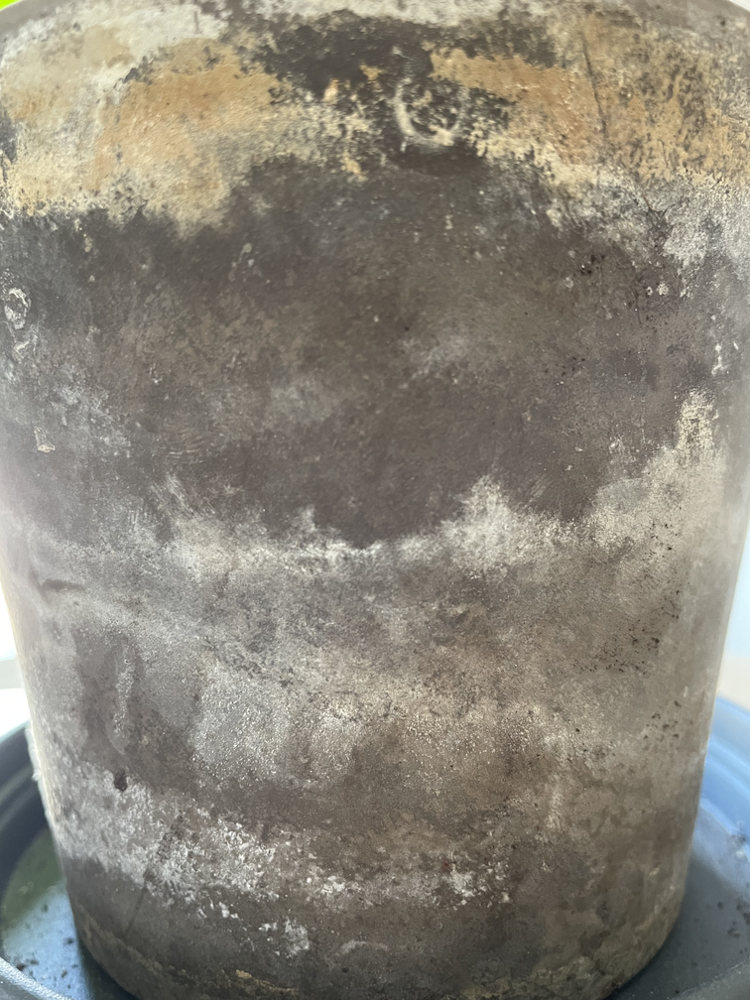
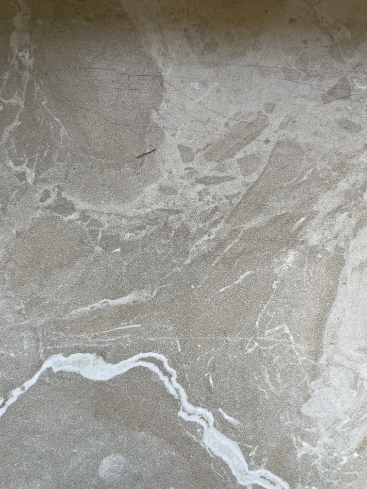
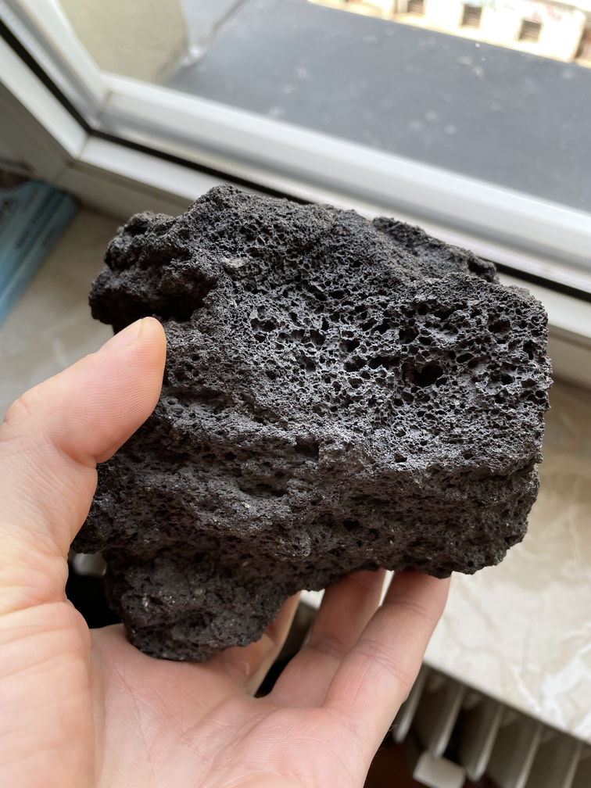
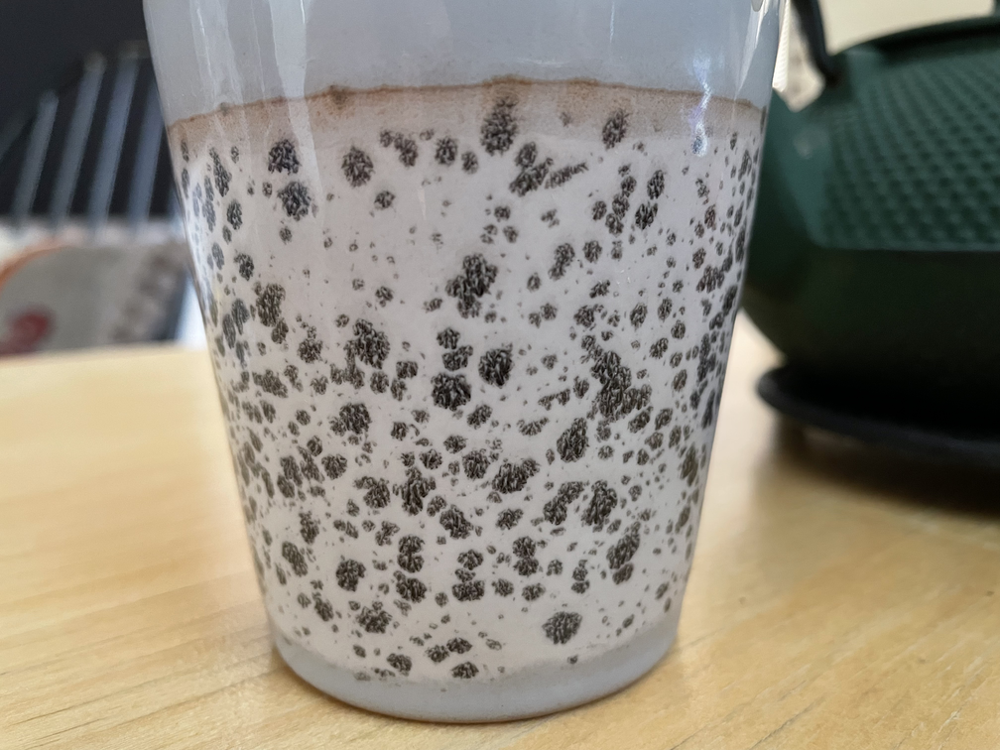
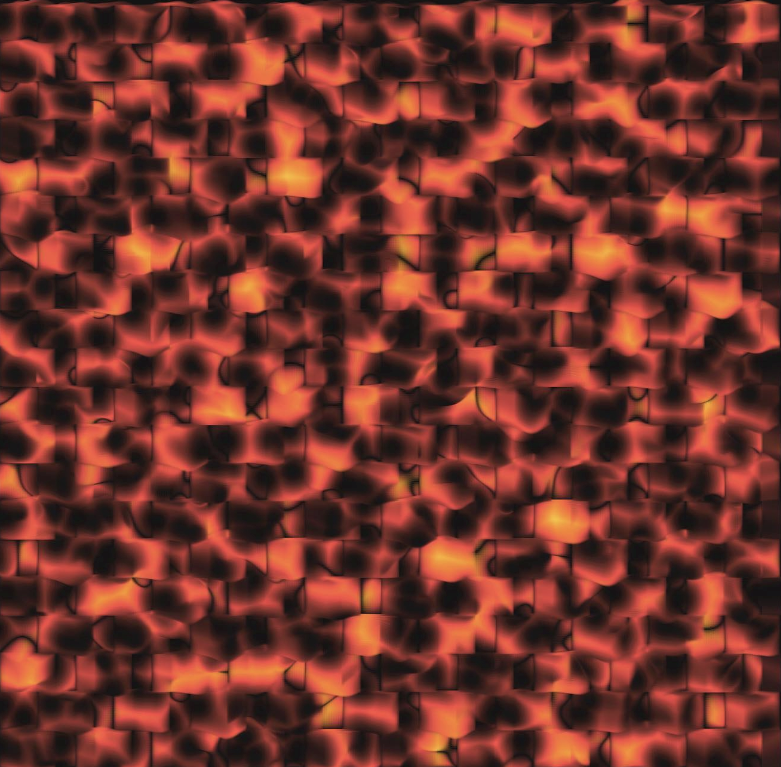
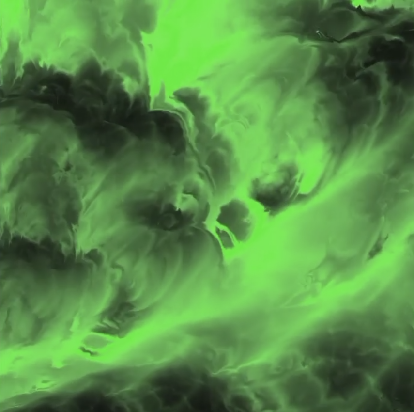
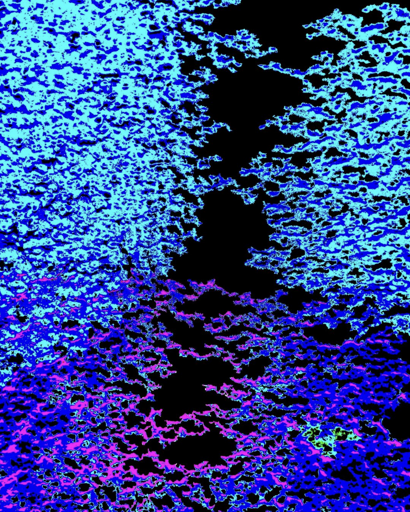
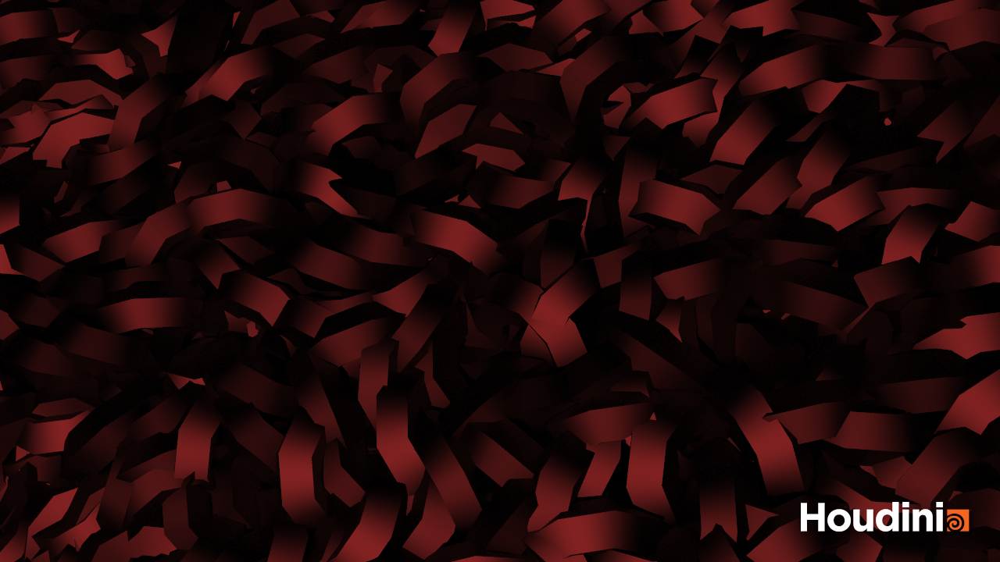

# Procedural Generation and Simulation

Prof. Dr. Lena Gieseke \| l.gieseke@filmuniversitaet.de \| Film University Babelsberg KONRAD WOLF

# Questions Session 06

- [Procedural Generation and Simulation](#procedural-generation-and-simulation)
- [Questions Session 06](#questions-session-06)
  - [Chapter 06 - Seeing Noise](#chapter-06---seeing-noise)
- [Houdini Task 4](#houdini-task-4)

## Chapter 06 - Seeing Noise 

* Submit at least three pictures of natural noise patterns. You can photograph them yourself (recommended) or find them on the internet.

        
    
    
    

* Submit one stylized / artistic image that uses noise as generating principle or design element. You can find it on the internet.

# Houdini Task 4

       
        
