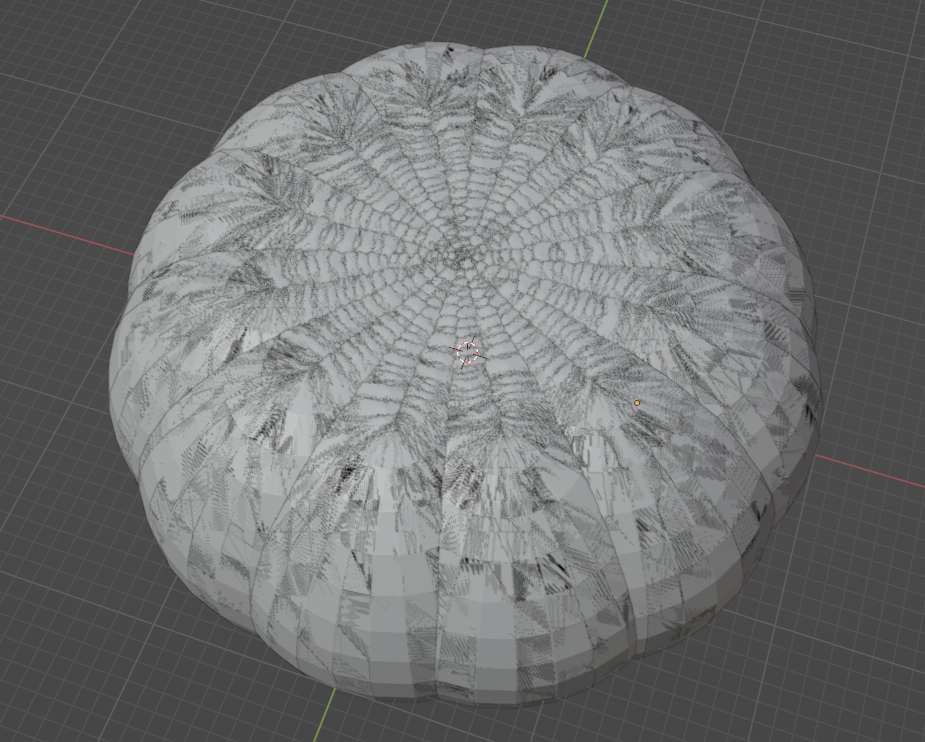
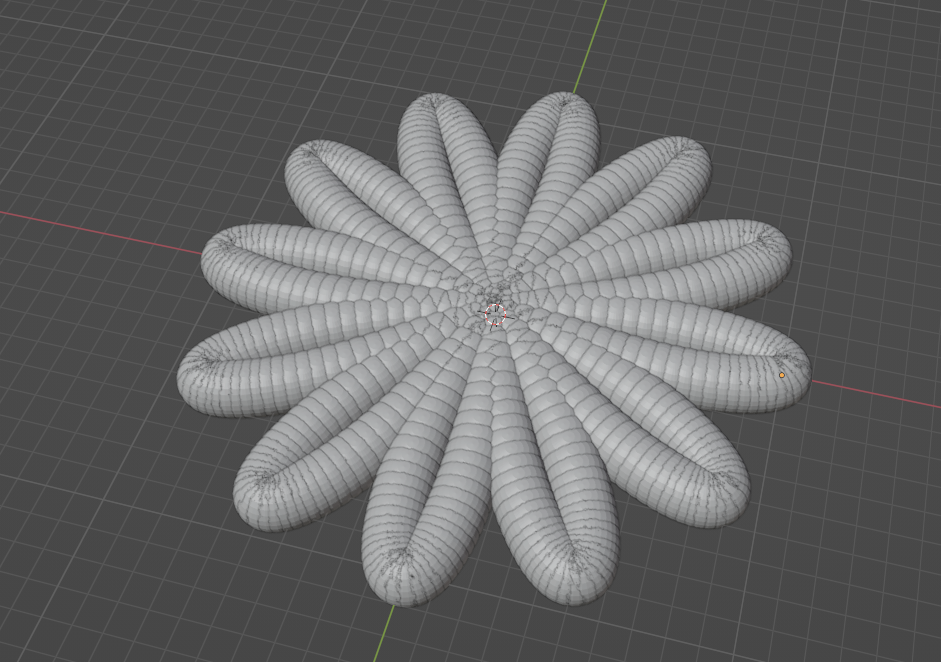
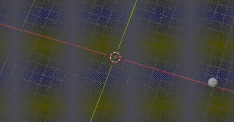
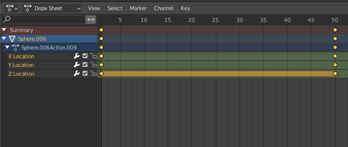
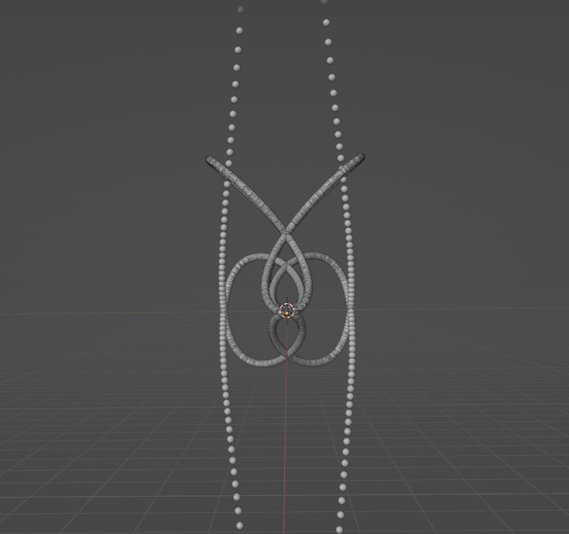
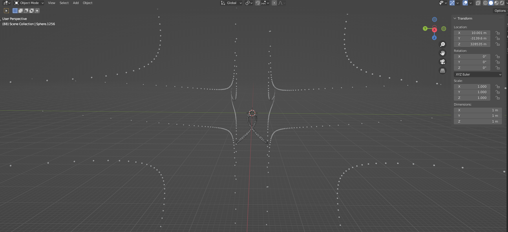
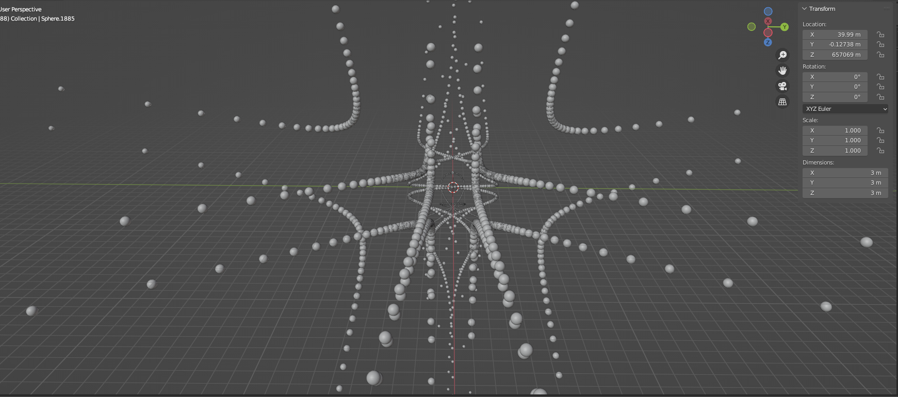
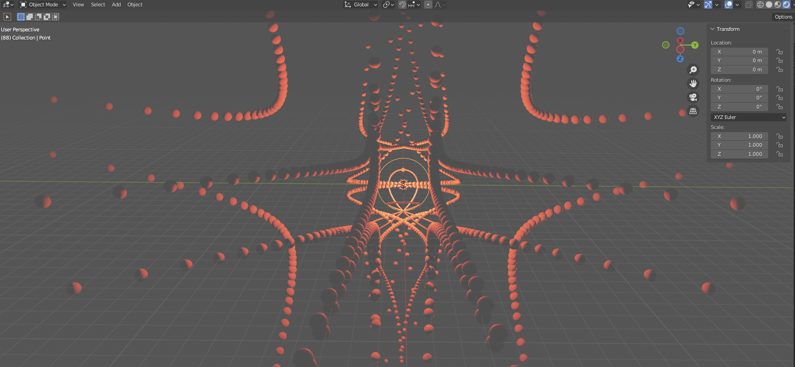

# Final Project
My goal was to revisit the topics either from the *beauty in maths* or *dynamics* chapters, but in Blender and using python.

# Working Process

## Intro to Python in Blender Code
Completed this tutorial to get acquainted with scripting in Blender:
https://www.youtube.com/watch?v=XqX5wh4YeRw

```python
import bpy
from math import radians

bpy.ops.mesh.primitive_cube_add()
so = bpy.context.active_object

# translation
# so.location[0] = 5

# rotation
so.rotation_euler[0] += radians(45)

# create modifier
mod_subsurf = so.modifiers.new("my-modifier", 'SUBSURF')

mod_subsurf.levels = 3
# bpy.ops.object.shade_smooth()

# iterate over a polygon
for face in so.data.polygons:
        face.use_smooth = True
        
#create a displacement modifier
mod_displace = so.modifiers.new("my_displacement", 'DISPLACE')

#create texture
new_tex = bpy.data.textures.new("my_texture", "DISTORTED_NOISE")

#change the texture settings
new_tex.noise_scale = 2.0

#assign the texture to displacement modifier
mod_displace.texture = new_tex
```

## Physics Simulation in Blender with Python
Started to look at procedurally generating with python.
https://www.youtube.com/watch?v=KI0tjZUkb5A

### Tower Fall Simulation
Procedurally generated cubes made into a tower.


```python
import bpy

number = 4
counter1 = 0

#make floor
bpy.ops.mesh.primitive_plane_add(enter_editmode=False, align='WORLD', location=(0, 0, 0), scale=(1, 1, 1))
bpy.ops.transform.resize(value=(58.8978, 58.8978, 58.8978), orient_type='GLOBAL', orient_matrix=((1, 0, 0), (0, 1, 0), (0, 0, 1)), orient_matrix_type='GLOBAL', mirror=False, use_proportional_edit=False, proportional_edit_falloff='SMOOTH', proportional_size=1, use_proportional_connected=False, use_proportional_projected=False)
bpy.ops.rigidbody.object_add()
bpy.context.object.rigid_body.type = 'PASSIVE'
bpy.context.object.rigid_body.collision_shape = 'MESH'


#make cube group
for a in range(0, number + 20):
    counter1 += 2
    counter2 = 0
    for b in range(0, number):
        counter2 += 2
        counter3 = 0
        for c in range(0, number):
            bpy.ops.mesh.primitive_cube_add(size=2, location=(counter3+2, counter2-2, 40 + counter1-2), scale=(1, 1, 1))
            counter3 += 2
            bpy.ops.rigidbody.object_add()
            bpy.context.object.rigid_body.mass = 500
            bpy.context.object.rigid_body.collision_shape = 'BOX'
            bpy.context.object.rigid_body.friction = 1
            bpy.context.object.rigid_body.use_margin = True
            bpy.context.object.rigid_body.collision_margin = 0
            bpy.context.object.rigid_body.linear_damping = 0.35
            bpy.context.object.rigid_body.angular_damping = 0.6
            
# rigid body settings
bpy.context.object.rigid_body_constraint.use_breaking = True
```

### Fracture Tutorials
Looked into how to do fracturing in Blender to see if I wanted to go down that path for the project and how achievable it would be with scripting. 

cell fracture: https://www.youtube.com/watch?v=T2nsntEzlAw   
cell fracture without pre-fractured visual: https://www.youtube.com/watch?v=Xdrz7icUvC4   

Got to this, which works visually, but due to a cheap trick result. The cell fracture addon *prefractures* an object, unlike in houdini where a collision defines the fracture dynamics 💩    
So you need to "wrap" the prefractured object with a solid object and then make it disappear in render view at the chosen keyframe of impact...    
Apparently there's a new node in the latest insider version that allows procedurally generated fracturing, but I can't find access to it... yet. 


## Procedural Generation Scenes
As I really wanted to go down the scripting path in Blender for this project, I decided to drop the fracturing idea - or at least not make it the focus of the project - as it seems a bit out of scope to script it in python. 

https://www.youtube.com/watch?v=r8hqLh_HE08

### Rose Curve Implementation
Direct implementation of code from script:
```python
import bpy
import math

bpy.ops.object.select_all(action='SELECT')
bpy.ops.object.delete(use_global=False, confirm=False)

theta = 0
r = 10
k = 6


while theta < 2 * math.pi:
    x = r * (math.cos(k*theta) * math.cos(theta))
    y = r * (math.cos(k*theta) * math.sin(theta))
    bpy.ops.mesh.primitive_uv_sphere_add(radius=1, enter_editmode=False, align='WORLD', location=(x, y, 0), scale=(1, 1, 1))
    theta += 0.01
```


Used a constant of 1 for sphere radius and radius used in function (r)
```diff
+ bpy.ops.mesh.primitive_uv_sphere_add(radius=sphere_1, enter_editmode=False, align='WORLD', location=(x, y, 0), scale=(1, 1, 1))
- bpy.ops.mesh.primitive_uv_sphere_add(radius=r, enter_editmode=False, align='WORLD', location=(x, y, 0), scale=(1, 1, 1))
```



#### Animation
This animates the growth in scale of the spheres, so the rose "grows" in size. 
```python 
import bpy
import math

# Utility
bpy.ops.object.select_all(action='SELECT')
bpy.ops.object.delete(use_global=False, confirm=False)

bc = bpy.context
bd = bpy.data


# Start
sphere_r = 0.5
theta = 0
r = 10
k = 6


# draw flower
while theta < 2 * math.pi:
    x = r * (math.cos(k*theta) * math.cos(theta))
    y = r * (math.cos(k*theta) * math.sin(theta))
    bpy.ops.mesh.primitive_uv_sphere_add(radius=sphere_r, enter_editmode=False, align='WORLD', location=(x, y, 0), scale=(1, 1, 1))
    theta += 0.01

# set variable for accessing objects in collection
flower_nodes = bd.collections['Collection'].objects

# iterate over objects in collection
for i in flower_nodes:
    # set initial state at frame 1
    i.scale = [ 0, 0, 0]
    i.keyframe_insert(data_path = 'scale', frame = 1)
    
    i.scale = [ 5, 5, 5]
    i.keyframe_insert(data_path = 'scale', frame = 150)
    
```

Trying now to figure out how to input the frame value into `k` to animate moving through the different formations of rose curve. A quick google / youtube search didn't solve this.   
At the moment it seems like I need to implement it programatically into the for loop as so far I've only found how to set keyframes in the python script, rather than read values from the playbar.

I'm now perhaps seeing a limitation of scripting in blender which is that the script is run once at setup, rather than in a loop. But maybe there are ways around this. 

The solution I found was to add a keyframe at each step, which I managed to do with a for loop but of course it pooled every sphere together into the same location.




Got to this point with about 8 hours to go on the clock. 
There are two problems. 
1. The for loop is setting all spheres to the same position on frame 1 and frame 50 (360 degrees). This means that *all* balls only know *two* positions to interpolate between: 0 degrees and 360 degrees...
2. But I only accidentally saw that the x and y parameters are actually not being saved as information into the animation keyframes... This is more of a problem right now. 
   1. EDIT: Turns out in Blender, you can't automate with a vector eg `i.location = [x, y, z]` you can only assign individual indexes at a time `i.location[0] = x`



```python
/ ... /
# draw rose
while theta < 2 * math.pi:
    x = r * (math.cos(k*theta) * math.cos(theta))
    y = r * (math.cos(k*theta) * math.sin(theta))
    bpy.ops.mesh.primitive_uv_sphere_add(radius=sphere_r, enter_editmode=False, align='WORLD', location=(x, y, 0), scale=(1, 1, 1))
    
    theta += 0.01

        # set variable for accessing objects in collection.
        # needs to be set after sphere creation
flower_nodes = bd.collections['Collection'].objects

# for animation
# iterate over objects in collection
for i in flower_nodes:

    # set initial state at frame 1
    x = r * (math.cos(k * 0) * math.cos(0))
    y = r * (math.cos(k * 0) * math.sin(0))
    i.location = [x, y, 0]
    i.keyframe_insert(data_path = 'location', frame = 1)
    
    x = r * (math.cos(k * 6.28999999999991) * math.cos(6.28999999999991))
    y = r * (math.cos(k * 6.28999999999991) * math.sin(6.28999999999991))
    i.location = [x, y, 0]
    i.keyframe_insert(data_path = 'location', frame = 50)
```


I think a solution to address each sphere on its own with its relative starting position relative to theta is to give the sphere an id on creation and to parametrically map that id to a starting point of theta. Could even give it the id of `id_theta` within the while loop.    
More than likely this could also be solved with filling each xyz coordinate into an array upon drawing each sphere, and then using that array within a for loop to define keyframes. This would take me more time than I would like and would only allow me to replicate the Houdini rose curve tutorial and not really "make it my own". So I will put the remaining time into exploring more creative design approaches working with what I have functioning right now. 

### Creative Direction

The obvious idea was to start integrating the z axis. Here drawing two iterations of the rose curve; one with k = 2 and the other with k = 3.    

```python 
while theta < 2 * math.pi:
    k = 2
    x = r * (math.cos(k*theta) * math.cos(theta))
    y = r * (math.cos(k*theta) * math.sin(theta))
    z = r * (math.sin(k*theta) * math.tan(theta))
    bpy.ops.mesh.primitive_uv_sphere_add(radius=sphere_r, enter_editmode=False, align='WORLD', location=(x, y, z), scale=(1, 1, 1))
    
    k = 3
    x = r * (math.cos(k*theta) * math.cos(theta))
    y = r * (math.cos(k*theta) * math.sin(theta))
    z = r * (math.sin(k*theta) * math.tan(theta))
    bpy.ops.mesh.primitive_uv_sphere_add(radius=sphere_r, enter_editmode=False, align='WORLD', location=(x, y, z), scale=(1, 1, 1))
    
    
    
    theta += 0.01
    print('build stage')
     
```

   

Variation
  

Scaling in the outer rose curve resultent from tan function.
   

Adding lights to test


### Other Tutorials I Viewed
Here mostly to do with the fact it was the first time using blender. 

HDRI / Polyhaven - https://www.youtube.com/watch?v=Pi4Ft7M8UOU   
Animation with Python - https://www.youtube.com/watch?v=QnvN1dieIAU   
Creating an ocean - https://www.youtube.com/watch?v=17pjMvOqX8A   


## The Final Product


[1080p export on gwdg cloud](https://owncloud.gwdg.de/index.php/s/8DV5qH5HPaOPvZJ)

### Procedural Generation of Rose Curve Structure
The rose curve generation and position animation of the spheres as well as point light animation is done procedurally with the below python script. The background seabed was added / animated via the Blender UI.   

```python
import bpy
import math
import random
bc = bpy.context
bco = bpy.context.object
bd = bpy.data

rose_nodes = bpy.data.collections['rose_curves'].objects
pointPower = [300000, 2000000]
pointKeyF = [0, 50, 100, 150, 200, 250, 300, 350, 400]

# Start
sphere_r = 0.5
theta = 0
r = 20
center = 0

# draw rose
while theta < 2 * math.pi:
    k = 2
    x = r * (math.cos(k*theta) * math.cos(theta))
    y = r * (math.cos(k*theta) * math.sin(theta))
    z = r * (math.sin(k*theta) * math.tan(theta))
    bpy.ops.mesh.primitive_uv_sphere_add(radius=sphere_r, enter_editmode=False, align='WORLD', location=(x * 2, y * 2, z), scale=(1, 1, 1))
    
    if theta > 0:
        k = 3
        x = r / (math.cos(k*theta) * math.cos(theta))
        y = r / (math.cos(k*theta) * math.sin(theta))
        z = r / (math.sin(k*theta) * math.tan(theta))
        bpy.ops.mesh.primitive_uv_sphere_add(radius=sphere_r + 3, enter_editmode=False, align='WORLD', location=(x * 0.8, y * 0.8, z * 0.8), scale=(1, 1, 1))
        
    k = 7
    x = r * (math.cos(k*theta) * math.cos(theta))
    y = r * (math.cos(k*theta) * math.sin(theta))
    #z = r * (math.sin(k*theta) * math.tan(theta))
    bpy.ops.mesh.primitive_uv_sphere_add(radius=sphere_r + 1, enter_editmode=False, align='WORLD', location=(x * 2, y * 2, z), scale=(1, 1, 1))
    
    theta += 0.01
    print('build stage')

print('rose curves drawn')

# set keyframes for sphere movement
for i in rose_nodes:
 
    startXpos = i.location[0]
    startYpos = i.location[1]
    startZpos = i.location[2]
    i.keyframe_insert(data_path = 'location', frame = 0)
    #i.modifiers.new(name = 'wave', type = 'WAVE')
         
    i.location[0] += random.randrange(-5, 5)
    i.location[1] += random.randrange(-3, 3)
    i.location[2] += random.randrange(-5, 5)
    i.keyframe_insert(data_path = 'location', frame = 100)
 
    i.location[0] += startXpos
    i.location[1] += startYpos
    i.location[2] += startZpos
    i.keyframe_insert(data_path = 'location', frame = 200)

    
    i.location[0] += random.randrange(-5, 5)
    i.location[1] += random.randrange(-3, 3)
    i.location[2] += random.randrange(-5, 5)    
    i.keyframe_insert(data_path = 'location', frame = 300)


    i.location[0] = startXpos
    i.location[1] = startYpos
    i.location[2] = startZpos
    i.keyframe_insert(data_path = 'location', frame = 400)
   
    print('rose keyframes added')

# Add keyframes for point light oscillation
 for i in range(8):

    if (i % 2) == 0:
        bpy.data.collections['others'].objects['Point'].data.energy = pointPower[0]
        bpy.data.collections['others'].objects['Point'].data.keyframe_insert(data_path = 'energy', frame = pointKeyF[i])
    else:
        bpy.data.collections['others'].objects['Point'].data.energy = pointPower[1]
        bpy.data.collections['others'].objects['Point'].data.keyframe_insert(data_path = 'energy', frame = pointKeyF[i])
    print('point light keyframes added')

```

## Final Thoughts
Overall I prefer Blender. I find it much more usable. 
However I didn't get to figure out whether you can run python scripts in a loop - ie to update animations as they go... 
This would be a major pitfall. 

For this project I'm relatively happy with the result in a design sense, but would've like to achieve something a bit more complex than a bunch of for loops. This was down to the time needed to learn Blender from scratch while also sticking close to the 16h time goal - all up spent 19h. But for me it was worth it, as I now have a good feeling of comparisons between Blender and Houdini. 
