**Procedural Generation and Simulation**

# Questions Session 01

- [Questions Session 01](#questions-session-01)
  - [Questions 1 - Topics & Syllabus](#questions-1---topics--syllabus)
  - [Questions 2 - Procedural Generation](#questions-2---procedural-generation)
  - [Questions 3 - Patterns](#questions-3---patterns)
    - [3.1 Seeing Patterns](#31-seeing-patterns)
  - [!self-similar tree](#)
    - [3.2 Understanding and Implementing Patterns](#32-understanding-and-implementing-patterns)
    - [3.3 Seeing Faces](#33-seeing-faces)
  - [Questions 4 - Abstraction](#questions-4---abstraction)
    - [4.1 Abstraction in Art](#41-abstraction-in-art)
    - [4.2 Abstracted Artistic Expression in CGI](#42-abstracted-artistic-expression-in-cgi)

## Questions 1 - Topics & Syllabus

* Which of the chapter topics given in the syllabus are of most interest to you? Why?

> I think noise, dynamics and particles are really cool!  
> Whenever I used Unity's particle system, I always felt like I'm missing out on something big. All I ever got to use it for was little effects like e.g. sparks for a campfire. But there's so much power (and efficiency?) in particles systems and what drives them. I want to learn these beautiful magic spells!

* Are there any further topics in regard to procedural generation and simulation that would interest you?

> Not yet! I always found the 3D generation of complex objects (like trees or buildings) interesting, but I think I am happy with what's in the syllabus so far!

* Which tool would you personally prefer to use for the practical tasks (e.g. Houdini, Unreal, Unity, Maya, Blender, JavaScript, p5, GLSL, ...)?

> I am very interested in learning Houdini. But I know that Maya also has some capabilities in this area, which I haven't explored yet.

* How would you rate your level of experience with SideFX's Houdini?
    * [ ] I have only used it in TI
    * [x] Novice (never used it, only heard of it)
    * [ ] Intermediate
    * [ ] Advanced
    * [ ] God-like

## Questions 2 - Procedural Generation

Briefly in your own words: how would you explain your nanny what *procedural generation* means?

Procedural generation is ... trying to find a "recipe" for patterns (which can be two- or three-dimensional).  
Like knowing which particular stitch is used, repeated again and again, to make a garment like e.g. a scarf. These "stitches" or "recipes" for computer graphics are often mathematical formulas, which tell the computer where to place a color (pixel) on the screen, or even objects like cubes. And just like with only having to memorize a few stitches for knitting big pieces, using these digital recipes can save a lot of "thinking power" for a computer (even though computers can't relax while knitting my digital scarves).

## Questions 3 - Patterns

### 3.1 Seeing Patterns

Take at least three pictures of natural patterns and at least three pictures of man-made ones (patterns can be two or three dimensional). Try to include at least one pattern with self-similarity. Taking the pictures with your smart phone is just fine. Link all images in this markdown file.

Human-made Patterns:

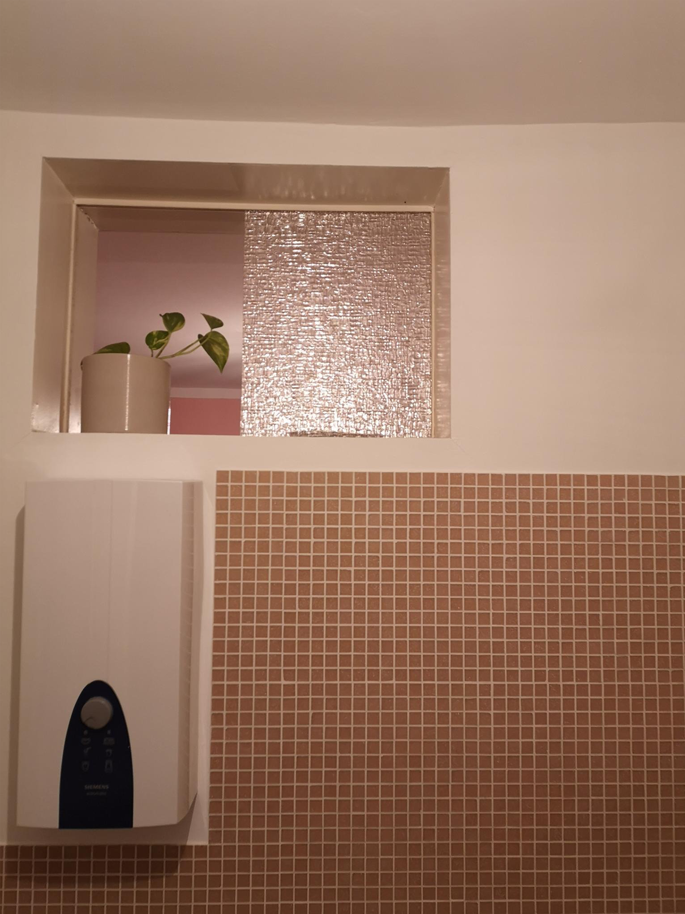  |  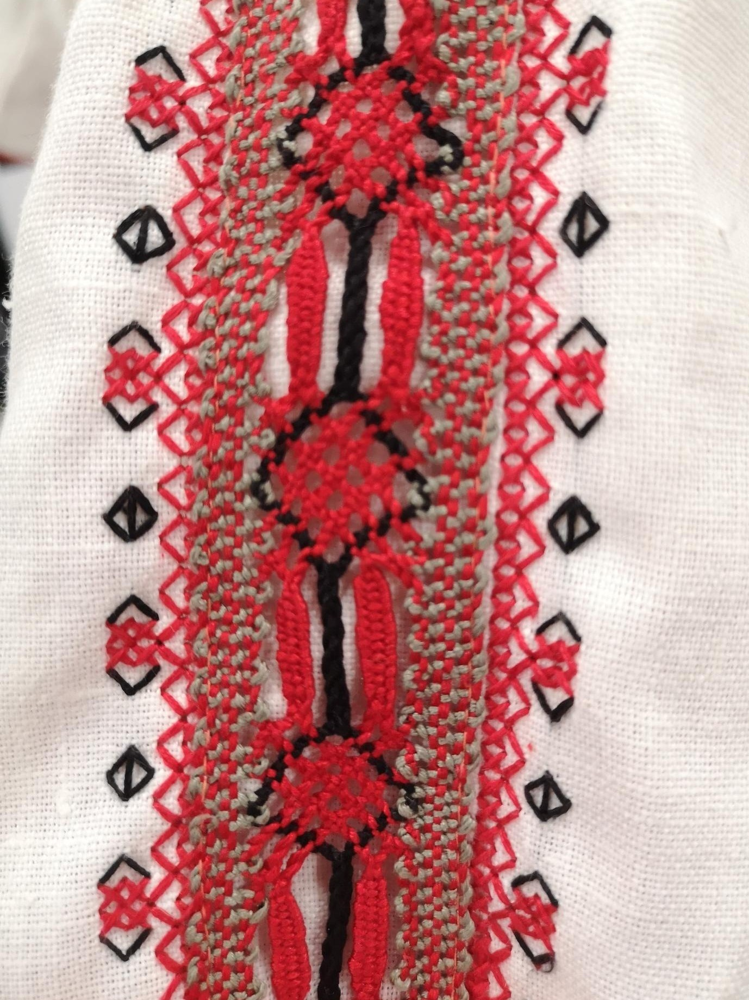
:-------------------------:|:-------------------------:
Tiling and glass pattern in a bathroom  | Crocheted applique on a dress 

---

Natural Patterns:

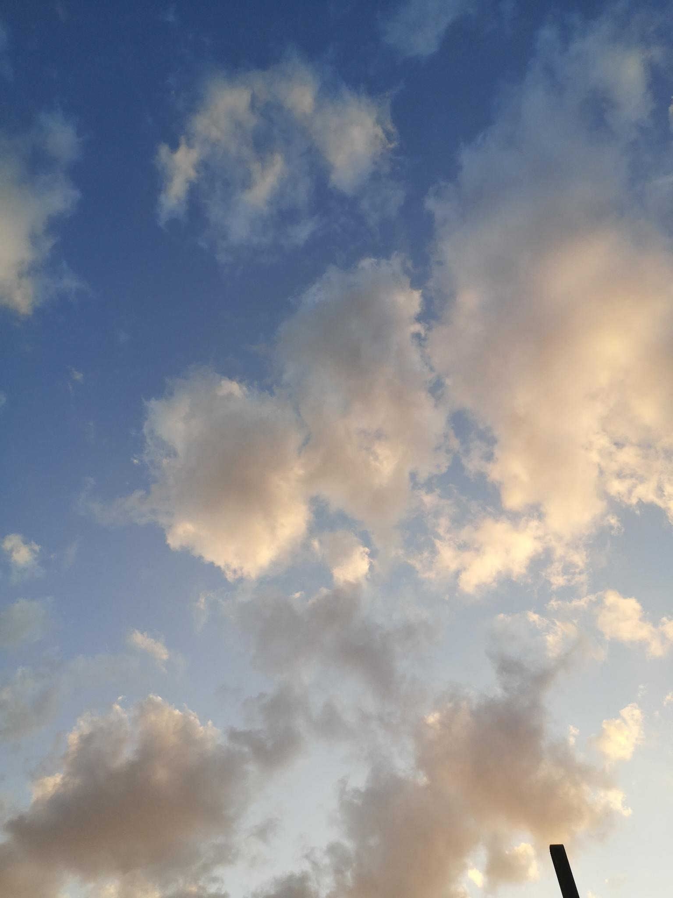  |  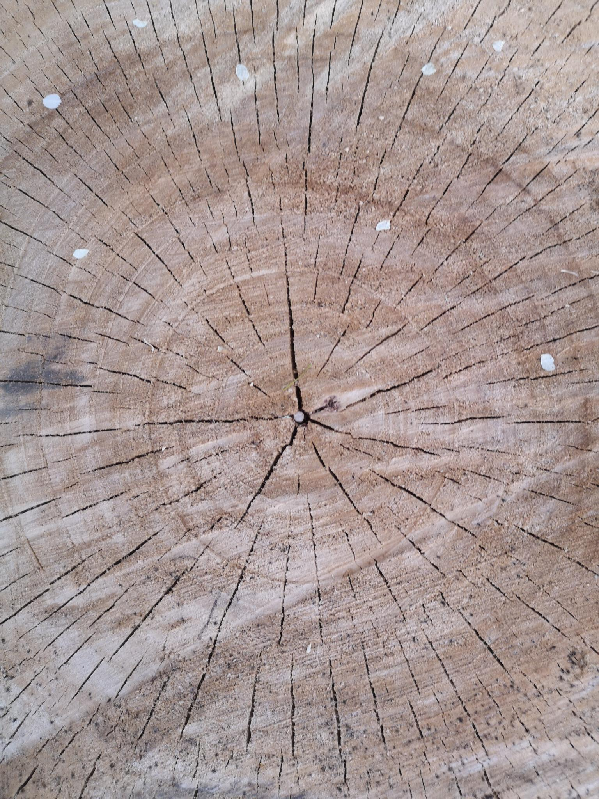
:-------------------------:|:-------------------------:
The edges of clouds are kind of self-similar (maybe?)  | Radially symmetric & repeating wood pattern

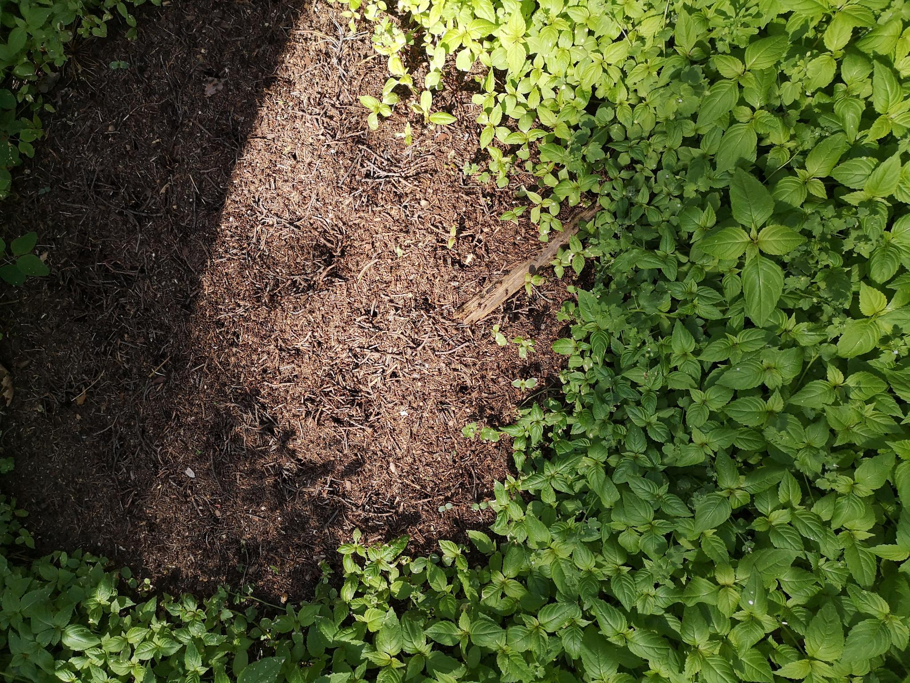  |  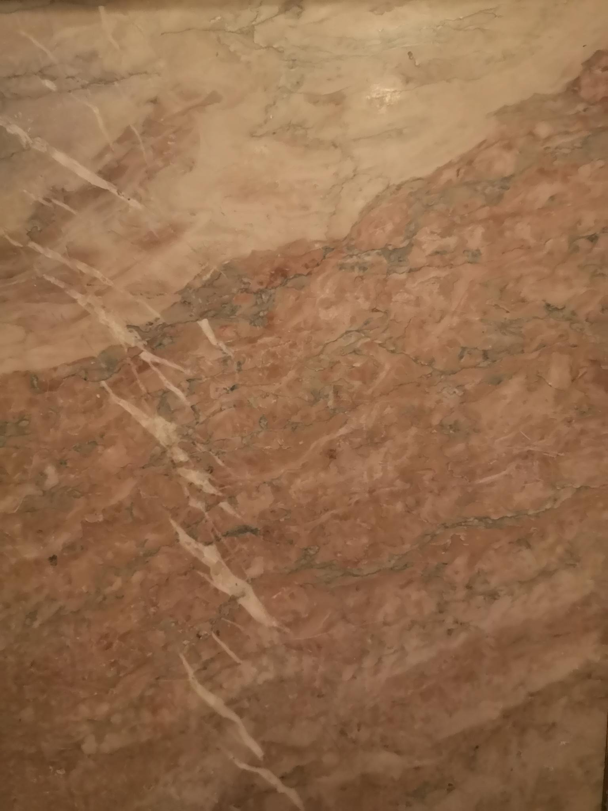
:-------------------------:|:-------------------------:
The plants and anthill could (almost) be seamless textures  | There is definitely a "recipe" to this stone as well

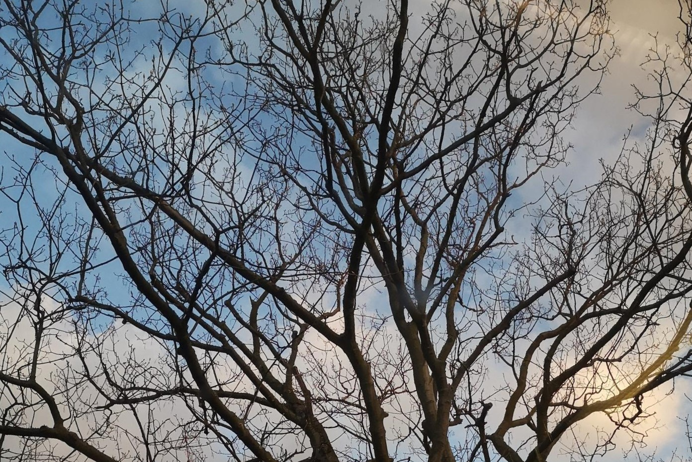
---

<p align="center">I felt like this tree is very self-similar, in a three-dimensional sense. The branches split up into smaller and smaller "tree" shapes ...</p>

---
### 3.2 Understanding and Implementing Patterns

Write for one of your pattern images a generating algorithm in pseudo-code or code. Submit the code below.

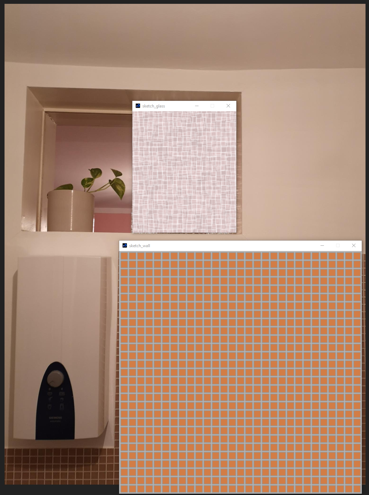

I made the sketches in Processing 4.0b2

```java
// sketch_glass
int rectSize=10;
int space=4;

void setup() {
  size(300, 350);
  background(200,180,180);
  noLoop();
}

void draw(){
  
  stroke(255,255,255,90);
  fill(240, 210, 210, 50);
  strokeWeight(2);

  for (int x = -1; x < 29; x++) {
    for (int y = -1; y < 29; y++) {
      rect(space + x * (rectSize + space) + random(-3, 3), space + y *(rectSize + space) + random(-3, 3), rectSize + random(1, 20), rectSize + random(1, 20));
    }
  }  
}

// sketch_wall
int rectSize=20;
int space=4;

void setup() {
  size(700, 700);
  background(185);
  noLoop();
}

void draw(){
  
  stroke(150);
  fill(210,125,70);
  strokeWeight(2);

  for (int x = 0; x < 29; x++) {
    for (int y = 0; y < 29; y++) {
      rect(space + x * (rectSize + space), space + y *(rectSize + space), rectSize, rectSize);
    }
  }
}
```


### 3.3 Seeing Faces

As an exercise to see and understand the environment around you (and to have some fun 😊), try to find at least two faces. Link all images in this file.


[Image sources left to right, top to bottom: [1](https://www.google.com/imgres?imgurl=https%3A%2F%2Fpbs.twimg.com%2Fprofile_images%2F378800000719377900%2F45f6f5459fe0d5678de052e8741700d0_400x400.jpeg&imgrefurl=https%3A%2F%2Ftwitter.com%2Ffacespics&docid=JoT1wUHfRfTWbM&tbnid=x30M4EKn_ft1wM%3A&vet=10ahUKEwisyqXc27_hAhXGJlAKHXNpArEQMwg_KAAwAA..i&w=400&h=400&bih=915&biw=1680&q=faces%20in%20things&ved=0ahUKEwisyqXc27_hAhXGJlAKHXNpArEQMwg_KAAwAA&iact=mrc&uact=8#h=400&imgdii=PorYURvb5HYYdM:&vet=10ahUKEwisyqXc27_hAhXGJlAKHXNpArEQMwg_KAAwAA..i&w=400), [2](https://www.themarysue.com/things-that-look-like-faces-pareidolia/), [3](https://www.themarysue.com/things-that-look-like-faces-pareidolia/), [4](http://www.abovetopsecret.com/forum/thread1159632/pg1), [5](https://lockerdome.com/buzzfeed.com/6814745186674964), [6](https://twitter.com/FacesPics/status/1086717380837953536), [7](https://laughingsquid.com/faces-in-things-funny-photos-of-objects-that-appear-to-have-faces/), [8](https://twitter.com/facespixx)]

Here are some faces I found:

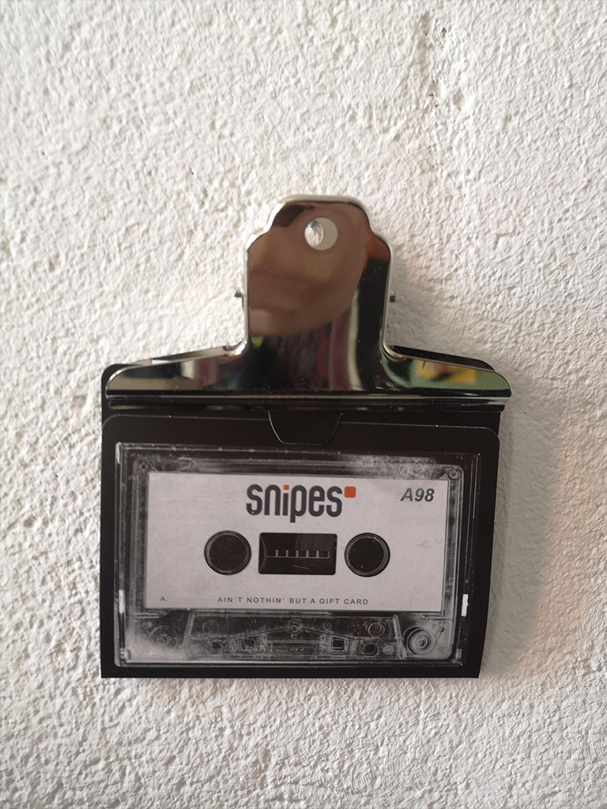  |  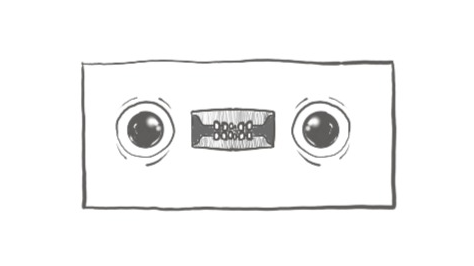
:-------------------------:|:-------------------------:
  My photo | My sketch of the little face

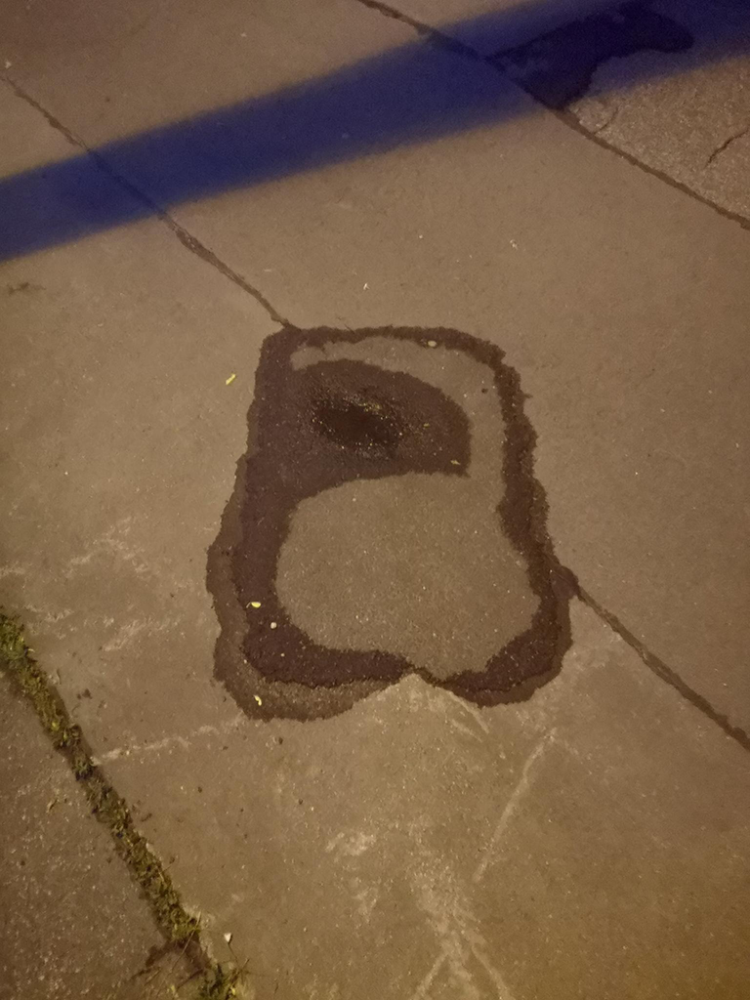  |  
:-------------------------:|:-------------------------:
  My (a bit older) photo | I know it's not quite a "face" but I took this picture because of a meme, which I felt like really fit the seeing "faces" assignment :D


---
## Questions 4 - Abstraction

### 4.1 Abstraction in Art

Chose one "traditional" painting, which is inspirational to you. The image can come from the script or you can refer to any artists or image you like.  

I really liked this one from your collection:


from: [Kazimir Malevich, "Quadrato rosso", 1915](https://eo.wikipedia.org/wiki/Dosiero:Kazimir_malevich,_quadrato_rosso_(realismo_del_pittore_di_una_campagnola_in_due_dimensioni),_1915.JPG)

I really like the dedication to absolute simplicity in this piece. I feel like it also takes (or: took) a lot of bravery to do this kind of art. I feel like people often say that "anyone could have painted this" or that it's not even "real art" - even today. I find the boldness and dedication to the craft very inspiring! 


And I don't know if it's abstract enough, but I always enjoy the work of Ines J. a.k.a. [art-creature](https://art-creature.tumblr.com/):


from: [art-creature on tumblr](https://art-creature.tumblr.com/post/681900197224284160)

What I really enjoy about art-creature's pieces is the core of "known" parts, e.g. a human figure, and the way they dissipate on the canvas: into symbolic shapes, surreal plant-like structures or just patches of colours. She often portaits a specific, albeit abstracted, mood - like in this piece there is definitely a topic/theme, but it's really hard to put into words. This portrayal of very human (?) experiences is very inspirational to me and I would like to adopt this kind of storytelling in my own art as well.

### 4.2 Abstracted Artistic Expression in CGI

Choose one CG image, which you like and of which you think that it has an artistic quality to it. The image doesn't need to be from the script, again you can chose any CGI image you like (it should use 3D graphics). You can find more examples in the [Summary of Artists](../../02_scripts/pgs_ss22_01_intro_script.md#summary-of-artists) section.  

Sorry, I picked 2! :D


found on: [StashMedia](https://www.stashmedia.tv/growing-flower-alexa-sirbu-lukas-vojir/) & [Vimeo](https://vimeo.com/232473927)  
made by: Alexa Sirbu, Lukas Vojir, with music Zelig Sound

I feel like a specialty about computer graphics is the ability to animate/introduce movement into the works. Especially in 3D, most of my favorite works have a movement to them, like the video where the stills above originate from.  
In such works, which use these "thick hairs" in motion, I often have the feeling that I can almost touch the hairs / experience the feel of these unreal objects, if I just look at them long enough. In contrast to the "traditional" abstract art, where the canvas determines the texture, I feel like in CGI texture is often overexaggerated and also often used as a contrast.  
Either way, it is definitely as much part of the artwork as the choice of linen in "traditional" artworks.  

<!-- https://frederikheyman.com/SYMPATHY-FLOWER-ARRANGEMENT -->
...

I'll have to admit though, I found it really hard to find a more abstract CG image, as most works that really interest/inspire me are more figurative and use a lot of real-world-objects and then abstract or work with them.  
One artist whose works I really like is [Frederik Heyman](https://frederikheyman.com/) who creates these maximalistic surreal and somewhat horror works:


This is a still from a [music video with Arca](https://youtu.be/NL-tvd8jeBc).
