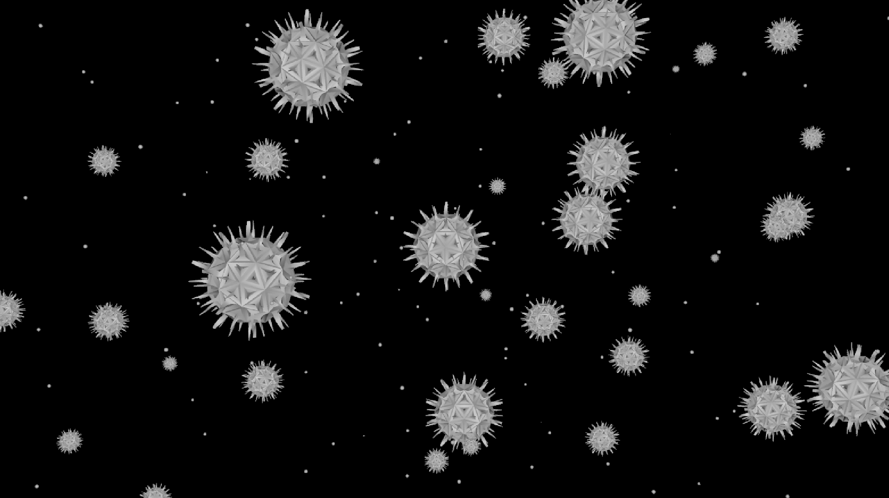
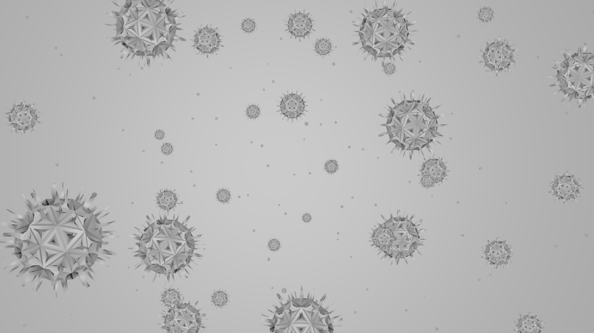
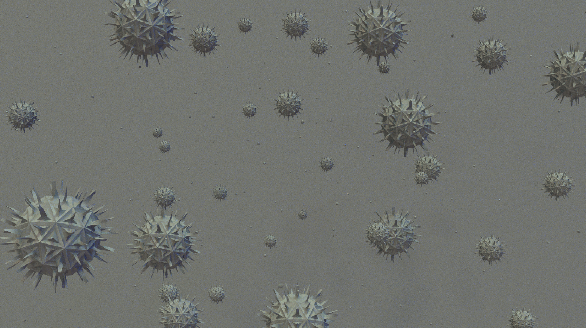
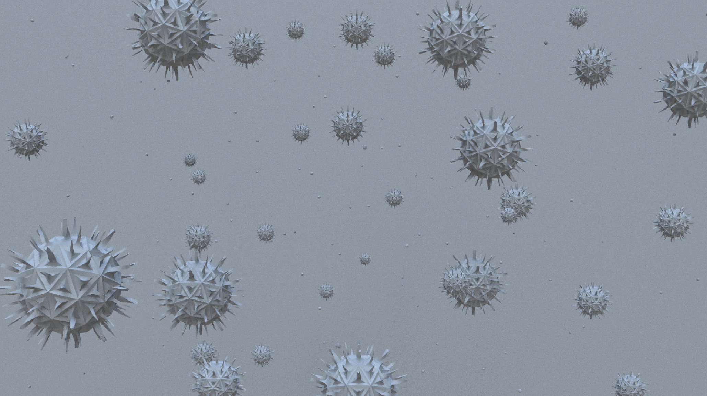
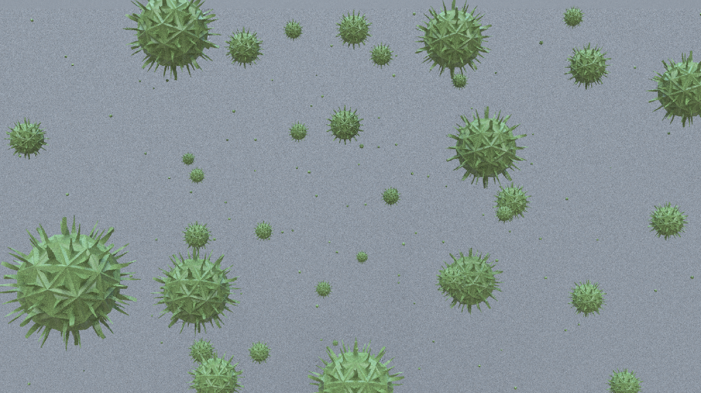
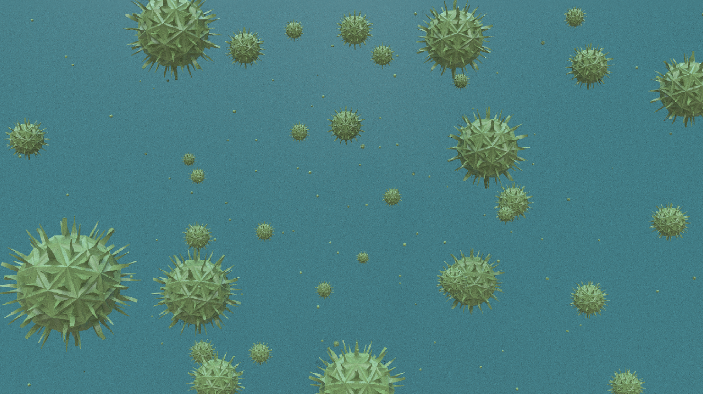
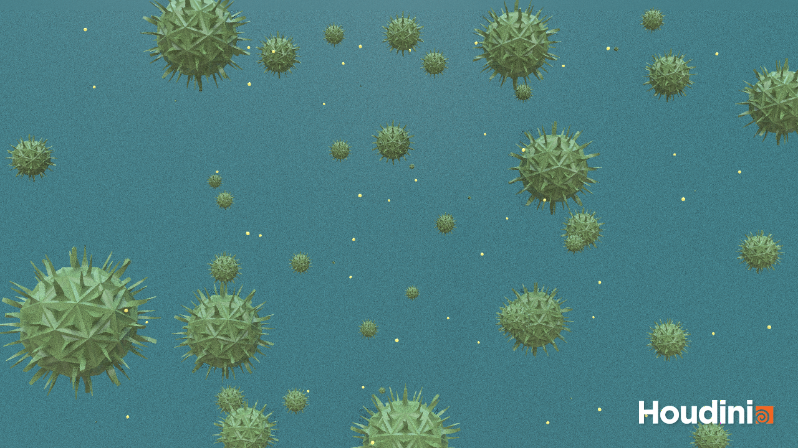
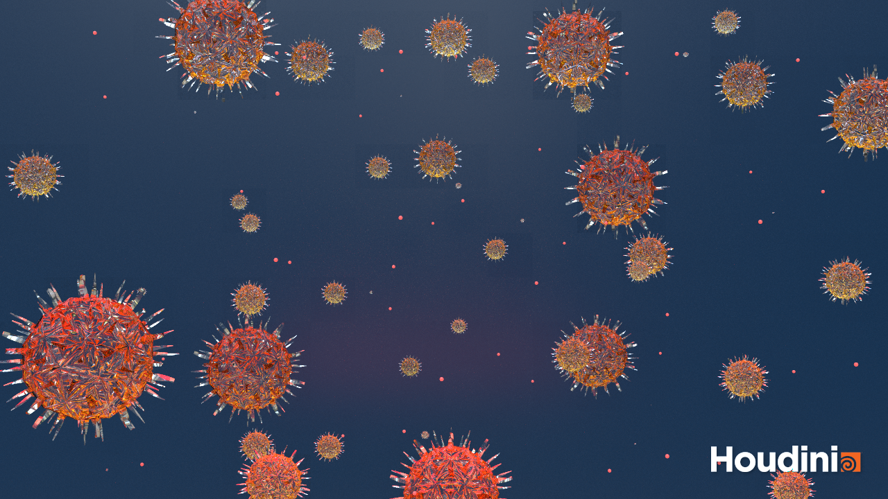

## Tutorial Results

I have made some Work In Progress Renders while following along.

Setting up the scene:

Refining the scatter and adding a background plane:

Testing a downloaded HDRI of an artifical light scene:

Testing a downloaded HDRI of a natural light scene:

Adding a basic material to the viruses:

Adding a basic material to the background:

**The final result:**

## My own interpretation

I played around with different lights, render settings and tested some materials.  
Sadly, I didn't take a lot of screenshots in between. For the final render (which took 01:45 hours...) I have played around with the "tinted glass" material and added an additional red area light to the scene:

