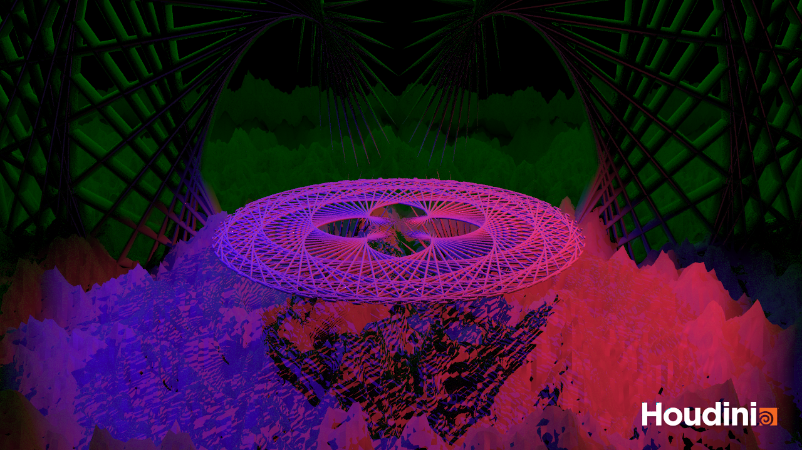
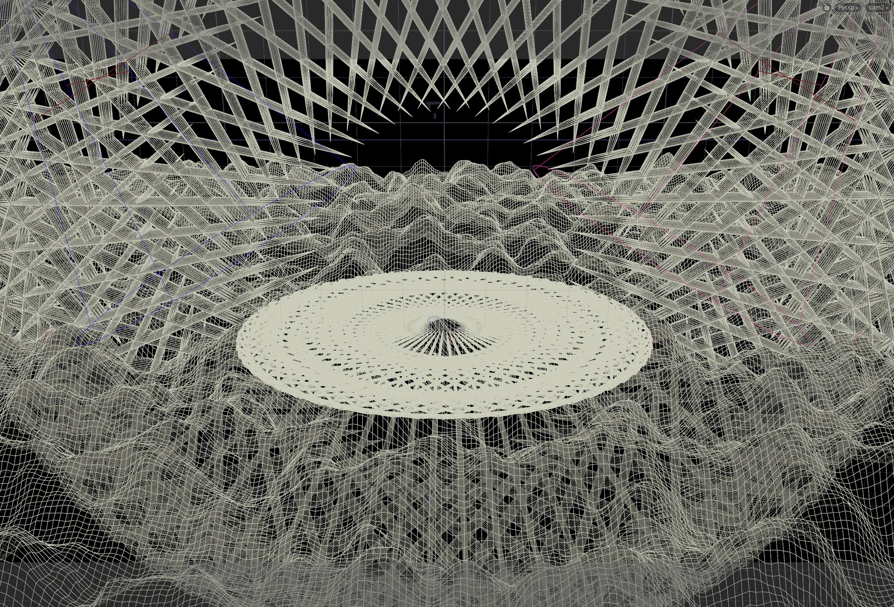

<!-- Math's Beauty -->

## Tutorial Results

Sadly, I learned today that Houdini doesn't always save the snaps from an earlier session...  
When I opened my project again, my tutorial result render was gone. :(

## My own interpretation

I was extra safe with my own interpretation though & always saved the rendered WIP shots:

Also, I caught this very cool looking wireframe scene view:

And the final render:

