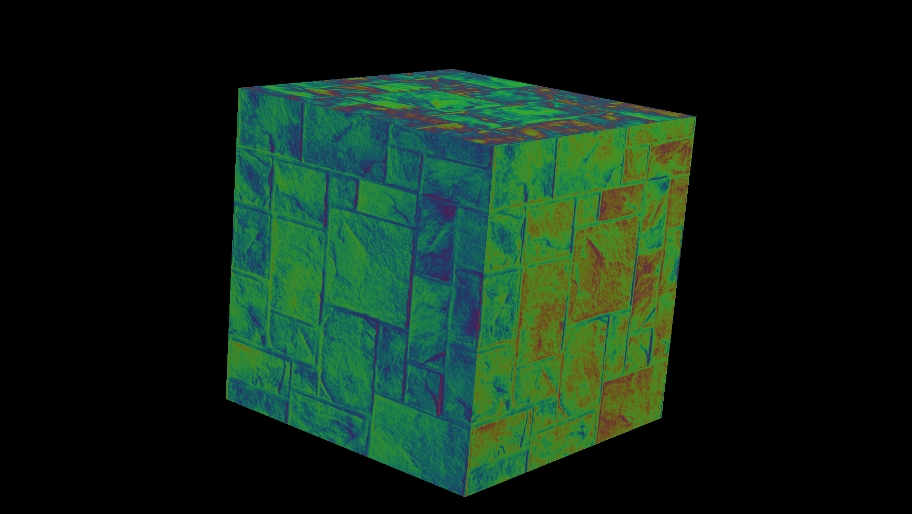
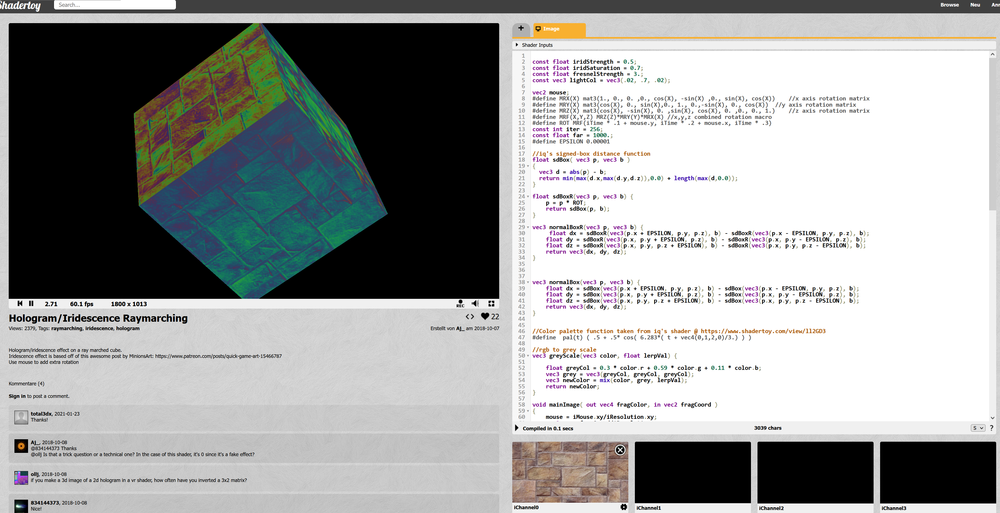
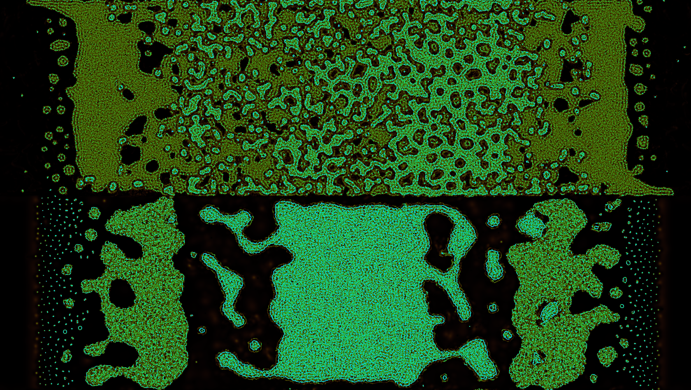

<!-- Functions -->

## Experiment Results

X

## My Inspirational Shader

This beautiful piece is called [Hologram/Iridescence Raymarching](https://www.shadertoy.com/view/XlcBR7) by [Aj_](https://www.shadertoy.com/user/Aj_)

I really wanted to implement this shader in TBAG, but I just couldn't see through the jungle of math! The code isn't too long and I think I might be ready to tackle this one eventually ...

Another cool shader I found while browsing is the [Primordial Soup System](https://www.shadertoy.com/view/NssczB) by [davidar](https://www.shadertoy.com/user/davidar):

This one has different buffers and a lot of code. I really don't feel ready yet to understand something like this, but I really like it :)

---

## Time Annotations

The time we should spent on this assignment: <3h

I have started to log the time I spent on homework assignments.
I have made more detailed notes on the time spent per task and the reasons - if you're interested we can talk about them.

**= in total it took me about 2 hours to get this far. (to be continued)**
