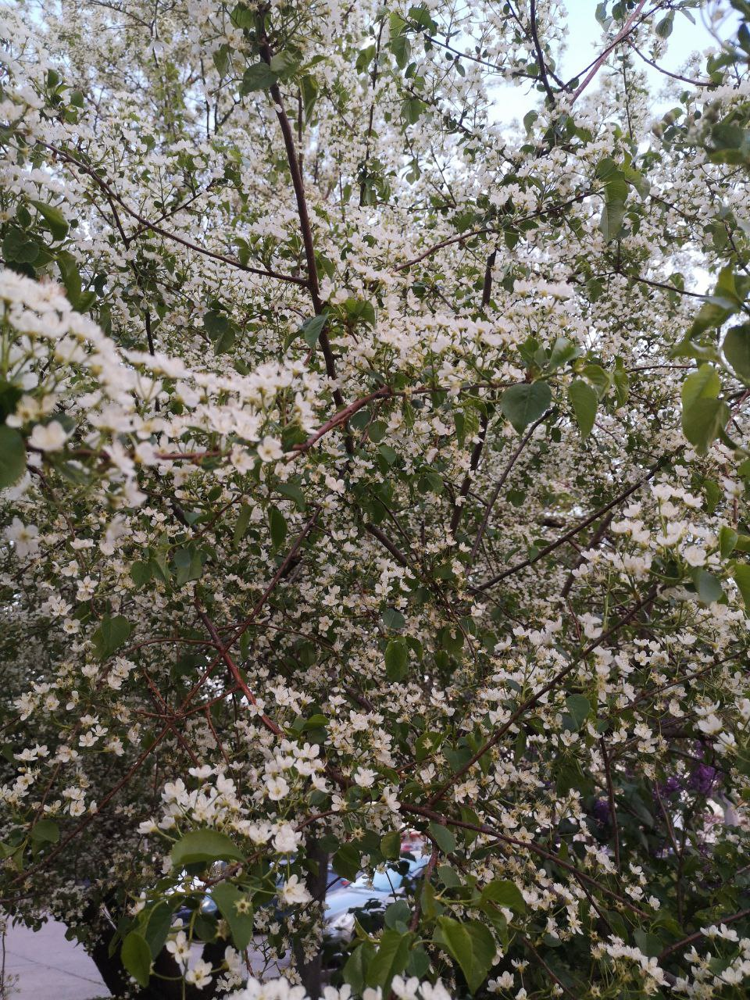
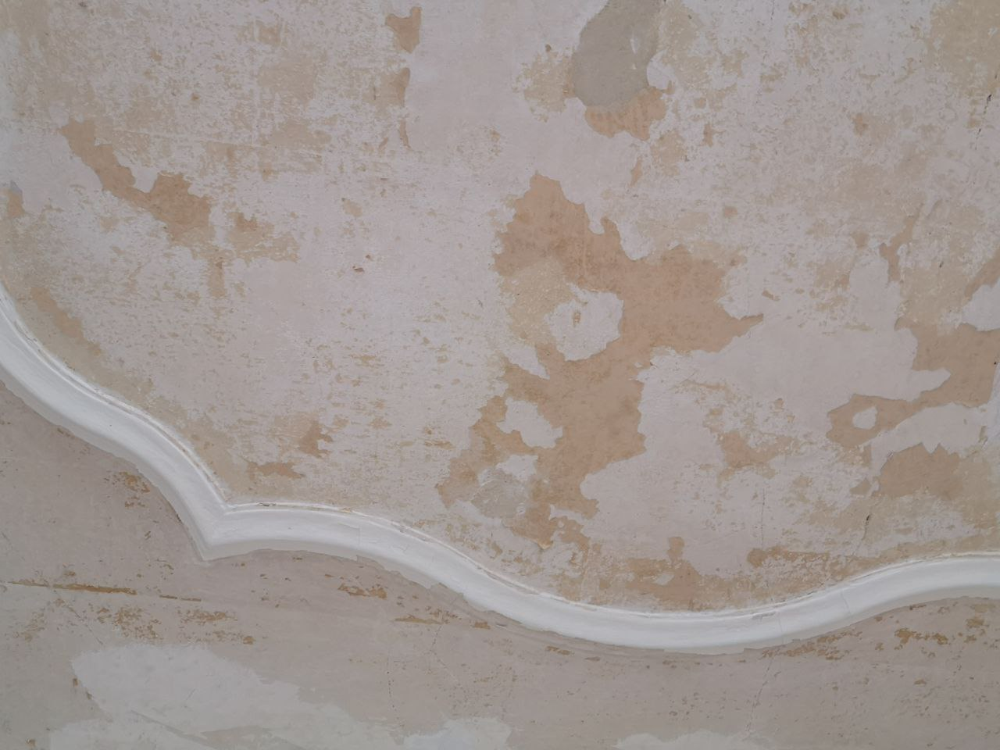
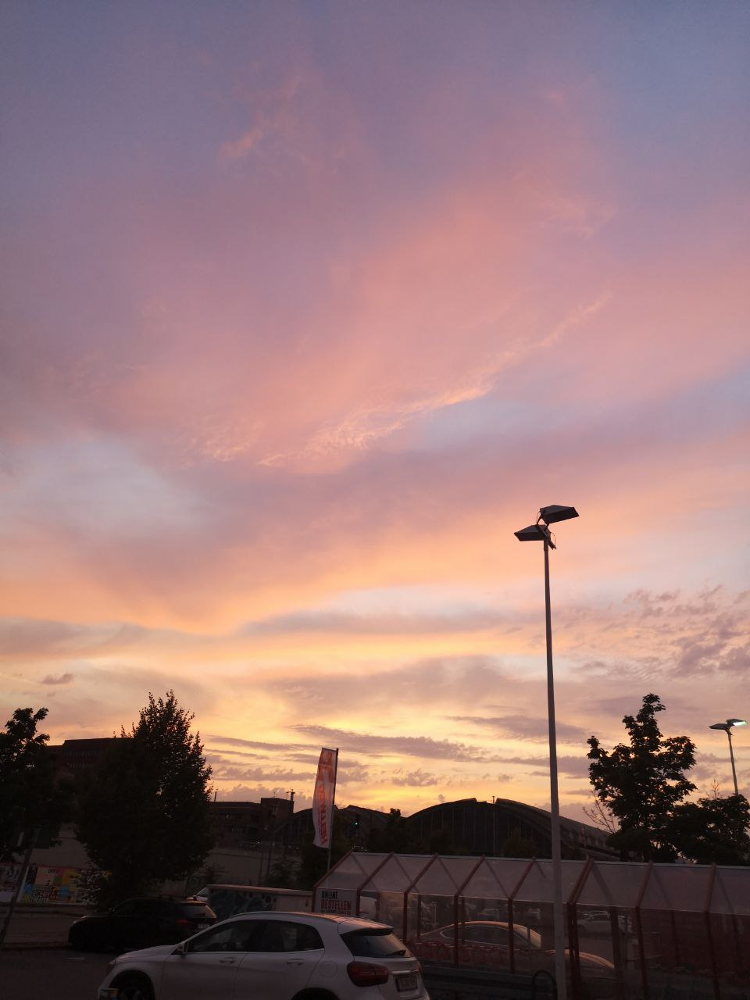
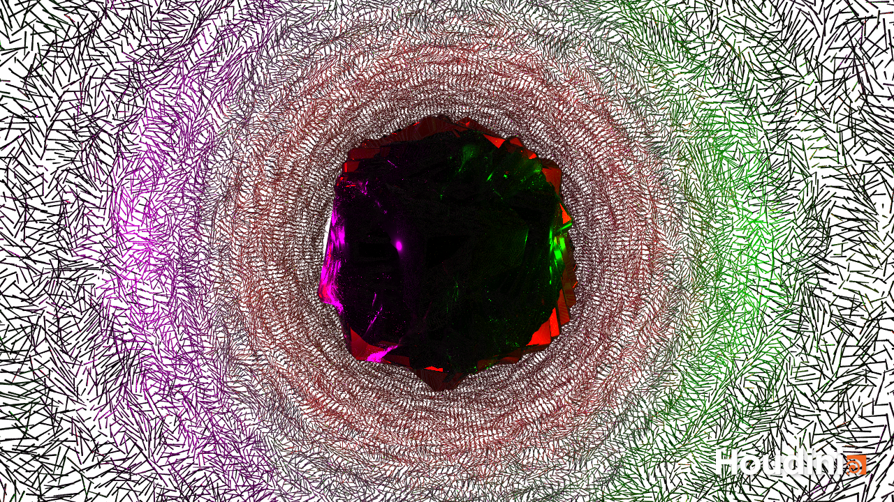
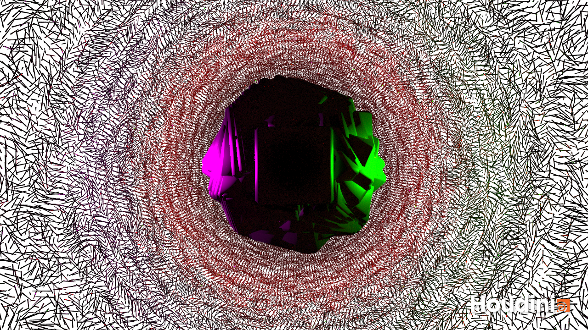

<!-- Noise -->
## Finding Noise

Natural Noises:

Artificial Noise:

This is the title picture of this very cool [video tutorial](https://vimeo.com/300928131)

## Task 2 - Results

First test with tinted glass material:

Second render with iron material (to reduce render time):

## Video

https://user-images.githubusercontent.com/93382434/173902502-ec1553d2-b1fe-4c83-abfc-7e24d65af5aa.mp4

