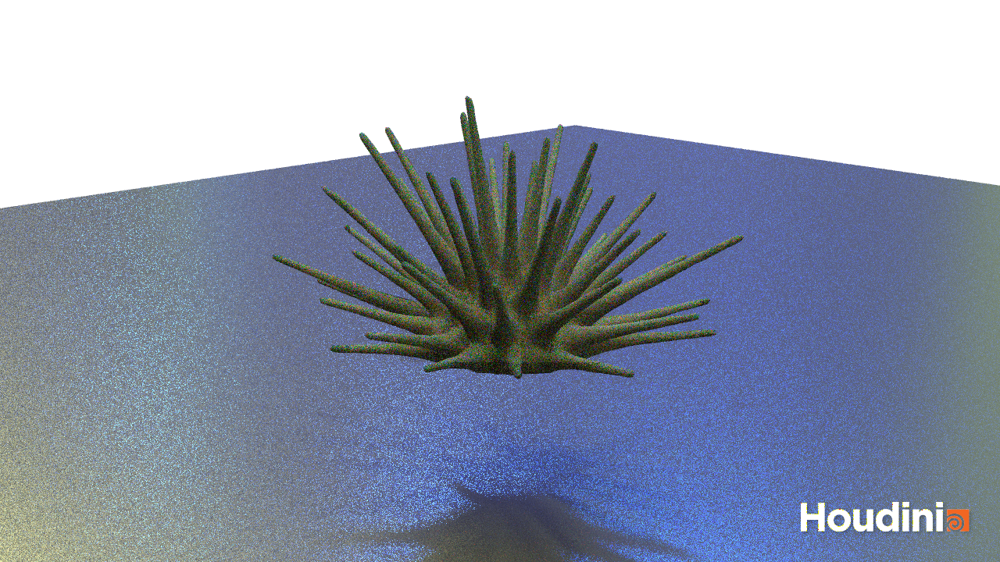
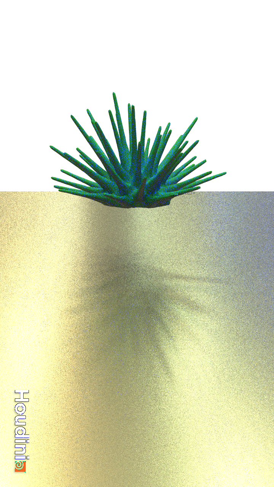

<!-- Forces -->
## Task 2: A Basic Force Setup

I struggled quite a bit with the tutorial, especially with the [Moving the Particles II](https://github.com/ctechfilmuniversity/lecture_procedural_generation_and_simulation/blob/main/docs/01_sessions/07_dynamics/pgs_ss22_tutorial_04_dynamics.md#moving-the-particles-ii) part. I didn't understand how I could create the code / make it work. Luckily, Tim helped me debugging it.

My result:

https://user-images.githubusercontent.com/93382434/175824499-e6a23470-0425-429a-86a6-39f7602b7e73.mp4

This took my about 2,5 hours - without adding a freestyle force.

## Task 3: Intro Rigid Body Dynamics

I chose this tutorial about [FEM Fibers & Procedural Motion](https://www.youtube.com/watch?v=K50aBkVNZjU), but I didn't manage to finish it. I started the tutorial at [01:07:23](https://www.youtube.com/watch?v=K50aBkVNZjU&t=4043s) because I wanted to try doing the reactive anemone. Sadly, at [01:24:31](https://youtu.be/K50aBkVNZjU?t=5071) the creator uses a node which no longer exists - "solid embed" :(  
It has been [deprecated and removed](https://www.sidefx.com/docs/houdini/nodes/dop/solidobject-.html) which made following from now on *very* hard. I tried a bit, but was honestly too confused at this point. I tried using an [organic mass](https://www.sidefx.com/docs/houdini/nodes/dop/femsolidobject.html#organicmass), but I have *no* idea how that works. Subsequently, I gave up!  

Then I tried to do some renderings and added materials:

In this flipbook rendering you can see that I tried to use gravity to at least have a squishy thing. Sadly, the anemone is kindly ignoring the pretty floor I set up:

https://user-images.githubusercontent.com/93382434/175824519-6d25a1ee-fe0e-4231-bf55-32f5c59813ba.mp4

It took my 2,5 to 3 hours to get to this point.

## Time Annotation

This session took me around 5 hours in total.
