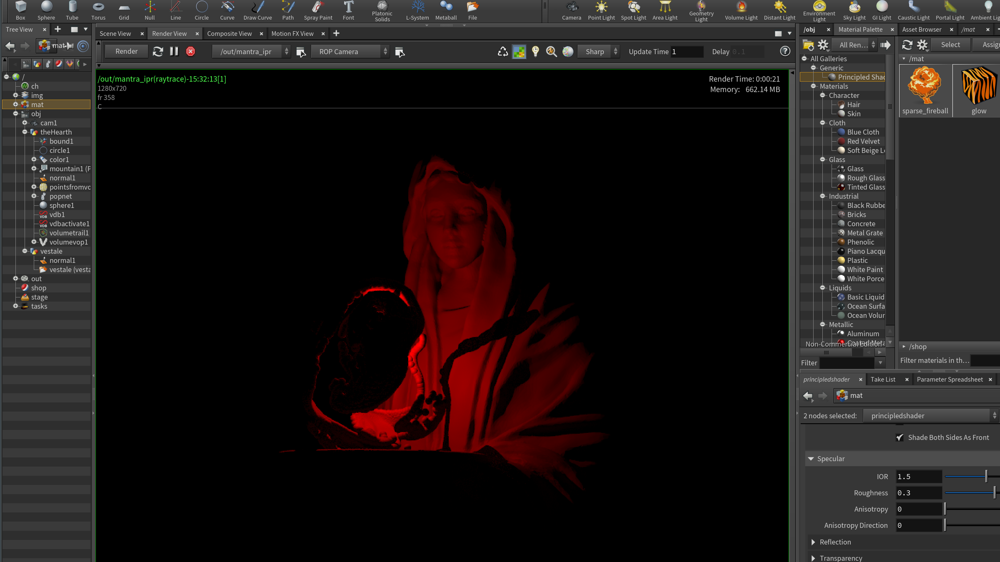

    Abstract
    Concept
    Implementation
    Results
    Project Reflection & Discussion
    Lessons Learned

# Final Project

With this project I explored particles and rendering them with Houdini. The goal was to create an abstracted fire or hearth encasing a statue.

## Concept

It took a while to find a good tutorial. in the end settled with this [Entagma tutorial on swirly particles](https://www.youtube.com/watch?v=yqM_3goH4J8).  
I wanted to find a statue to combine this motion with an object. I checked the [ScanTheWorld](https://www.myminifactory.com/object/3d-print-vestale-at-the-louvre-paris-7427) archive and found this scan of a statue of a [Vestale](https://en.wikipedia.org/wiki/Vestal_Virgin), a high priestess of Rome, guarding the holy hearth of the city.
While reading up on the history of the vestale, I came up with this concept:

## Implementation

For the particles I followed the tutorial linked above rather closely. I really loved taking my time to play around with the values and seeing what happens, but in the end my result is quite close to the original.

The other challenge was the rendering: This step is omitted from the tutorial... So I had to figure out how to get a result I liked, especially with the glowing materials.
The final result has 1000 frames and took a whopping 53 hours and 11 minutes to render.

## W.I.P. Screenshots

At first I reallly struggled with rendering the particles as intended:

Some light experiments:

Sometimes "fixing things" doesn't fix anything, but makes it worse...  
In this screenshot I am comparing an older rendering (right) with the one I've been rendering for 10 hours. I thought I was making it better by changing some render settings, but I made it worse :D  
Hence, I had to start over.

This screenshots is just a work in progress before my final rendering attempt.  
I tried to make extra sure everything is to my liking. While rendering I also often exported the already finished frames to a video to check whether I like the way it's going.

## Results

Some stills from the final render:

And the final video:

// WILL BE LINKED

## Project Reflection & Discussion & Lessons Learned

I'm very happy with my results, even though I can still see room for improvement in the final renders. I would like to dive deeper into professional lighting setups (for photographers and cinematographers). During the course I often felt like my objects are lit a little "amateurish". Maybe I can find a course like this next semester at Filmuni.

Other than that, I felt like sticking to just one tutorial was a good idea. In my original concept I also wanted to melt the statue, following this [tutorial](https://www.youtube.com/watch?v=B3W-S0EW9xw&t=80s). I'm glad I didn't attempt that! :D Especially the rendering took quite a while - the final result is my 3rd render because I was often still unhappy with the "flow" or the development of the glow.  

In summary, I'm happy with my result. Maybe I'll come back it eventually to implement the melting, but let's see... First I'll enjoy the summer!

