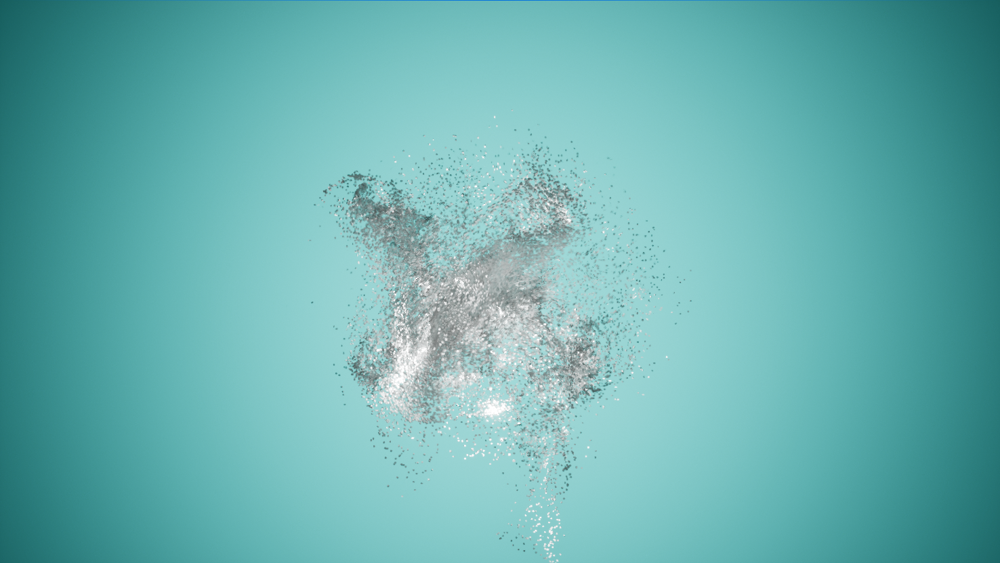

# PGS Final Project by Jannis Volz

## Abstract

I created a realtime audio reactive particle system using Unreal Engine 5.

## Concept

This audio reactive particle system will be a part of my Second Term Project, which will be a projection mapping installation on a dancefloor of a music festival.
Therefore it had to be done in a live-capable environment, which ruled out Houdini.  
I briefly researched particle systems in TouchDesigner, but quickly realized, that this would not be suitable for the more elaborate 3D environment that the particle system should be incorporated in in my second term project. I then found a tutorial for a particle system in Niagara which I found very nice:

## Implementation

Initially I followed the setup of the tutorial, meaning creating a Niagara system and applying several forces:  
- Drag
- Wind Force
- Point Attract Force
- Gravity Force
- Vortex Force
- Curl Noise Force 1
- Curl Noise Force 2

I chose a Cube as particle geometry for performance reason and applied a Chrome material for nice lighting interactions.  

To make everything audio reactive I created a Niagara Module Script, which reads the Audio Spectrum of the Master Submix (whatever Audio is being output) of the Engine. The amplitude level is ***decompressed*** using an exponential function, meaning that lower amplitudes will have an even lower effect, while higher amplitudes will have even greater effect. Due to how (electronic) music is mastered this lets the system react to the beat rather than every melodic pad element. The ***decompressed*** amplitude value is then multiplied with the current particle velocity.  
I also experimented with mapping particle age to the entire audio spectrum, meaning that younger particles react to lower frequencies and vice versa, but the effect was not as noticeable and also messy at times.  
Additionally I turned the Particle Mesh Scale parameter into a Scratch Dynamic Input, meaning it is calculated using code. I subtly scale the particles by amplitude with a very similar method than the one mentioned above.  
  
Live Audio is put into Unreal via a Blueprint containing an **Audio Capture** component. Audio Capture takes the audio signal from whatever is set as Microphone in your Windows System Settings and sends it to a selected Submix, in my case the Master Submix. (**This means if you try my project out in Unreal and have your PC microphone selected in the settings and your speakers turned on this will result in nasty feedback**). I connected an audio interface where sound is coming in and selected this as microphone.  

## Result

The render is somewhat laggy, which is because I did not want to get into the hassle of recording video with Unreal. I had already set up a pipeline to send live video from Unreal to TouchDesigner via Spout. I recorded there and could not get it to run super smoothly, but it's fine I guess, as this project is meant to be enjoyed live.

[Link to Video of result](https://drive.google.com/file/d/171qBWW4kEFFgwiQjJHT5A3kA9G3gd1D5/view?usp=sharing)

### Preview Pic:

## Project Reflection & Discussion & Lessons Learned

I had a lot of fun with Niagara and Unreal 5. The results you can achieve through the sophisticated optimizations of the Unreal rendering pipeline were very impressive to me.  
However I found that Unreal is a very closed system, meaning it is quite unintuitive to do things that are not Unreals primary use case (like Live Audio input).  
Live Audio was also my biggest struggle. Audio Capture does not let you select an Audio Input Source, which initialy made my System react to my microphone audo only. So I then set up a TouchDesigner project which should handle the audio and sent it to Unreal via NDI. I could not get Unreal to receive the signal and make it usable as an Audio Spectrum Object however.  
Then I tried to convert the TD Audio CHOP into a TOP texture and send it to Unreal using Spout. I could receive it in Unreal but due to poor documentation I could not find a way to read the entire pixel data in the Niagara Module Script. I could only sample a pixel at a certain position at once, which would make reading all pixels very unperformant.  
It was at this point that I found out, that I could set my microphone outside of Unreal (which was also not documented anywhere).  
  
My favorite learning was also caused by head scratcher. I had to scale my particle system, which completely changed the movement. The forces did not scale with it, which made forces like the Point Attraction force act much stronger on the particles that where now all closer to the origin.  
Therefore I had to readjust all force strengths myself until I got a similar result to the tutorial. This process made me understand what each force contributed to the whole system much better.  

All in all I think this project is what it is supposed to be. It is not a fully fleshed concept by itself, as it will only become semantically meaningful in the context of my second term project installtion. So it is just very pleasing and beautifully unpredictable visuals that can live-react to audio.

