**Procedural Generation and Simulation**

# Questions Session 01

- [Questions Session 01](#questions-session-01)
  - [Questions 1 - Topics & Syllabus](#questions-1---topics--syllabus)
  - [Questions 2 - Procedural Generation](#questions-2---procedural-generation)
  - [Questions 3 - Patterns](#questions-3---patterns)
    - [3.1 Seeing Patterns](#31-seeing-patterns)
    - [3.2 Understanding and Implementing Patterns](#32-understanding-and-implementing-patterns)
    - [3.3 Seeing Faces](#33-seeing-faces)
  - [Questions 4 - Abstraction](#questions-4---abstraction)
    - [4.1 Abstraction in Art](#41-abstraction-in-art)
    - [**“Making Love to a Man Who isn’t All There” by Ann Leda Shapiro.**](#making-love-to-a-man-who-isnt-all-there-by-ann-leda-shapiro)
    - [4.2 Abstracted Artistic Expression in CGI](#42-abstracted-artistic-expression-in-cgi)
    - [**Journey Sand Shaders**](#journey-sand-shaders)

## Questions 1 - Topics & Syllabus

* Which of the chapter topics given in the syllabus are of most interest to you? Why?
  * **It's very hard to say because this is one of the most interesting courses in the entire program for me. I'd say complex systems and fluids in particular, because I'd like to further explore the "drying minimal painting that also moves around"-aesthetic that Andreea and I tried our hands at for our Sehsüchte installation. There is just something about fluids that draws me towards them. It's is probably the same effect that particles have on other people. Some deep feeling of satisfaction.**
* Are there any further topics in regard to procedural generation and simulation that would interest you?
  * **An overview on how to implement the learned techniques in 3D engines might be very interesting since so many of us tried out Unity/Unreal for our first-term-projects. Though I guess that this might also come up once again during the shader programming course.** 
* Which tool would you personally prefer to use for the practical tasks (e.g. Houdini, Unreal, Unity, Maya, Blender, JavaScript, p5, GLSL, ...)?
  * **I will definitely at least try Houdini after hearing you sing its praise. I have wanted to get into Touchdesigner for a while, but this might be my chance to take on its more capable older brother straight away. I'd also like to continue using GLSL, but my impression is that it's barely used outside of academia, so maybe it's a waste of time. Currently I don't intend to return to p5 or Javascript since GLSL suits me so much more (+traumatizing experiences with web development during cc1). Unity and Unreal would be a nice extra, as I've written before.** 
* How would you rate your level of experience with SideFX's Houdini?
    * [x] I have only used it in TI
    * [ ] Novice
    * [ ] Intermediate
    * [ ] Advanced
    * [ ] God-like

## Questions 2 - Procedural Generation

Briefly in your own words: how would you explain your nanny what *procedural generation* means?

**Making seamless and endless patterns with computers.**

## Questions 3 - Patterns

### 3.1 Seeing Patterns

Take at least three pictures of natural patterns and at least three pictures of man-made ones (patterns can be two or three dimensional). Try to include at least one pattern with self-similarity. Taking the pictures with your smart phone is just fine. Link all images in this markdown file.

**From natural- to human-made patterns in ascending order. For some of them, I find it hard to say!**

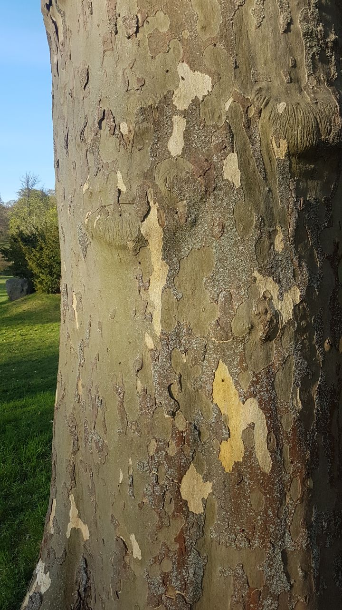
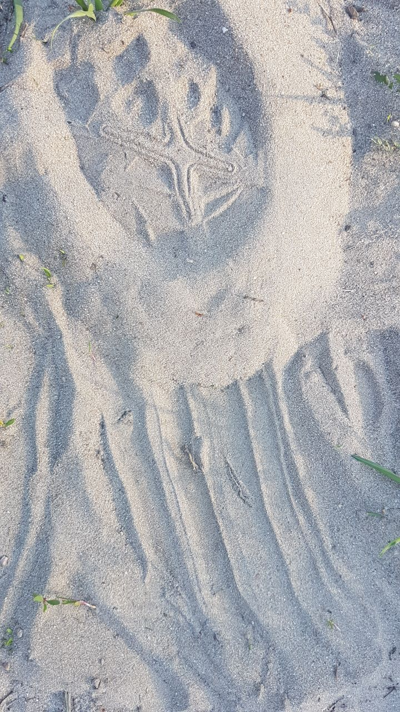
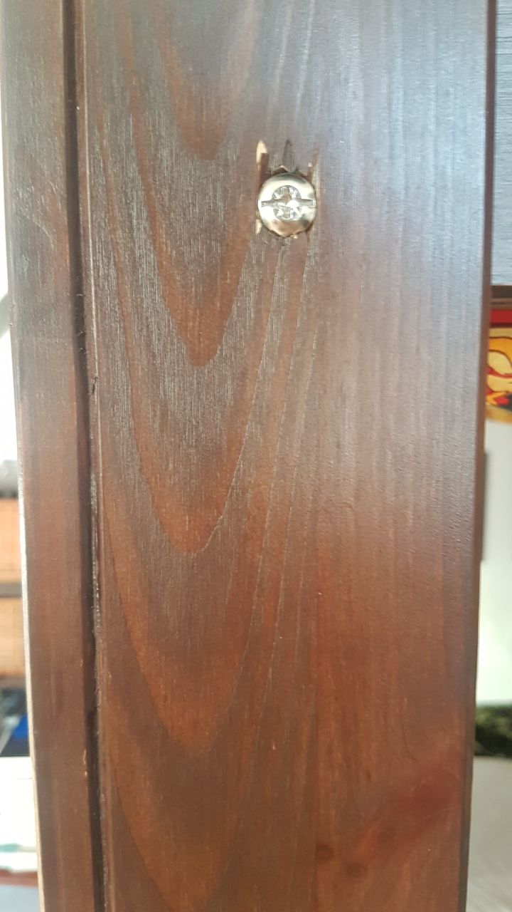
<p/p>
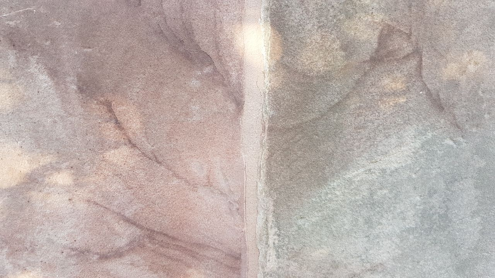
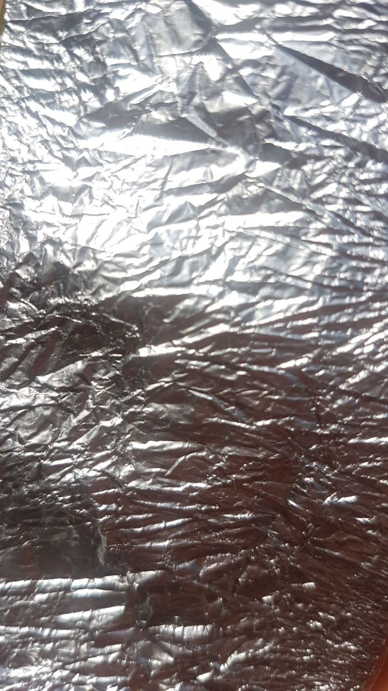
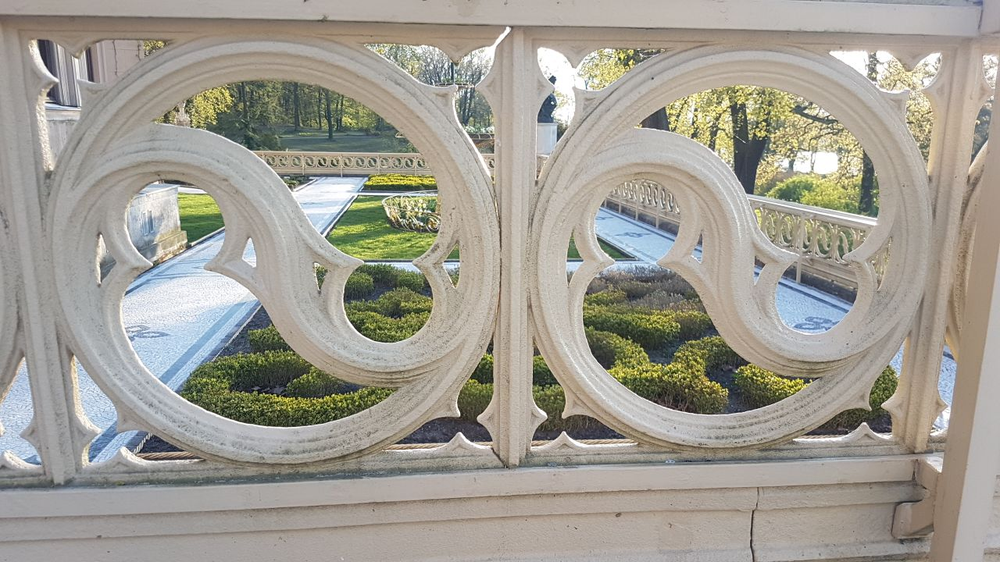
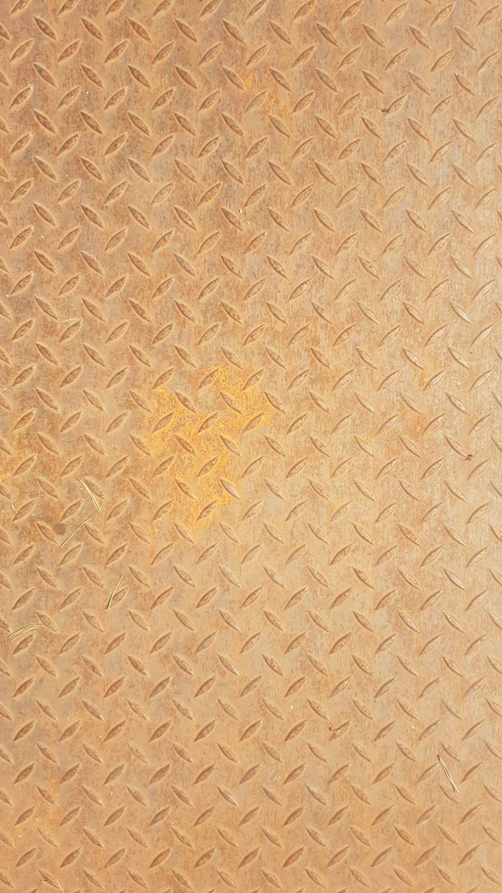


### 3.2 Understanding and Implementing Patterns

Write for one of your pattern images a generating algorithm in pseudo-code or code. Submit the code below.

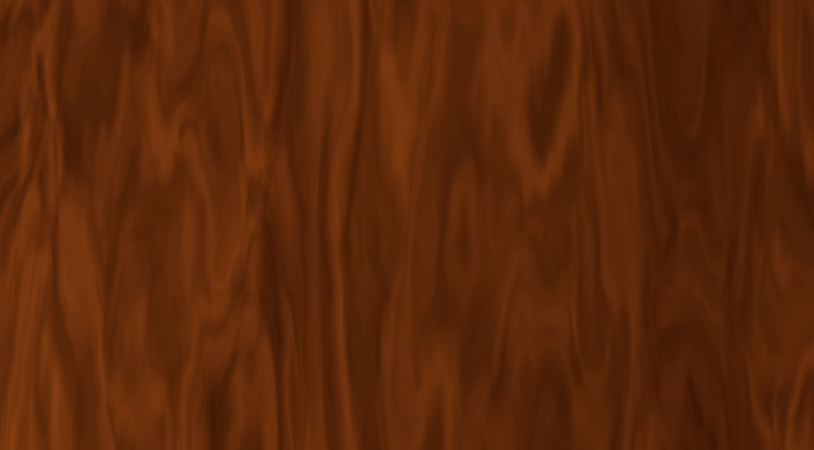

````glsl
//Based on the bookofshaders.com and this tutorial by Inigo Quilez:
//https://iquilezles.org/articles/warp/
//It's the same code as for my tbag fluid shader, just with some minor changes.

precision highp float;

uniform vec2 u_resolution;

float random (in vec2 st) {
    return fract(sin(dot(st.xy,
                         vec2(12.9898,78.233)))*
        43758.5453123);
}

// Based on Morgan McGuire @morgan3d
// https://www.shadertoy.com/view/4dS3Wd
float noise (in vec2 st) {
    vec2 i = floor(st);
    vec2 f = fract(st);

    // Four corners in 2D of a tile
    float a = random(i);
    float b = random(i + vec2(1.0, 0.0));
    float c = random(i + vec2(0.0, 1.0));
    float d = random(i + vec2(1.0, 1.0));

    vec2 u = f * f * (3.0 - 2.0 * f);

    return mix(a, b, u.x) +
            (c - a)* u.y * (1.0 - u.x) +
            (d - b) * u.x * u.y;
}

#define NUM_OCTAVES 7

float fbm ( in vec2 _st) {
    float v = 0.0;
    float a = 0.6;
    for (int i = 0; i < NUM_OCTAVES; ++i) {
        v += a * noise(_st);
        _st*=1.75;
        a *= 0.5;
    }
    return v;
}

float pattern( in vec2 st, out vec2 q, out vec2 w) {
    float a = 30.0;
    q = vec2( fbm( st + vec2(0.0,0.0) ),
                   fbm( st + vec2(5.2,1.3) ) );

    w = vec2( fbm( st + a*q + vec2(1.7,9.2) ),
                   fbm( st + a*q + vec2(8.3,2.8) ) );
                                   
    return fbm(st);
}

void main() {
    vec2 st = gl_FragCoord.xy/u_resolution.xy;
    st.x *= u_resolution.x/u_resolution.y;
    vec3 color = vec3(0.2157, 0.0784, 0.0078);
    vec2 q = vec2(0.0);
    vec2 w = vec2(0.0);

    st.y*=0.22;
    st *= 2.0;
    st.x+=0.9;

    float f = pattern(st, q, w);

    color = mix (color, vec3(0.5529, 0.2588, 0.0745), dot(w.y, q.x));

    gl_FragColor = vec4(color,1.0);
}
````


### 3.3 Seeing Faces

As an exercise to see and understand the environment around you (and to have some fun 😊), try to find at least two faces. Link all images in this file.

**Gahhh I'm bad at this.**

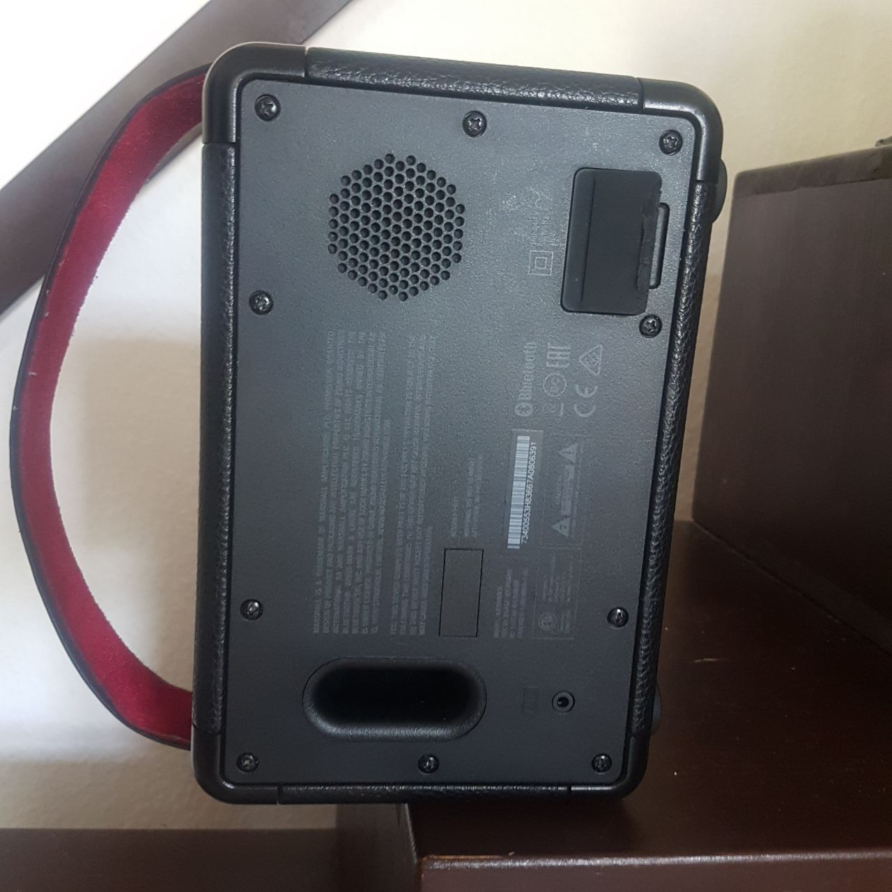 

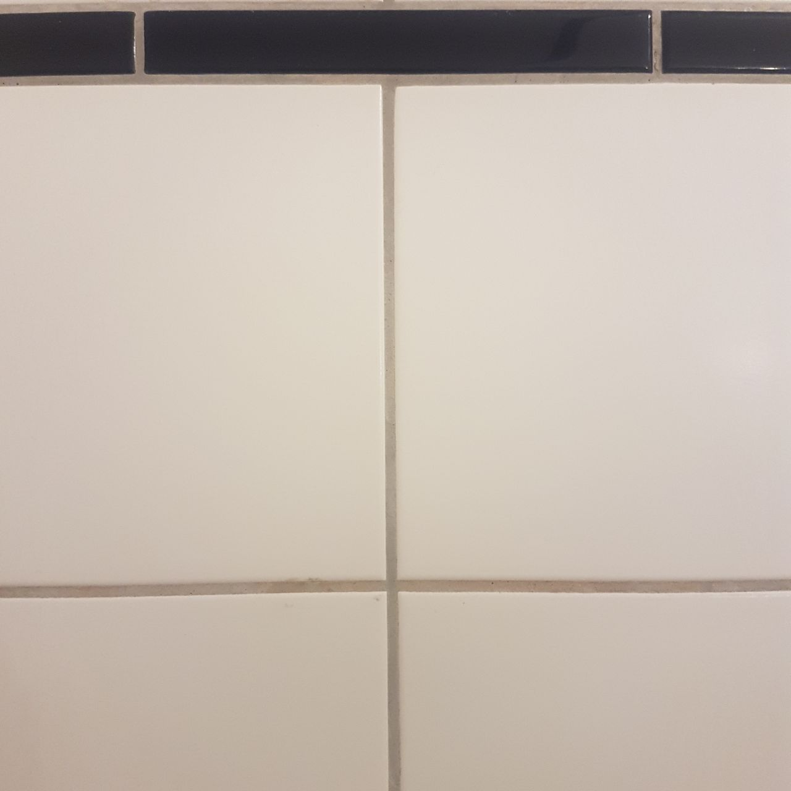 

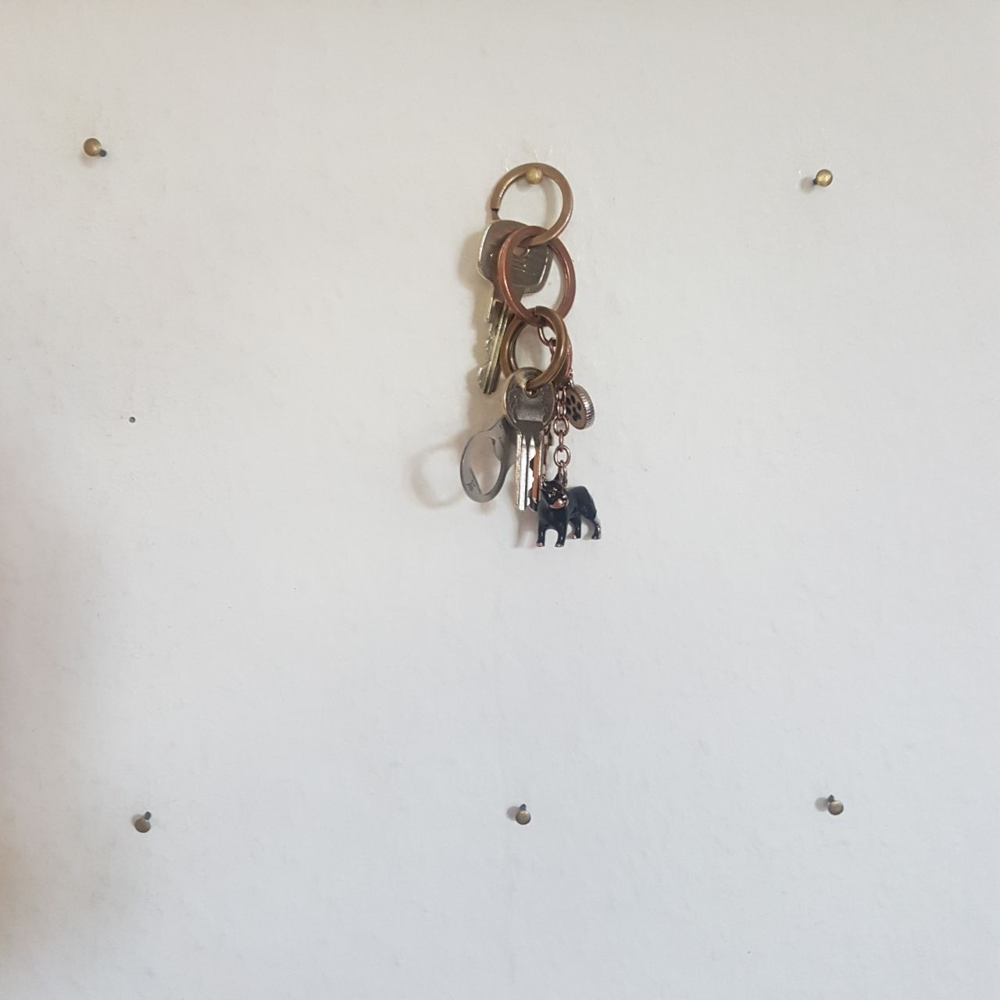  (I didn't find a good fit for this one...)


## Questions 4 - Abstraction

### 4.1 Abstraction in Art

Chose one "traditional" painting, which is inspirational to you. The image can come from the script or you can refer to any artists or image you like.  

Explain briefly what you like about the painting and how it might inspire you for your own work.

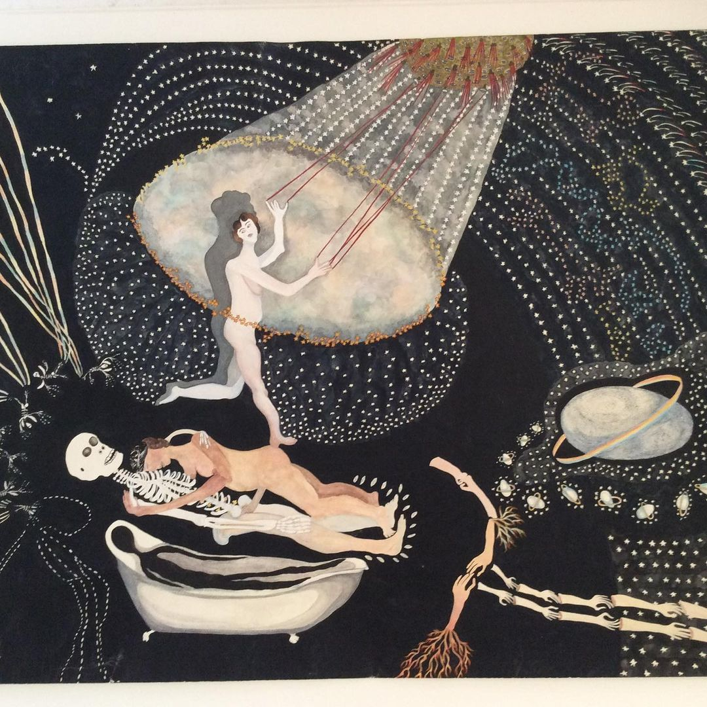
### **“Making Love to a Man Who isn’t All There” by Ann Leda Shapiro.**
**Her other works can be viewed [here](http://www.annledashapiro.com/) or on her [Instagram](https://www.instagram.com/annledashapiro/).**
**To me, she is a more accessible and funnier Hilma af Klint.**
**Unfortunately, she isn't all that popular, so there are only low-res scans and smartphone photos like this one to be found. This makes me sad.**

**I like that she embraces the 2Dness of the canvans - for example with the shadow of the woman in the spotlight. This gives the painting a certain feel of materiality, not unlike some action paintings. The way she draws plants (absent here) is also a nice example for abstraction. They are easily recogniced as their respective species, but there is something alien or rather ancient about them.** 

**I'd like to look into plant-based patterns in the future, while keeping a handdrawn look. I really adore the [Pleasant Places](https://quayola.com/work/series/landscape-paintings.php) example from your script in that regard, though I wish it would be a little bit wilder.**
**Still, it manages to get into the hyperreal territory that I like so very much.**


### 4.2 Abstracted Artistic Expression in CGI

Chose one CG image, which you like and of which you think that it has an artistic quality to it. The image doesn't need to be from the script, again you can chose any CGI image you like (it should use 3D graphics). You can find more examples in the [Summary of Artists](../../02_scripts/pgs_ss22_01_intro_script.md#summary-of-artists) section.  

Explain briefly what you like about the image and why you consider it to be somewhat a pice of art. 


### **Journey Sand Shaders**

**I chose this example because the use of procederal generation might not be too obvious here, yet it is a nice showcase how it can be used subtly in high profile releases (also I didn't get to talk about it anywhere else and I wanted for quite some time).**

**Journey is a game where you walk on sand most of the time, so getting the look and feel of the sand right was essential during the development. John Edwards used many techniques that we *might* cover in this class to create the destinctive look of the sand using shader programming. If you're interested, you can check out his [GDC talk](https://www.youtube.com/watch?v=wt2yYnBRD3U) and [this tutorial series based on the former](https://www.alanzucconi.com/2019/10/08/journey-sand-shader-1/).** 

**For me, this is a marvelous technical and artistic achievement, as well as another lesson in abstraction. I'd say that abstraction serves the game in two ways: It creates a distinct look and helps saving resources. Journey is now ten years old but doesn't look its age due to this clever combination of artistic and technical decisions. It even runs on your Iphone.**


