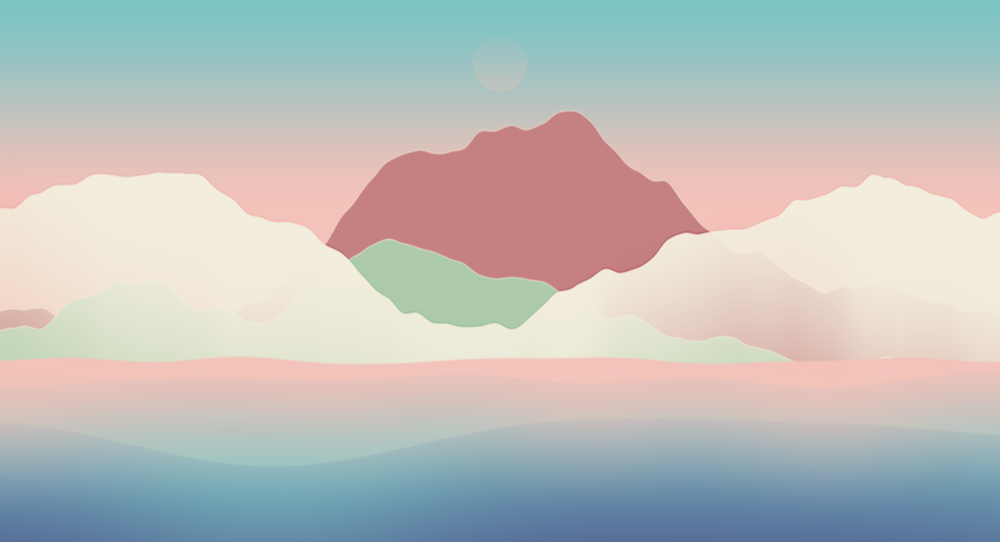

## Task 4: Experiments

Cream County:

Video with some audio:

https://user-images.githubusercontent.com/93442123/170897057-93fcb9d7-e312-47c7-8590-78c40a359343.mp4

> I tried to make my own abstract landscape inspired by the Holger Lippmann examples from the first session. The cutesy look wasn't intended, but I'm very happy with this first attempt. It also reminds me of the backgrounds from the old Patapon game:

## Task 5: Inspiration

[Spilled by the AMAZING flockaroo](https://www.shadertoy.com/view/MsGSRd)

> Well what can I say. I LOVE LOVE LOVE 2d fluid shaders like this. The reflections and the illusion of multiple layers is done very nicely, though the fullscreen view looks a bit awkward in some places. It could use some smoothing I'd say. 
