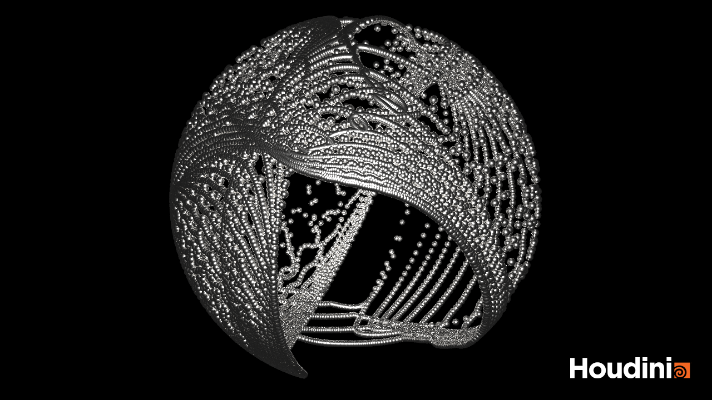
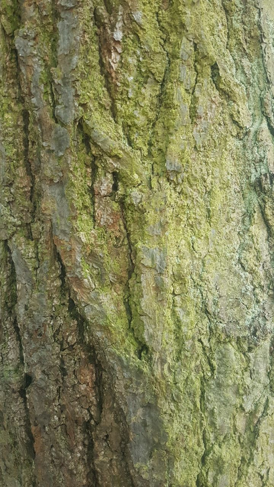
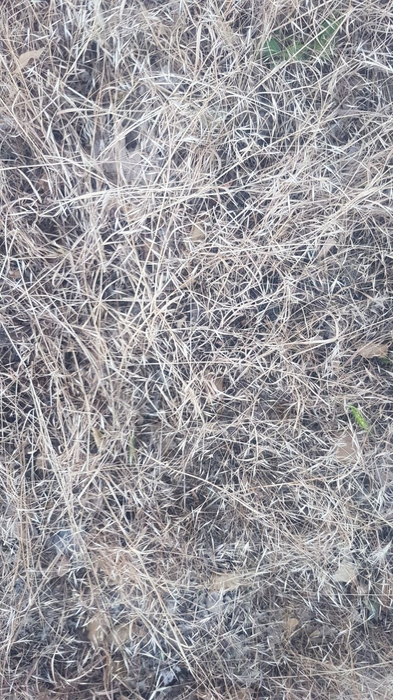
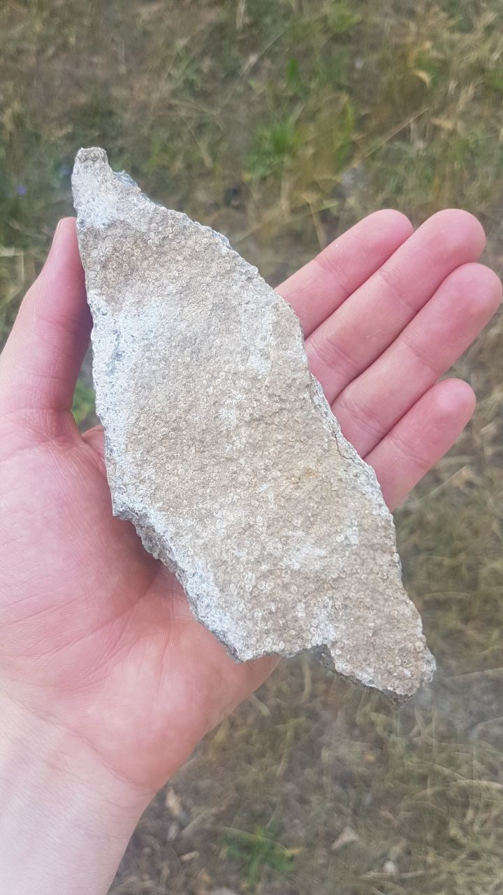

https://user-images.githubusercontent.com/93442123/173732495-7480f8f5-a60a-4979-b1c1-fdf2a3bc8c7b.mp4

underlying geometry:

## Chapter 06 - Seeing Noise 

* Submit at least three pictures of natural noise patterns. You can photograph them yourself (recommended) or find them on the internet.

* Submit one stylized / artistic image that uses noise as generating principle or design element. You can find it on the internet.

Some Voronoi that I actually like by Ployz:

[Some Voronoi that I actually like by Ployz.](https://www.behance.net/gallery/114208311/Voronoi-Syndrome/modules/652627945)
[She is quite the noise magician in general and maybe also a worthy entry for your list of female Berlin-based artists ;)](https://www.behance.net/gallery/105952077/Terra-Incognita/modules/608205499)

Link all images in this file.
