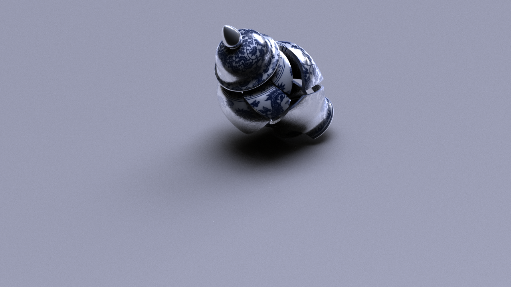
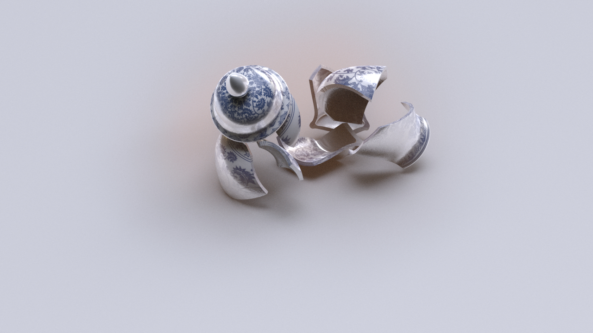
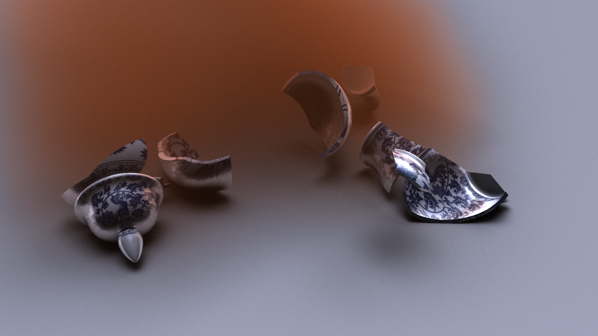
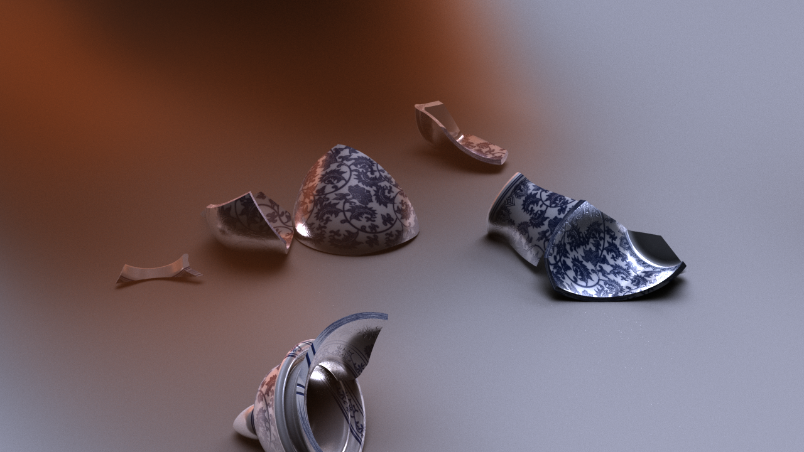
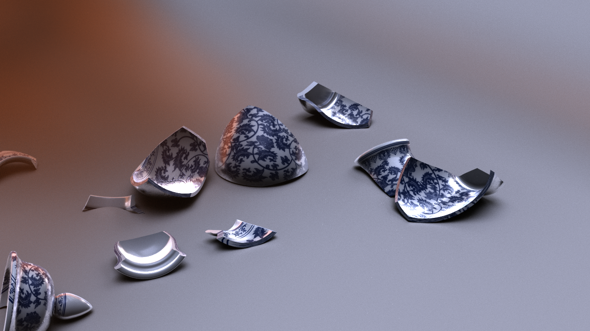
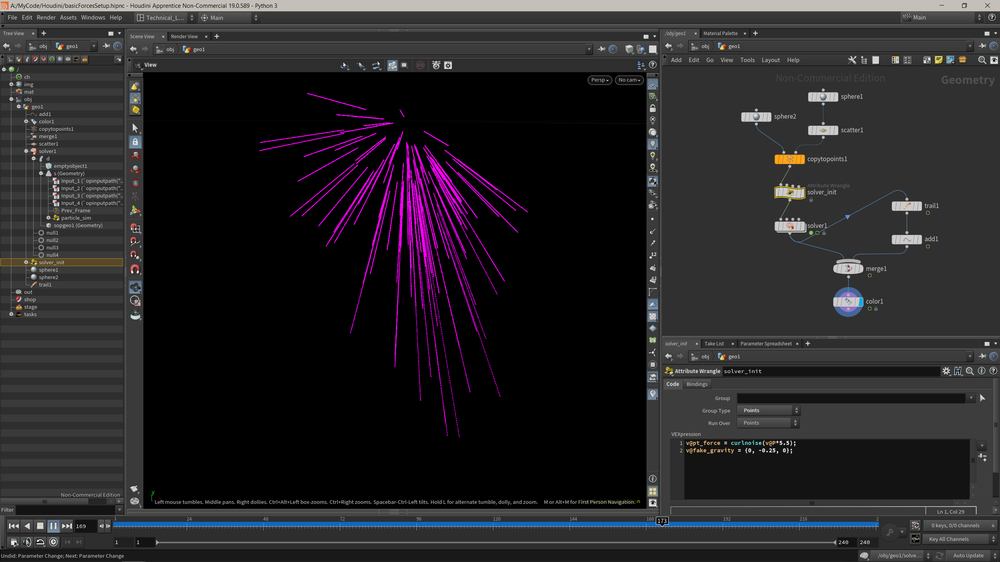

# Violence was always an option.

I'm very happy with this rendering! There are still some ugly parts and the behavior of the shards is less than ideal. The smoke-sand is also not-so-great, but the overall visual fidelity is a big improvement over my previous attempts. I was jumping back-and-forth between multiple tutorials. The smoke was done by placing a Billowy Smoke and changing the input volume to the debris that gets generated on collision. I'm starting to REALLY enjoy Houdini, though I had to render overnight. 

https://user-images.githubusercontent.com/93442123/178205556-36727d6b-81a2-491f-9a62-963bdfe03526.mp4

