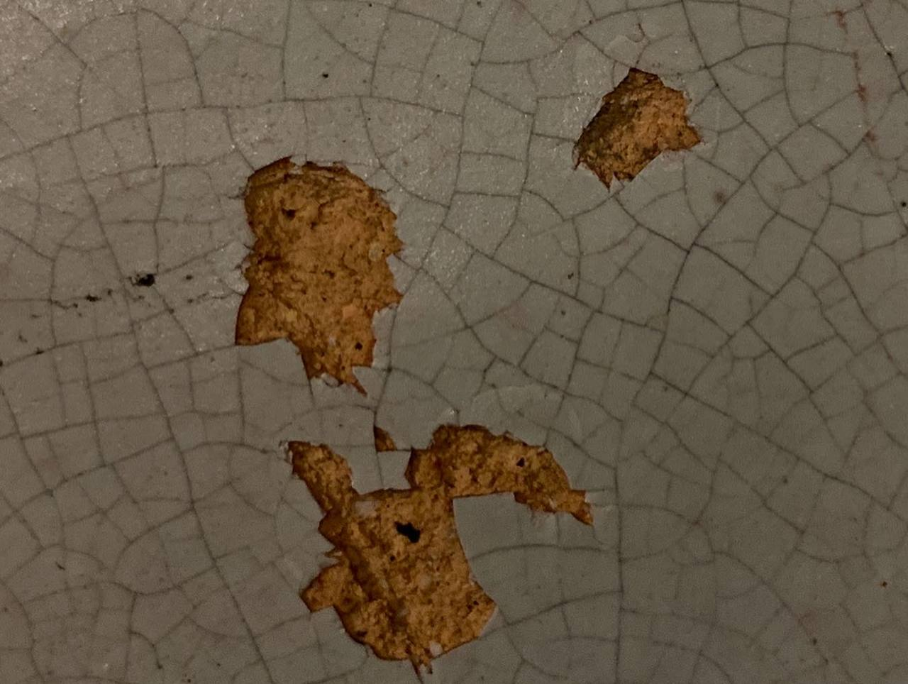
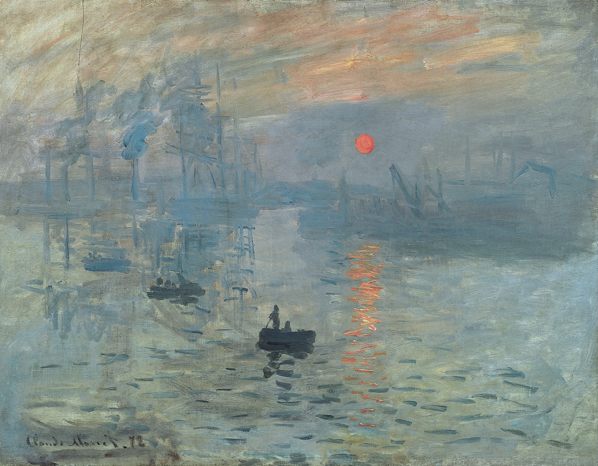
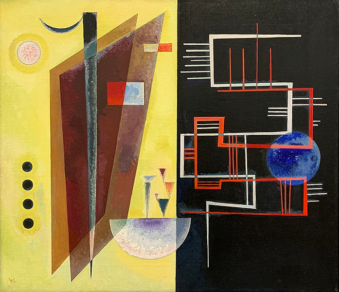

**Procedural Generation and Simulation**

# Results Session 01


<!-- #### Andreea
#### Anna
#### Jannis
#### Jonathan
#### Katja
#### Marco B.
#### Marco W.
#### Marton
#### Tillman
#### Tim
#### Vivien

 -->


## Questions 2 - Procedural Generation

Briefly in your own words: how would you explain your nanny what *procedural generation* means? 


#### Andreea
#### Anna

#### Jannis

> Procedural generation is a way of creating things – say, a chair – based on simple rules. Instead of manually building a chair, which leaves you with a single chair, you develop a recipe that lets a machine create a chair without you having to do anything. So in the beginning, it might be a little harder to come up with that recipe, but then you are left with as much chairs as you can acquire resources for.

#### Jonathan
#### Marco B.

> Procedual generation decribes the process to create something graphical, by defining rules and algorithms that can be modified to modify the whole creation.

#### Marco W.

> Making seamless and endless patterns with computers.

#### Marton

> Generating procedurally is like explaining our paintbrush how to paint instead of painting ourselves.


#### Tillman

> Procedural Generation is where you create something by telling a machine to follow rules. But these rules interact with one another as well, meaning that each time you run the instructions again, you will end up with something that looks different than before. As to *how* different it will look, that is dependent on how much potential for variation you include in your rules. 

#### Tim


#### Vivien

> Procedural generation is ... trying to find a "recipe" for patterns (which can be two- or three-dimensional).  
Like knowing which particular stitch is used, repeated again and again, to make a garment like e.g. a scarf. These "stitches" or "recipes" for computer graphics are often mathematical formulas, which tell the computer where to place a color (pixel) on the screen, or even objects like cubes. And just like with only having to memorize a few stitches for knitting big pieces, using these digital recipes can save a lot of "thinking power" for a computer (even though computers can't relax while knitting my digital scarves).


## Questions 3 - Patterns

### 3.1 Seeing Patterns

Take at least three pictures of natural patterns and at least three pictures of man-made ones (patterns can be two or three dimensional). Try to include at least one pattern with self-similarity. Taking the pictures with your smart phone is just fine. Link all images in this markdown file.

### 3.2 Understanding and Implementing Patterns

Write for one of your pattern images a generating algorithm in pseudo-code or code. Submit the code below.

---

#### Andreea
#### Anna

Natural Patterns  
 


Human-made Patterns  


#### Jannis


Natural     
   


   
    


 Man-made   
Self-similar glass patterns with three layers: larger outlines of irregalur shapes can be noticed from a distance. These larger shapes consist of smaller irregular (but similar) shapes, which consist of even smaller irregular shapes

  
  
    


---

```
draw:
    int x, z = 0
    while(endOfFrameNotReached)
        drawCylinder(diameter, height, rotation, x, z)
        x+= 30
    
    z += 10
    while(endOfFrameNotReached)
        drawCylinder(diameter, height, -rotation, x, z)
        x+= 30
```

#### Jonathan

#### Katja


> Human pattern


> Nature pattern


#### Marco B.


**Natural Patterns:**

*1: Leaf*


*2: Branches with self-similarity:*


*3: Tree bark*


*4: Sand "hills"*


**Man-made Patterns:**

*1: Speaker*


*2: Tiles*


*3: Grid*


-----------------

> p5.js Code for man-made pattern 2 - *Tiles*:

````
let tileX = 50;
let tileY = 25;
let space = 2;

function setup() {
  createCanvas(200, 200);
  background(0);
  noStroke();
  fill(255);
}

function draw() {
  for (let y=0; y*(tileY+space)<height;y++){
    for(x=0; x<=width; x+=tileX+space){
      //add an offset every second row
      if(y%2!==0 && x==0){  
        x-=(tileX+space)/2;
      }
      //draw tile
      rect(x,y*(tileY+space),tileX,tileY);
    }
  }
}
````


#### Marco W.

From natural- to human-made patterns in ascending order. For some of them, I find it hard to say!


<p/p>


---


````glsl
//Based on the bookofshaders.com and this tutorial by Inigo Quilez:
//https://iquilezles.org/articles/warp/
//It's the same code as for my tbag fluid shader, just with some minor changes.

precision highp float;

uniform vec2 u_resolution;

float random (in vec2 st) {
    return fract(sin(dot(st.xy,
                         vec2(12.9898,78.233)))*
        43758.5453123);
}

// Based on Morgan McGuire @morgan3d
// https://www.shadertoy.com/view/4dS3Wd
float noise (in vec2 st) {
    vec2 i = floor(st);
    vec2 f = fract(st);

    // Four corners in 2D of a tile
    float a = random(i);
    float b = random(i + vec2(1.0, 0.0));
    float c = random(i + vec2(0.0, 1.0));
    float d = random(i + vec2(1.0, 1.0));

    vec2 u = f * f * (3.0 - 2.0 * f);

    return mix(a, b, u.x) +
            (c - a)* u.y * (1.0 - u.x) +
            (d - b) * u.x * u.y;
}

#define NUM_OCTAVES 7

float fbm ( in vec2 _st) {
    float v = 0.0;
    float a = 0.6;
    for (int i = 0; i < NUM_OCTAVES; ++i) {
        v += a * noise(_st);
        _st*=1.75;
        a *= 0.5;
    }
    return v;
}

float pattern( in vec2 st, out vec2 q, out vec2 w) {
    float a = 30.0;
    q = vec2( fbm( st + vec2(0.0,0.0) ),
                   fbm( st + vec2(5.2,1.3) ) );

    w = vec2( fbm( st + a*q + vec2(1.7,9.2) ),
                   fbm( st + a*q + vec2(8.3,2.8) ) );
                                   
    return fbm(st);
}

void main() {
    vec2 st = gl_FragCoord.xy/u_resolution.xy;
    st.x *= u_resolution.x/u_resolution.y;
    vec3 color = vec3(0.2157, 0.0784, 0.0078);
    vec2 q = vec2(0.0);
    vec2 w = vec2(0.0);

    st.y*=0.22;
    st *= 2.0;
    st.x+=0.9;

    float f = pattern(st, q, w);

    color = mix (color, vec3(0.5529, 0.2588, 0.0745), dot(w.y, q.x));

    gl_FragColor = vec4(color,1.0);
}
````

#### Marton

Natural  

Strange pattern on my flatmate's plant  


---

Wind + snow on a Romanian mountaintop  


---

Original photo of a Wellingtonea Gigantea's trunk   


---

Displacement noise in Tiergarten   


---

Human-made  
Wall on my balcony  


---

Kitchen's window  


---

Taking a picture with an iPhone while covering a camera, with maximum ISO  


---

Bonus: Nature taking back property from the humans  


```glsl
//Based on p5's 2D Noise example:
//https://p5js.org/examples/math-noise2d.html

let noiseVal;
let noiseScale = 0.1;

function setup() {
  createCanvas(200, 200);
        colorMode(HSB);
}

function draw() {
  background(0);


for (let y = 0; y < height ; y++) {
    for (let x = 0; x < width; x++) {
      // noiseDetail of the pixels octave count and falloff value
      noiseDetail(4, 0.9);
      noiseVal = noise((mouseX + x) * noiseScale, (mouseY + y) * noiseScale);
      stroke(noiseVal * 255,noiseVal * 255,noiseVal * 30 );
      point(x, y);
    }
  }
}
```

#### Tillman

   
   
   
   
   


---


```js
var threadThickness = something; 

for (i = 0; i < height; i + threadThickness){

  - draw one ellipse at x = 0: 
  - ellipse height = threadThickness and x width = random width
  - random selection from colour pallette 
  - duplicate that ellipse along the x axis until x = width
}
}
```

#### Tim


#### Vivien


Human-made Patterns:

  |  
:-------------------------:|:-------------------------:
Tiling and glass pattern in a bathroom  | Crocheted applique on a dress 

---

Natural Patterns:

  |  
:-------------------------:|:-------------------------:
The edges of clouds are kind of self-similar (maybe?)  | Radially symmetric & repeating wood pattern

  |  
:-------------------------:|:-------------------------:
The plants and anthill could (almost) be seamless textures  | There is definitely a "recipe" to this stone as well


I made the sketches in Processing 4.0b2

```java
// sketch_glass
int rectSize=10;
int space=4;

void setup() {
  size(300, 350);
  background(200,180,180);
  noLoop();
}

void draw(){
  
  stroke(255,255,255,90);
  fill(240, 210, 210, 50);
  strokeWeight(2);

  for (int x = -1; x < 29; x++) {
    for (int y = -1; y < 29; y++) {
      rect(space + x * (rectSize + space) + random(-3, 3), space + y *(rectSize + space) + random(-3, 3), rectSize + random(1, 20), rectSize + random(1, 20));
    }
  }  
}

// sketch_wall
int rectSize=20;
int space=4;

void setup() {
  size(700, 700);
  background(185);
  noLoop();
}

void draw(){
  
  stroke(150);
  fill(210,125,70);
  strokeWeight(2);

  for (int x = 0; x < 29; x++) {
    for (int y = 0; y < 29; y++) {
      rect(space + x * (rectSize + space), space + y *(rectSize + space), rectSize, rectSize);
    }
  }
}
```


### 3.3 Seeing Faces

As an exercise to see and understand the environment around you (and to have some fun 😊), try to find at least two faces. Link all images in this file.


#### Andreea
#### Anna


#### Jannis


#### Jonathan

#### Katja


#### Marco B.


#### Marco W.

 

 

  (I didn't find a good fit for this one...)

#### Marton

 


 


#### Tillman

   
   


#### Tim
#### Vivien

  |  
:-------------------------:|:-------------------------:
  My photo | My sketch of the little face

  |  
:-------------------------:|:-------------------------:
  My (a bit older) photo | I know it's not quite a "face" but I took this picture because of a meme, which I felt like really fit the seeing "faces" assignment :D


## Questions 4 - Abstraction

### 4.1 Abstraction in Art

Chose one "traditional" painting, which is inspirational to you. The image can come from the script or you can refer to any artists or image you like.  

Explain briefly what you like about the painting and how it might inspire you for your own work.

#### Andreea
#### Anna


#### Jannis


#### Jonathan

#### Katja


#### Marco B.


[Monet, Soleil Levant](https://en.wikipedia.org/wiki/Impressionism#/media/File:Claude_Monet,_Impression,_soleil_levant.jpg)


#### Marco W.


*“Making Love to a Man Who isn’t All There” by Ann Leda Shapiro.*

#### Marton



#### Tillman


#### Tim
#### Vivien


from: [Kazimir Malevich, "Quadrato rosso", 1915](https://eo.wikipedia.org/wiki/Dosiero:Kazimir_malevich,_quadrato_rosso_(realismo_del_pittore_di_una_campagnola_in_due_dimensioni),_1915.JPG)


### 4.2 Abstracted Artistic Expression in CGI

Chose one CG image, which you like and of which you think that it has an artistic quality to it. The image doesn't need to be from the script, again you can chose any CGI image you like (it should use 3D graphics). You can find more examples in the [Summary of Artists](../../02_scripts/pgs_ss22_01_intro_script.md#summary-of-artists) section.  

Explain briefly what you like about the image and why you consider it to be somewhat a pice of art. 

#### Andreea
#### Anna


Iconographies by Quayola. (https://quayola.com/work/series/iconographies-series.php)


#### Jannis

 by beeple_crap


#### Jonathan
#### Marco B.


#### Marco W.


#### Marton

Sage Jenson

[Link to the picture](https://cargocollective.com/sagejenson/tapestries)

#### Tillman


#### Tim
#### Vivien


found on: [StashMedia](https://www.stashmedia.tv/growing-flower-alexa-sirbu-lukas-vojir/) & [Vimeo](https://vimeo.com/232473927)  
made by: Alexa Sirbu, Lukas Vojir, with music Zelig Sound

