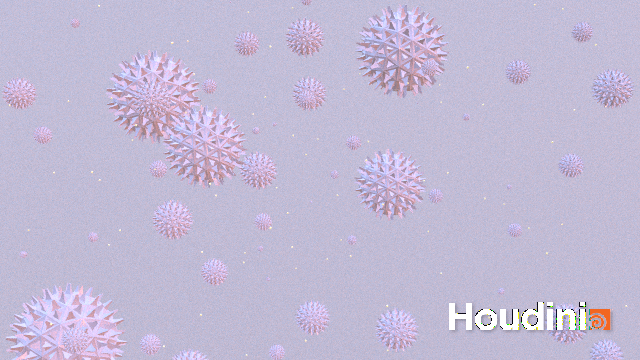
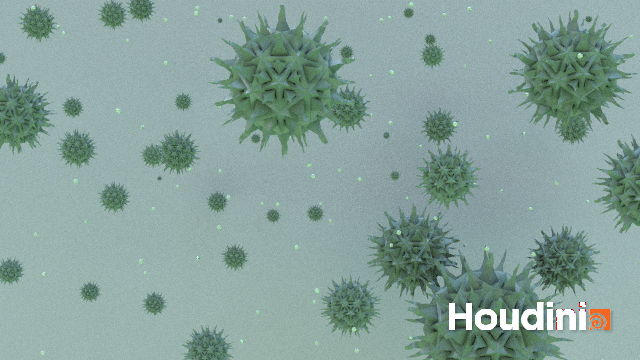
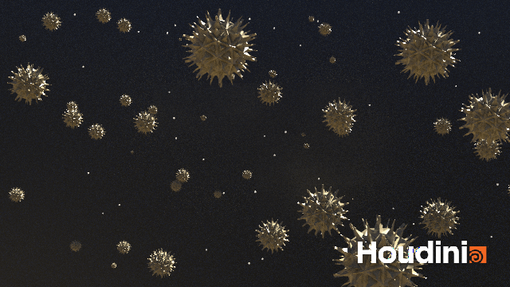

# Procedural Generation and Simulation

Prof. Dr. Lena Gieseke \| l.gieseke@filmuniversitaet.de \| Film University Babelsberg KONRAD WOLF

# Session 02

We will discuss this session on **Monday, May 9th**.  

These tasks should take take < 4h. I recommend not to do all tutorial parts in one session but to take a break in between.

## 1. Houdini - First Steps

* Read [Chapter 02 - Houdini](../../02_scripts/pgs_ss22_02_houdini_script.md)

## 2. Houdini - First Steps

*For this task you don't need to submit anything.*

* For Houdini you must, must, must have a three-button mouse - everything else will just lead to unnecessary, insufferable pain. You can get such a mouse for less than 10 Euro. We also have plenty of mice at university for you to borrow.
* Install [version 19](https://www.sidefx.com/download/) of Houdini. You will need to create an SideFX account for that.
* Know the [fundamental aspects](pgs_ss22_houdini_fundamentals.md) of working with Houdini. From now on, I will assume that you roughly know all aspects mentioned in that file:
    * UI Setups and General UI Components
    * Network View
    * Parameter View
    * Selection and Navigation in the Viewport and the Network View
    * Working with Nodes
        * The Geometry Node
        * Adding a Primitive 
        * Creating a Network  

* If topics and steps of the [fundamental aspects](pgs_ss22_houdini_fundamentals.md) feel foreign to you and you want to brush up on your skills, you can find plenty of tutorials on the Internet.

## 3. Houdini - Extrusions

Go through the tutorial and make the example your own. This means that your results should look different from mine and that you can make any changes you like, even drastic ones. Your example should include *extrusions*, *object scattering*, a *camera*, an *environment light*, at least one *material*. Also, you need to *render* at least one output image.  

This tutorial is beginner-friendly. There are many general explanations in the video for which you can increase the playback speed. 

* [Intro](https://drive.google.com/open?id=1CDeX-N-ZlqZPWL2XGpapdWw7G7wM8c1m) (09:20 min)
* [Sphere](https://drive.google.com/open?id=1GLHmR3H5Yki0L8GRVHqWNiCGsmmDKzly) (28:39 min)
* [Scatter](https://drive.google.com/open?id=1-gzqdFSr1q20GFmNHdDC2U82C5yZXfz8) (18:42 min)
* [Rendering](https://drive.google.com/open?id=1l5LT96qvrzWciIt1_ZWbcxweqA7xWWyC) (30:10 min)
* [Materials](https://drive.google.com/open?id=1HHmZcwLkHNDHHMwCfcPo8xAiyYxGSJyN) (22:56 min)
* [Wrap-Up](https://drive.google.com/open?id=1VX7mfmVChKVoABxbne05L_KyLhbaY1W0) (02:01 min)

Or download all videos at once from [this folder](https://drive.google.com/open?id=1fMXiAyPP3cnaYije5h_1KB9lZKPZJtWH).

*Please do not share these videos*.

---

Submit your houdini file as `pgs_ss22_tutorial_01_lastname.hipnc` and at least one image file as `pgs_ss22_tutorial_01_lastname.png`.

---

**Happy Extruding!**

