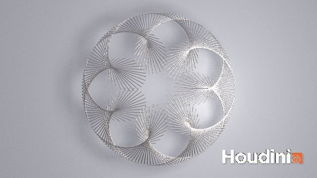
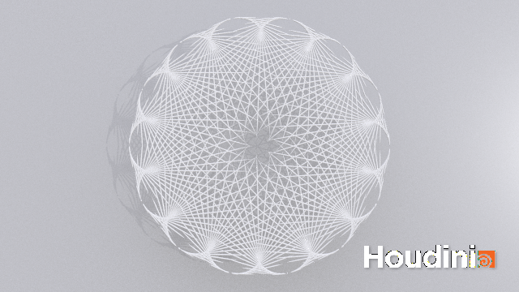

# Procedural Generation and Simulation

Prof. Dr. Lena Gieseke \| l.gieseke@filmuniversitaet.de \| Film University Babelsberg KONRAD WOLF

# Session 03

We will discuss this session on **Monday, May 23th**. 

These tasks should take take < 4h. I recommend not to do all tutorial parts in one session but to take a break in between.

## Task 1: Chapter 03 - Beauty in Maths

* Read [Chapter 03 - Beauty in Maths](https://ctechfilmuniversity.github.io/lecture_procedural_generation_and_simulation/02_scripts/pgs_ss22_03_mathsbeauty_script.html)

*On a side note:* This script includes formulas and GitHub's markdown preview will not display them. To read the script with properly set formulas, you have the following options:

* Read the script [online](https://ctechfilmuniversity.github.io/lecture_procedural_generation_and_simulation/02_scripts/pgs_ss22_03_mathsbeauty_script.html) (this links to an online `.html` version of the script)
* Download the script folder and open [pgs_ss22_03_mathsbeauty_script.html](../../02_scripts/pgs_ss22_03_mathsbeauty_script.html) locally in your browser.
* Download the script folder and open [pgs_ss22_03_mathsbeauty_script.md](../../02_scripts/pgs_ss22_03_mathsbeauty_script.md) in Visual Studio Code with the [Markdown All in One](https://marketplace.visualstudio.com/items?itemName=yzhang.markdown-all-in-one) plugin installed. Then the preview of the `.md` within VSCode will render the formulas nicely.

---

## Task 2: Houdini

Go through the tutorial and make the example your own. Your example should look *different* from the tutorial result, make any changes you like. Play around with camera angels, lights and materials. Render at least one polished output image (rendering artefakts such as noise are ok).  

* [Intro](https://drive.google.com/open?id=1k3Gi9Io59CHLtnoq6B6pp4Hd8xhG8zMZ) (09:24 min)
* [Circle](https://drive.google.com/open?id=1Kfv9H8W5ScatSKGuX1doA81tDjSplk2B) (28:25 min)
* [Line](https://drive.google.com/open?id=11huDTyhq1FYRRMxgMegNujNTjYlOBP8V) (23:36 min)
* [Rendering](https://drive.google.com/open?id=1YkAX-rhKHzUFUygjEZcBqBF40onET7KF) (17:33 min)
* [Wrap-Up](https://drive.google.com/open?id=17TIDtyu1wTFEqJp_TLtmKrgCJYhSjwc9) (00:57 min)

Or download all videos at once from [this folder](https://drive.google.com/open?id=1JFDke_1bWAQe5nSldaJ6ZR6mDIIN3L8a).

*Please do not share these videos*.

### Reference

This tutorial is based on the [Circle Pattern VEX tutorial](https://www.youtube.com/watch?v=Hvk7KCfS-xE&t=1224s) by Anastasia Opara.

---

Submit your houdini file as `pgs_ss22_tutorial_02_lastname.hipnc` and at least one image file as `pgs_ss22_tutorial_02_lastname.png`.

---

**Happy Mathing!**

