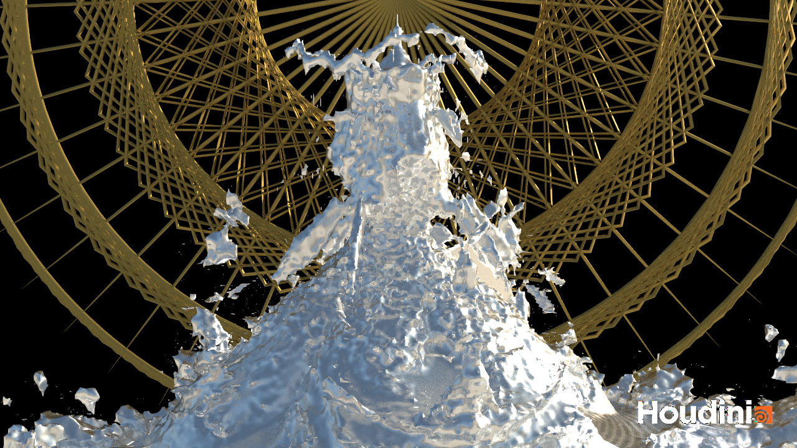
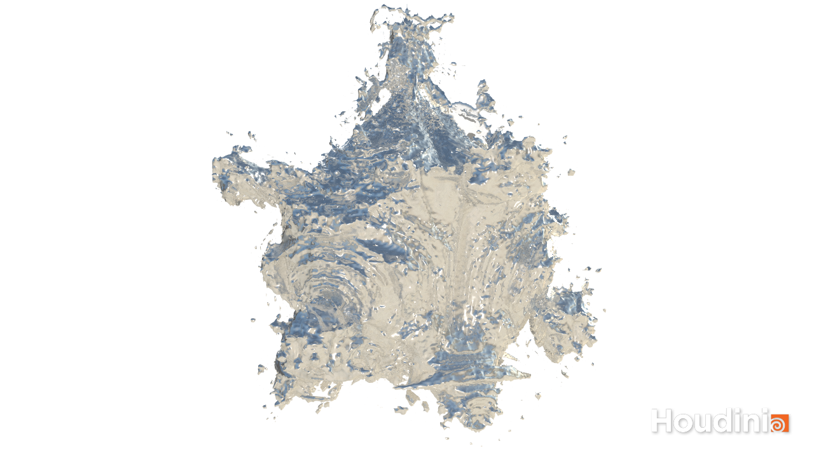
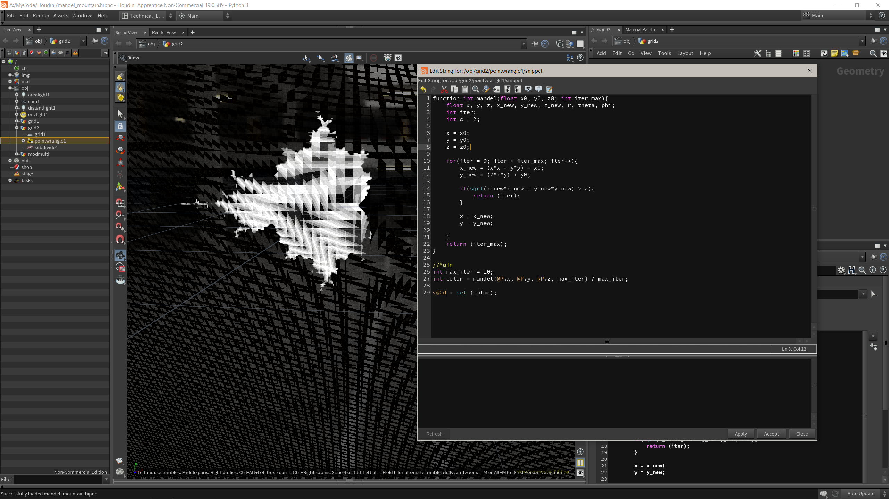
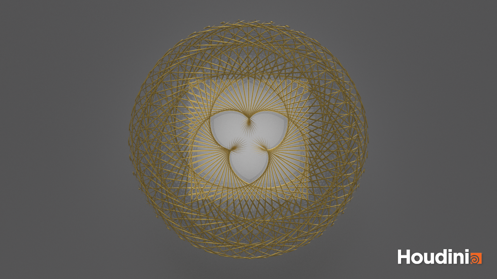

Mandel-Mountain:

I also wanted to add volumetric fog, but that didn't really work out in the 15 minutes that I tried it. For the Mandelbulb, I used a combination of Lena's pseudocode from the last session, [this website](https://www.skytopia.com/project/fractal/mandelbulb.html) that Lena showed us and some of [this tutorial](https://www.youtube.com/watch?v=_mwJ7mlYRWg).