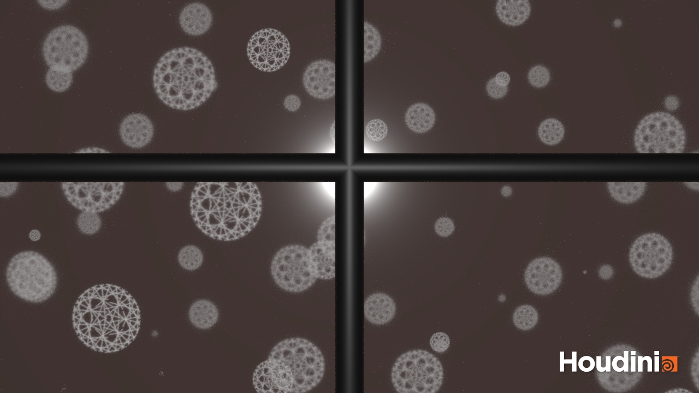
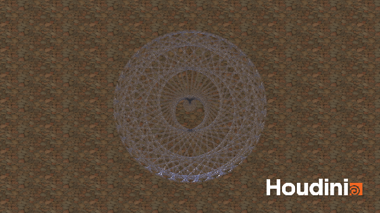
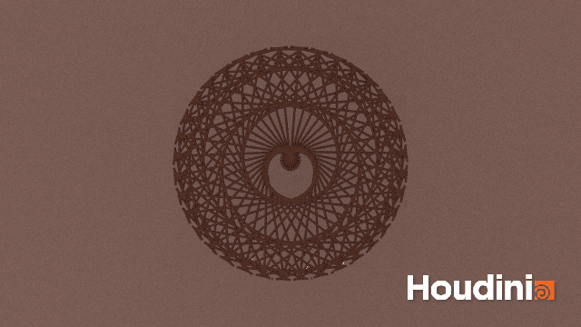
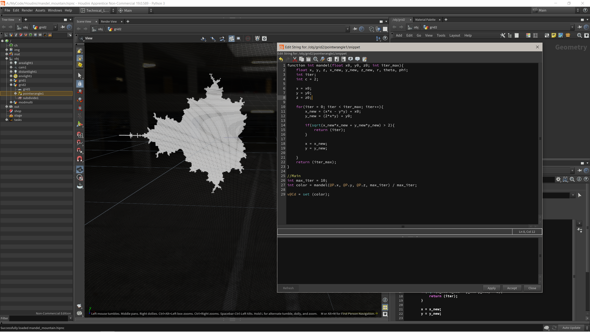
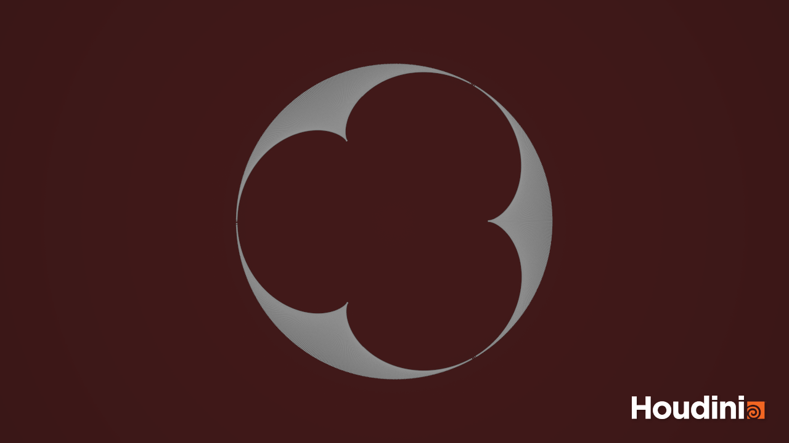
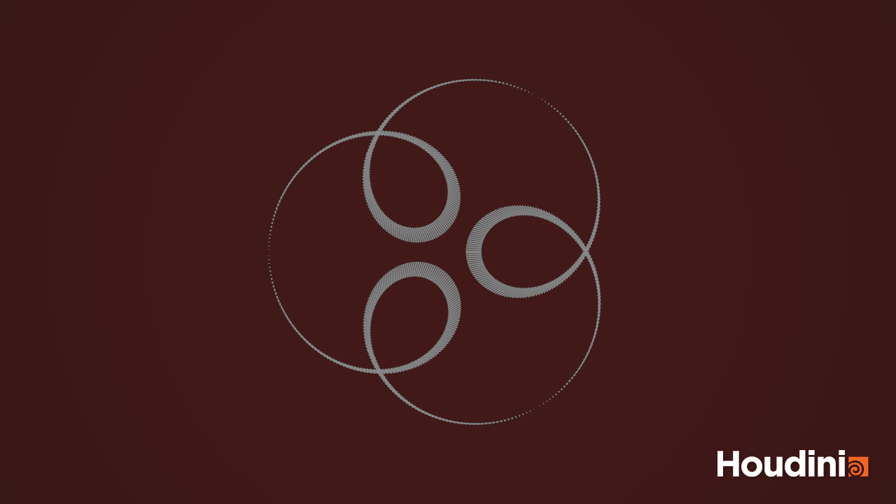
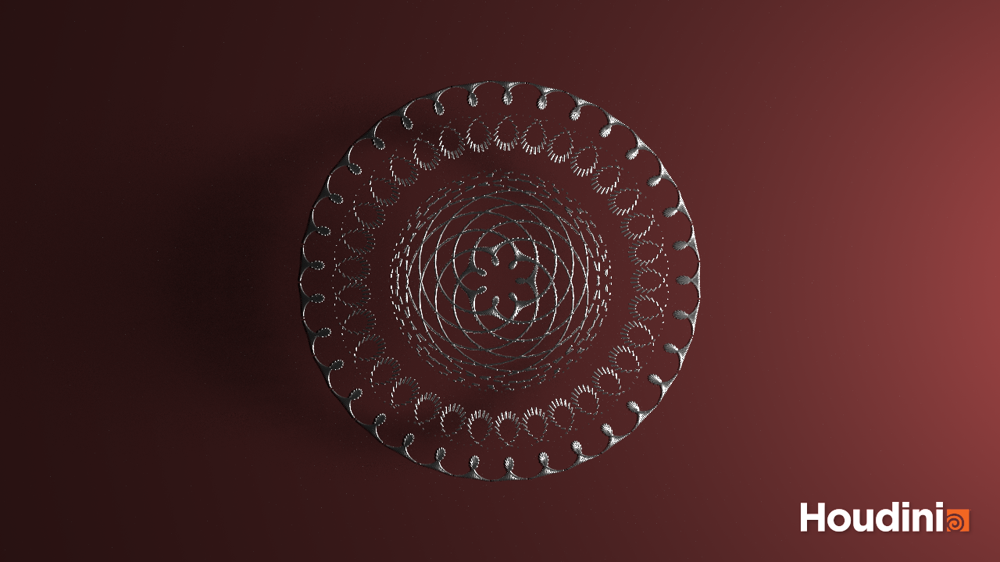
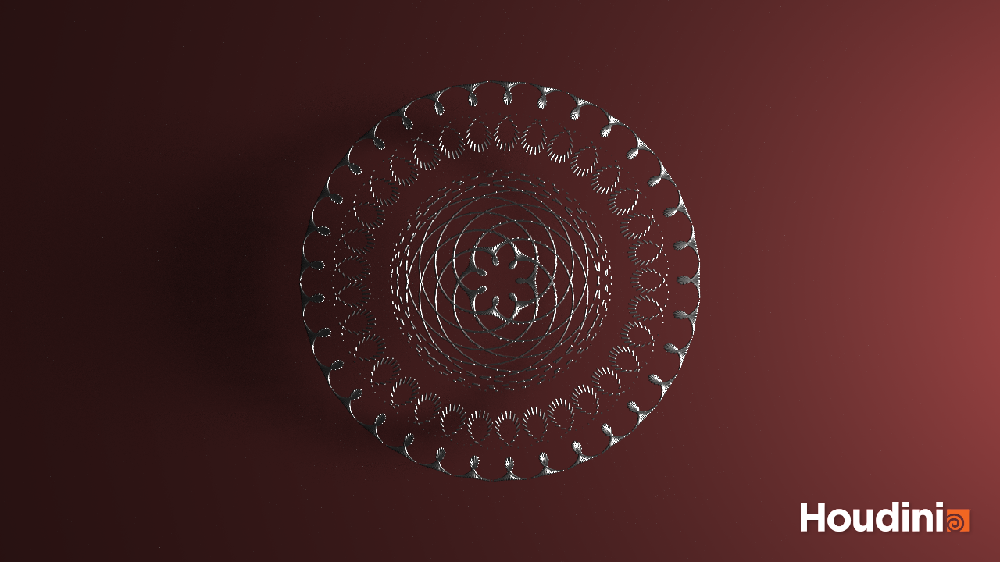
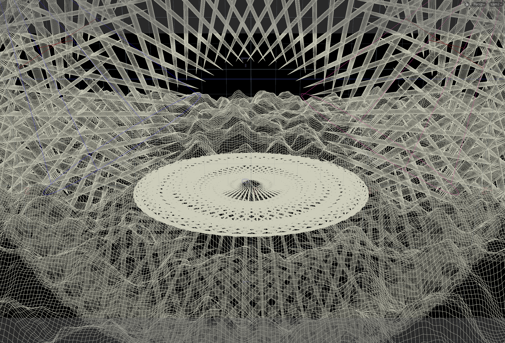

# Procedural Generation and Simulation

Prof. Dr. Lena Gieseke \| l.gieseke@filmuniversitaet.de \| Film University Babelsberg KONRAD WOLF

# Results Session 03

<!-- #### Andreea -->
<!-- #### Anna -->
#### Janine

#### Jannis

#### Jonathan

#### Katja

#### Marco W.

Mandel-Mountain:
  
  
  
  
  
I also wanted to add volumetric fog, but that didn't really work out in the 15 minutes that I tried it. For the Mandelbulb, I used a combination of Lena's pseudocode from the last session, [this website](https://www.skytopia.com/project/fractal/mandelbulb.html) that Lena showed us and some of [this tutorial](https://www.youtube.com/watch?v=_mwJ7mlYRWg).

#### Marton

#### Tillman

   

 Below: using first and second U in carve
   

Below: using three shapes   
   

Below: experimenting with raytracing bias. Looks a bit crisper.
   

#### Tim

#### Vivien

I was extra safe with my own interpretation though & always saved the rendered WIP shots:

Also, I caught this very cool looking wireframe scene view:

And the final render:

