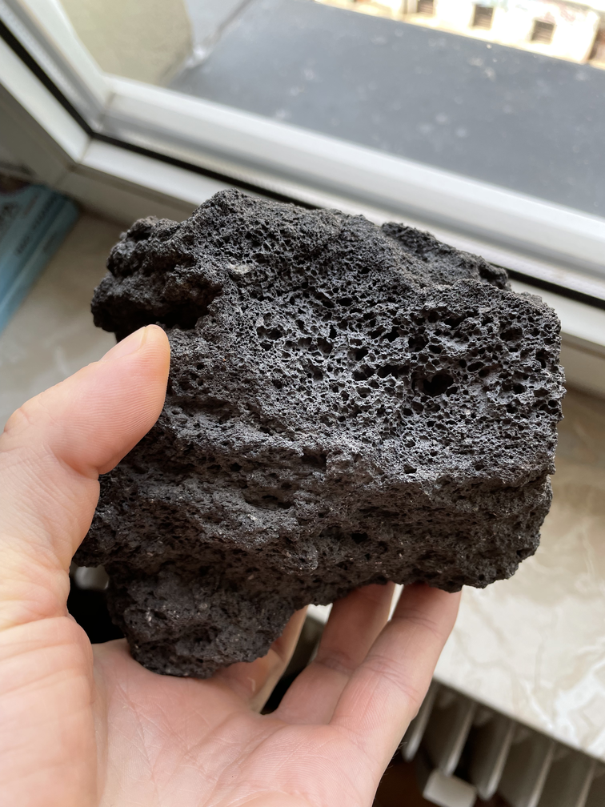
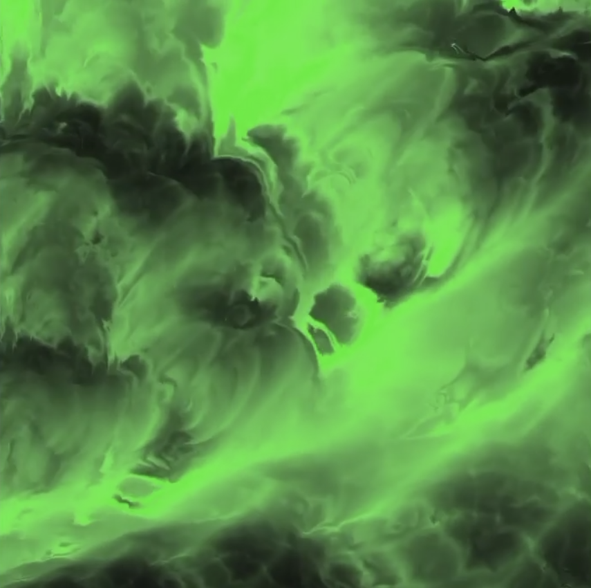
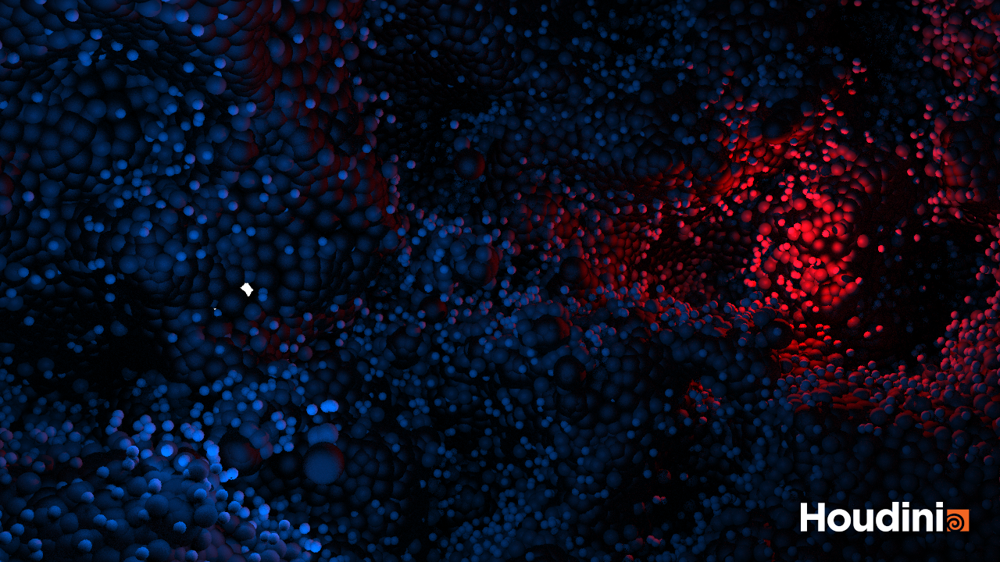
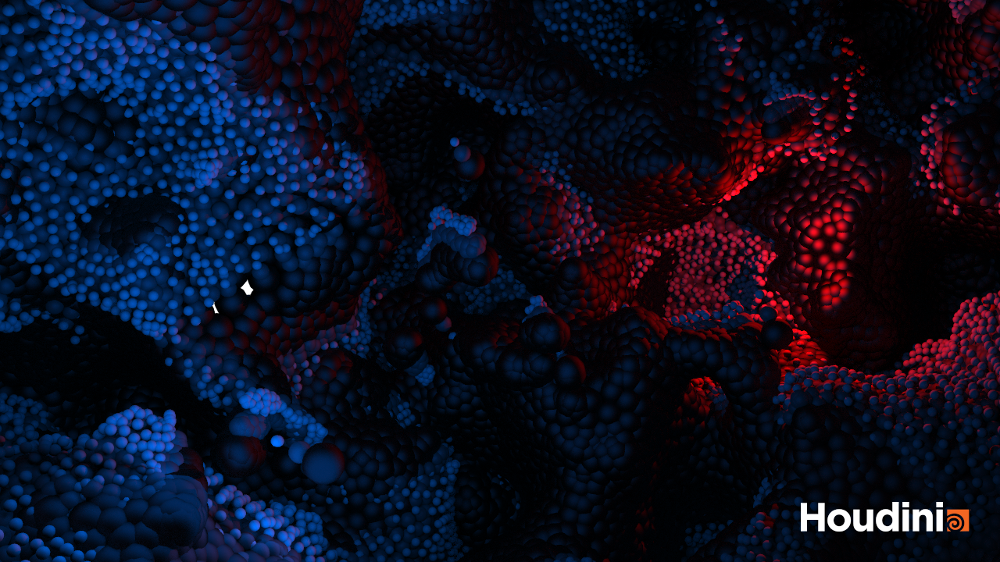

# Procedural Generation and Simulation

Prof. Dr. Lena Gieseke \| l.gieseke@filmuniversitaet.de \| Film University Babelsberg KONRAD WOLF

# Results Session 06 - Noise

* [Procedural Generation and Simulation](#procedural-generation-and-simulation)
* [Results Session 06 - Noise](#results-session-06---noise)
    * [Seeing Noise](#seeing-noise)
        * [Andreea](#andreea)
        * [Anna](#anna)
        * [Janine](#janine)
        * [Jannis](#jannis)
        * [Jonathan](#jonathan)
        * [Katja](#katja)
        * [Marco B.](#marco-b)
        * [Marco W.](#marco-w)
        * [Marton](#marton)
        * [Tillman](#tillman)
        * [Tim](#tim)
        * [Vivien](#vivien)
    * [Tutorial](#tutorial)
        * [Andreea](#andreea-1)
        * [Anna](#anna-1)
        * [Janine](#janine-1)
        * [Jannis](#jannis-1)
        * [Jonathan](#jonathan-1)
        * [Katja](#katja-1)
        * [Marco B.](#marco-b-1)
        * [Marco W.](#marco-w-1)
        * [Marton](#marton-1)
        * [Tillman](#tillman-1)
        * [Tim](#tim-1)
        * [Vivien](#vivien-1)

## Seeing Noise

### Andreea
### Anna

### Janine
### Jannis
### Jonathan

### Katja
### Marco B.
### Marco W.

[Some Voronoi that I actually like by Ployz.](https://www.behance.net/gallery/114208311/Voronoi-Syndrome/modules/652627945)
[She is quite the noise magician in general and maybe also a worthy entry for your list of female Berlin-based artists ;)](https://www.behance.net/gallery/105952077/Terra-Incognita/modules/608205499)

### Marton
### Tillman

        
    
    
    

### Tim
### Vivien

## Tutorial

### Andreea
### Anna

 

 

### Janine
### Jannis
### Jonathan

### Katja
### Marco B.

  

### Marco W.
### Marton
### Tillman

       
        

### Tim

Flipbook:

### Vivien

First test with tinted glass material:

Second render with iron material (to reduce render time):

https://user-images.githubusercontent.com/93382434/173902502-ec1553d2-b1fe-4c83-abfc-7e24d65af5aa.mp4

